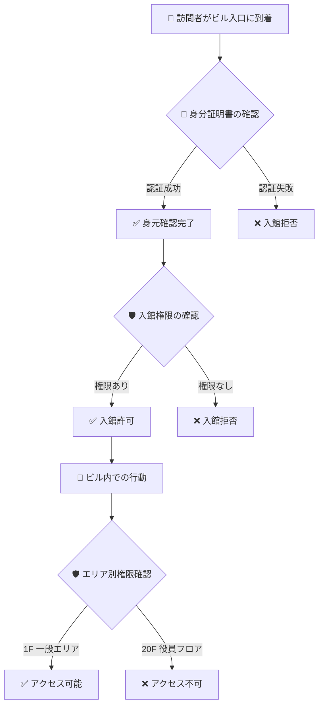
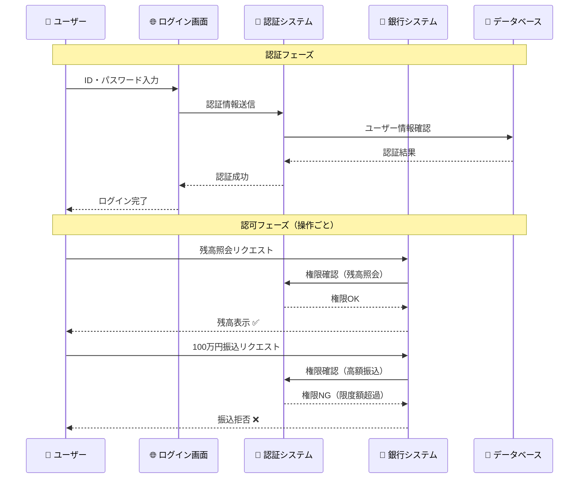
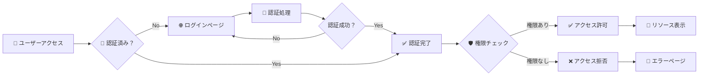

# 認証と認可の違い

## 🎯 学習目標

- 認証 (Authentication) と認可 (Authorization) の違いを明確に理解する
- それぞれがどのタイミングで実行されるかを知る
- 実際の Web アプリケーションでの具体例を理解する

## 🔍 基本的な違い

### 📝 簡単な覚え方

| 概念 | 英語 | 質問 | 確認すること | タイミング |
|------|------|------|--------------|------------|
| **認証** | Authentication | 「あなたは誰？」 | **身元** | ログイン時 |
| **認可** | Authorization | 「何ができる？」 | **権限** | 操作時 |

## 🏢 具体例で理解する

### 例1: オフィスビルでの入館



#### 🔐 認証フェーズ
- **何をする**: 身分証明書で身元確認
- **確認すること**: 本当にその人かどうか
- **結果**: 身元が証明されれば次のステップへ

#### 🛡️ 認可フェーズ
- **何をする**: 入館権限・エリア別権限の確認
- **確認すること**: その人に権限があるかどうか
- **結果**: 権限があれば該当エリアにアクセス可能

### 例2: ネットバンキング



## 💻 Web アプリケーションでの実例

### 📧 Gmail の場合

#### 🔐 認証
```
👤 ユーザー: example@gmail.com + パスワード
🌐 Gmail: この人は本当に example@gmail.com の持ち主？
✅ 確認完了: ログイン成功
```

#### 🛡️ 認可
```
👤 ユーザー: 受信トレイを見たい
🌐 Gmail: この人は自分の受信トレイを見る権限がある？ → ✅ OK

👤 ユーザー: 他人のメールを見たい
🌐 Gmail: この人は他人のメールを見る権限がある？ → ❌ NG

👤 ユーザー: メール送信したい
🌐 Gmail: この人はメール送信権限がある？ → ✅ OK

👤 ユーザー: 管理者設定を変更したい
🌐 Gmail: この人は管理者権限がある？ → ❌ NG（一般ユーザーの場合）
```

## 🎯 バケットリストアプリでの具体例

私たちのプロジェクトでの実装を見てみましょう：

### 🔐 認証の実装

```typescript
// app/features/auth/lib/auth-context.tsx より抜粋
const signIn = async (email: string, password: string) => {
  // 1. 入力値の検証
  if (!email || !password) {
    return { error: { message: "メールアドレスとパスワードは必須です" } };
  }

  // 2. Supabase で認証
  const { error } = await supabase.auth.signInWithPassword({
    email: email.toLowerCase().trim(),
    password,
  });

  // 3. 認証結果の処理
  if (error) {
    console.error("Sign in failed:", error.message);
  } else {
    updateActivity(); // 認証成功後の処理
  }

  return { error };
};
```

**何をしている？**
- 👤 ユーザーがメールアドレスとパスワードを入力
- 🔐 システムがその情報でユーザーを特定
- ✅ 正しければ認証成功、間違っていれば認証失敗

### 🛡️ 認可の実装

```typescript
// app/features/auth/components/auth-guard.tsx より抜粋
export function withAuth<T extends object>(
  Component: React.ComponentType<T>,
  options: WithAuthOptions = {},
) {
  return function AuthenticatedComponent(props: T) {
    const { user, loading } = useAuth();
    const navigate = useNavigate();

    useEffect(() => {
      // 認証されていないユーザーはログインページへ
      if (!loading && !user) {
        navigate(redirectTo);
      }
    }, [user, loading, navigate]);

    // 認証されたユーザーのみコンポーネントを表示
    if (!user) {
      return <div>認証が必要です</div>;
    }

    return <Component {...props} />;
  };
}
```

**何をしている？**
- 🛡️ ページにアクセスする前に認証状態をチェック
- ✅ ログイン済み → ページを表示
- ❌ 未ログイン → ログインページにリダイレクト

### 📊 サーバーサイドでの認可

```typescript
// app/lib/auth-server.ts より抜粋
export async function getServerAuth(request: Request): Promise<ServerAuthResult> {
  try {
    const cookieHeader = request.headers.get("Cookie") || "";
    const cookies = parseCookies(cookieHeader);

    // Cookie から認証トークンを取得
    const { access_token } = extractSupabaseTokens(cookies);
    
    if (!access_token) {
      return { user: null, isAuthenticated: false, session: null };
    }

    // トークンを検証してユーザー情報を取得
    const user = await validateJwtToken(access_token);
    
    if (!user) {
      return { user: null, isAuthenticated: false, session: null };
    }

    return { user, isAuthenticated: true, session: {...} };
  } catch (error) {
    return { user: null, isAuthenticated: false, session: null };
  }
}
```

**何をしている？**
- 🛡️ サーバーでリクエストごとにユーザーの認証状態を確認
- ✅ 有効なトークン → そのユーザーとして処理
- ❌ 無効なトークン → 未認証として処理

## 🔄 認証と認可の関係



## 📋 実際のシステムでの適用例

### SNS（Twitter/X）の場合

| 操作 | 認証 | 認可 |
|------|------|------|
| ツイート閲覧 | 不要（公開ツイート） | 不要 |
| ツイート投稿 | 必要 | ✅ 自分のアカウントで投稿 |
| DM送信 | 必要 | ✅ フォロワーにのみ送信可能 |
| アカウント削除 | 必要 | ✅ 自分のアカウントのみ削除可能 |
| 他人のツイート削除 | 必要 | ❌ 管理者以外は不可 |

### EC サイト（Amazon）の場合

| 操作 | 認証 | 認可 |
|------|------|------|
| 商品閲覧 | 不要 | 不要 |
| 商品購入 | 必要 | ✅ 自分のアカウントで購入 |
| 注文履歴確認 | 必要 | ✅ 自分の注文のみ閲覧可能 |
| 商品レビュー投稿 | 必要 | ✅ 購入済み商品のみレビュー可能 |
| 他人の個人情報閲覧 | 必要 | ❌ 管理者以外は不可 |

## 🎯 重要なポイント

### ✅ 覚えておくべきこと

1. **認証は1回、認可は操作ごと**
   - 認証: ログイン時に1回
   - 認可: ページアクセス・API呼び出しごとに毎回

2. **認証なしに認可なし**
   - まず「誰か」を特定してから「何ができるか」を決める

3. **認証成功 ≠ 全権限**
   - ログインできても、すべての操作ができるわけではない

4. **セキュリティは多層防御**
   - フロントエンド・バックエンド両方でチェックが必要

### ❌ よくある間違い

```typescript
// ❌ 悪い例: 認証チェックのみ
function deleteUser(userId: string) {
  if (!isLoggedIn()) {
    throw new Error("ログインが必要です");
  }
  // 問題: ログインしていれば誰でも任意のユーザーを削除できてしまう
  return database.deleteUser(userId);
}

// ✅ 良い例: 認証 + 認可チェック
function deleteUser(userId: string) {
  if (!isLoggedIn()) {
    throw new Error("ログインが必要です"); // 認証チェック
  }
  
  if (getCurrentUser().id !== userId && !getCurrentUser().isAdmin) {
    throw new Error("権限がありません"); // 認可チェック
  }
  
  return database.deleteUser(userId);
}
```

## 🚀 次のステップ

認証と認可の違いが理解できたら、次は **[一般的な認証パターン](./common-patterns.md)** で具体的な認証方法について学びましょう。

パスワード認証以外にも様々な認証方法があることを知ることができます。