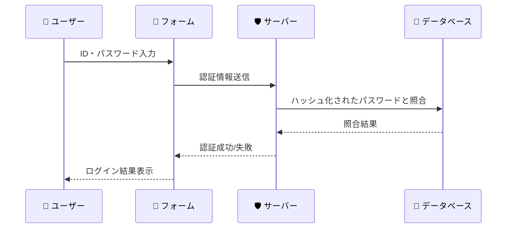
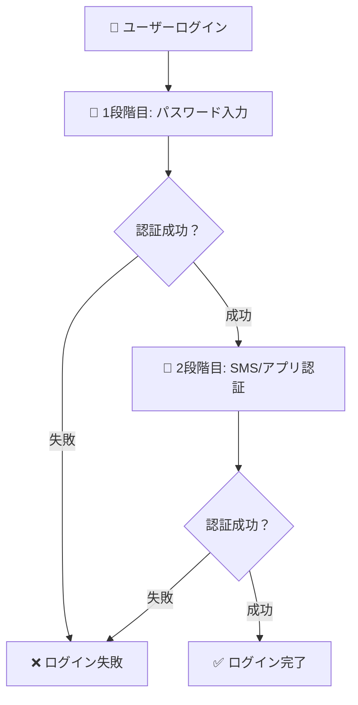
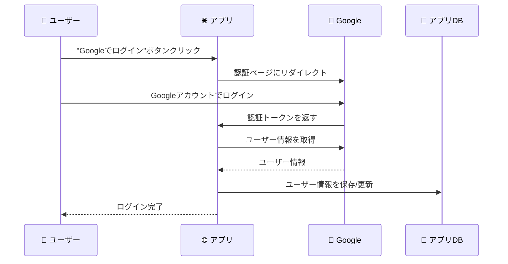
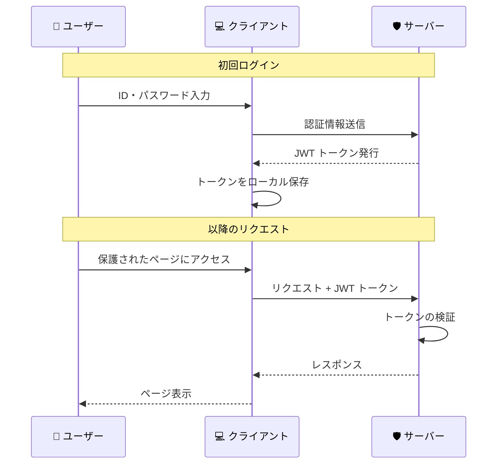
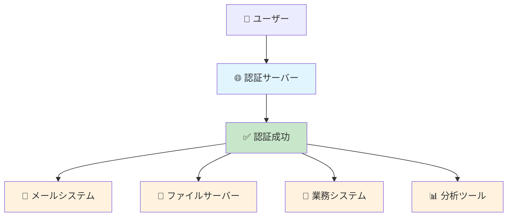

# 一般的な認証パターン

## 🎯 学習目標

- 現代の Web アプリケーションで使われている主要な認証方法を知る
- それぞれの認証方法のメリット・デメリットを理解する
- どの場面でどの認証方法が適しているかを判断できるようになる

## 🔐 主要な認証パターン一覧

### 1. 📝 パスワード認証（従来型）

**最も基本的で広く使われている認証方法**



#### ✅ メリット
- **実装が簡単**: 基本的なシステムで対応可能
- **コストが低い**: 追加のハードウェア不要
- **ユーザーが慣れている**: 多くの人が使い方を知っている

#### ❌ デメリット
- **パスワード忘れのリスク**: ユーザーが忘れやすい
- **セキュリティリスク**: 推測されやすい、使い回しされやすい
- **管理の負担**: 定期的な変更が推奨される

#### 🎯 使用例
- 一般的な Web サイト（ブログ、ショッピングサイト）
- 内部システム
- **私たちのバケットリストアプリ**

### 2. 📱 多要素認証（MFA: Multi-Factor Authentication）

**複数の認証要素を組み合わせる方法**

#### 3つの認証要素

| 要素 | 内容 | 例 |
|------|------|-----|
| **知識要素** | あなたが知っていること | パスワード、秘密の質問 |
| **所有要素** | あなたが持っているもの | スマホ、ハードウェアトークン |
| **生体要素** | あなた自身の特徴 | 指紋、顔、声 |



#### ✅ メリット
- **高いセキュリティ**: 複数の要素が必要なため突破しにくい
- **パスワード漏洩に強い**: パスワードだけでは侵入できない

#### ❌ デメリット
- **ユーザビリティの低下**: ログインに時間がかかる
- **実装の複雑さ**: システムが複雑になる
- **コスト増**: 追加の仕組みが必要

#### 🎯 使用例
- 銀行・金融系サービス
- クラウドサービス（AWS、Google Cloud）
- 重要な企業システム

### 3. 🌐 ソーシャルログイン（OAuth）

**既存のサービス（Google、Facebook など）のアカウントを使用**



#### ✅ メリット
- **ユーザビリティ**: パスワードを覚える必要がない
- **開発効率**: 認証システムを自作しなくて良い
- **信頼性**: 大手企業のセキュリティを活用

#### ❌ デメリット
- **外部依存**: 外部サービスに依存する
- **プライバシー懸念**: ユーザーが嫌がる場合がある
- **機能制限**: 外部サービスの制約を受ける

#### 🎯 使用例
- スタートアップのアプリ
- コンシューマー向けサービス
- 開発速度を重視するプロジェクト

### 4. 🎫 トークンベース認証（JWT）

**ログイン後にトークンを発行して認証状態を管理**



#### ✅ メリット
- **ステートレス**: サーバーがセッション状態を保持しなくて良い
- **スケーラブル**: 複数サーバーでの負荷分散が容易
- **クロスドメイン対応**: 異なるドメイン間でも使用可能

#### ❌ デメリット
- **トークン管理の複雑さ**: 期限切れや無効化の処理が必要
- **セキュリティリスク**: トークンが盗まれると悪用される
- **サイズの大きさ**: Cookie より大きくなりがち

#### 🎯 使用例
- **私たちのバケットリストアプリ**（Supabase が JWT を使用）
- API サーバー
- マイクロサービスアーキテクチャ

### 5. 🏢 シングルサインオン（SSO）

**一度ログインすると複数のサービスにアクセス可能**



#### ✅ メリット
- **ユーザビリティ**: 一度ログインすれば複数サービスを利用可能
- **セキュリティ**: 中央集権的な認証管理
- **管理効率**: IT部門の管理負担軽減

#### ❌ デメリット
- **単一障害点**: 認証サーバーが止まると全サービスが使えない
- **実装の複雑さ**: 高度な技術が必要
- **コスト**: 専用システムの構築・運用が必要

#### 🎯 使用例
- 大企業の社内システム
- 大学の学生・教職員向けシステム
- 政府機関のシステム

## 📊 認証パターンの比較

| 認証方法 | セキュリティ | ユーザビリティ | 実装難易度 | コスト | 適用場面 |
|----------|--------------|----------------|------------|--------|----------|
| パスワード認証 | ⭐⭐ | ⭐⭐⭐⭐ | ⭐ | ⭐ | 一般的なWebサイト |
| 多要素認証 | ⭐⭐⭐⭐⭐ | ⭐⭐ | ⭐⭐⭐ | ⭐⭐⭐ | 金融・重要システム |
| ソーシャルログイン | ⭐⭐⭐ | ⭐⭐⭐⭐⭐ | ⭐⭐ | ⭐⭐ | コンシューマーアプリ |
| JWT トークン | ⭐⭐⭐ | ⭐⭐⭐ | ⭐⭐⭐ | ⭐⭐ | API・SPA |
| SSO | ⭐⭐⭐⭐ | ⭐⭐⭐⭐⭐ | ⭐⭐⭐⭐⭐ | ⭐⭐⭐⭐⭐ | 企業内システム |

## 🎯 バケットリストアプリでの選択

私たちのプロジェクトでは **パスワード認証 + JWT トークン** を組み合わせています：

### 🤔 なぜこの組み合わせ？

#### パスワード認証を選んだ理由
- ✅ **学習目的**: 認証の基本を理解するため
- ✅ **シンプル**: 複雑な外部連携が不要
- ✅ **コスト**: 追加費用がかからない
- ✅ **制御**: 認証フローを完全にコントロール可能

#### JWT トークンを選んだ理由
- ✅ **React Router v7 対応**: SSR とクライアントサイドの両方で動作
- ✅ **Supabase 標準**: Supabase が JWT を標準で使用
- ✅ **API 効率**: ステートレスなので API サーバーに最適
- ✅ **スケーラビリティ**: 将来的な拡張性

### 🔧 実装の概要

```typescript
// 認証フロー（簡略化）
const signIn = async (email: string, password: string) => {
  // 1. Supabase でパスワード認証
  const { data, error } = await supabase.auth.signInWithPassword({
    email, password
  });
  
  if (data.session) {
    // 2. JWT トークンを取得
    const token = data.session.access_token;
    
    // 3. Cookie に保存（安全な方法で）
    setAuthCookie('supabase.auth.token', token);
    
    // 4. 認証状態を更新
    setUser(data.session.user);
    setSession(data.session);
  }
};
```

## 🌟 新しい認証技術

### 🔒 パスキー（WebAuthn）

**パスワードなしで生体認証や PIN を使用**

- 指紋、顔認識、Windows Hello など
- フィッシング攻撃に強い
- Apple、Google、Microsoft が推進

### 🤖 AI による行動認証

**ユーザーの行動パターンを AI で分析**

- タイピングパターン
- マウスの動かし方
- アクセス時間帯

## 🎯 重要なポイント

### ✅ 覚えておくべきこと

1. **用途に応じて選択**: 一つの方法がすべてに最適ではない
2. **組み合わせが重要**: 複数の方法を組み合わせることも多い
3. **ユーザー体験とのバランス**: セキュリティとユーザビリティのトレードオフ
4. **技術の進歩**: 新しい認証技術が続々と登場している

### 🤔 選択の指針

#### 高セキュリティが必要な場合
- 多要素認証 + パスワード
- SSO + 多要素認証

#### 開発速度を重視する場合
- ソーシャルログイン
- 認証サービス（Auth0、Firebase Auth など）

#### 学習・理解を重視する場合
- パスワード認証 + JWT（私たちのプロジェクト）

## 🚀 次のステップ

様々な認証パターンについて理解できたら、次は **[Web セキュリティの基礎](./web-security-overview.md)** で、なぜこれらのセキュリティ対策が必要なのかを学びましょう。

実際の攻撃手法と対策について、具体的な例を通じて理解できます。