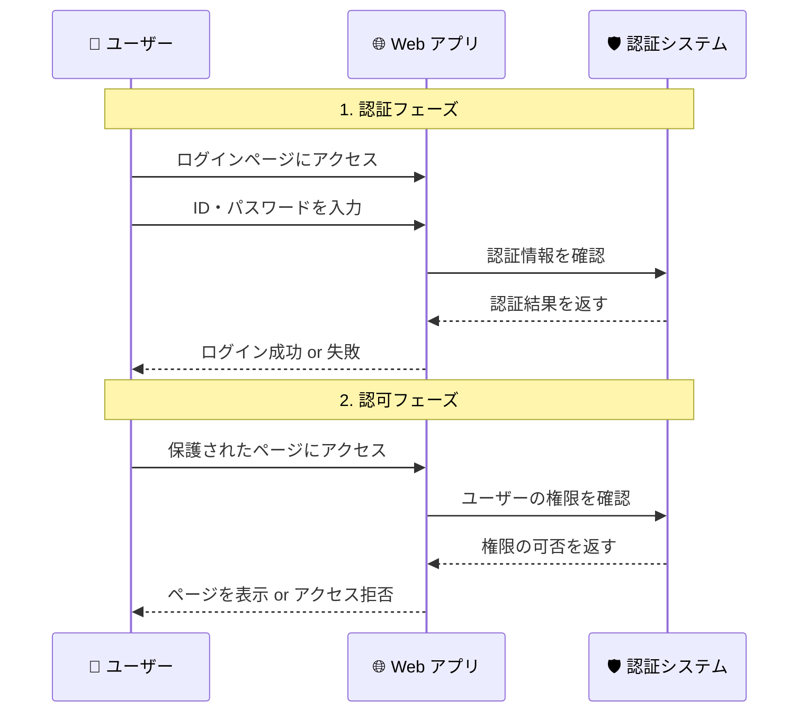

# 認証認可とは何か

## 🎯 学習目標

- 認証認可の基本概念を理解する
- なぜ Web アプリケーションに認証認可が必要なのかを知る
- 身近な例を通じて概念を具体的にイメージできるようになる

## 📖 認証認可とは

### 🔐 認証 (Authentication) とは

**「あなたは本当に、あなたが言う通りの人ですか？」**

これを確認するのが認証です。

#### 日常生活での認証の例

| 場面 | 認証方法 | 確認していること |
|------|----------|------------------|
| 🏧 ATM でお金を引き出す | カード + 暗証番号 | 本当に口座の持ち主か |
| 🏢 会社に入る | 社員証 + 顔写真 | 本当にその会社の社員か |
| 📱 スマホのロック解除 | 指紋・顔認証・パスコード | 本当に端末の持ち主か |
| 🎫 コンサート会場に入る | チケット + 身分証明書 | 本当にチケットの購入者か |

### 🛡️ 認可 (Authorization) とは

**「あなたには、これをする権限がありますか？」**

これを確認するのが認可です。

#### 日常生活での認可の例

| 場面 | 認可の内容 | 誰が決めるか |
|------|------------|--------------|
| 🏧 ATM での操作 | 残高照会はOK、100万円以上の引き出しはNG | 銀行のシステム |
| 🏢 会社での行動 | 自分のデスクはOK、役員会議室はNG | 会社の規則 |
| 📱 スマホのアプリ | 写真アプリはOK、設定変更は追加認証が必要 | 端末の設定 |
| 🎫 コンサート会場 | 指定座席はOK、バックステージはNG | チケットの種類 |

## 🌐 Web アプリケーションでの認証認可

### 🤔 なぜ Web アプリケーションに必要なのか

インターネットは「誰でもアクセスできる公開空間」です。  
だからこそ、**あなた個人の情報を守る**ために認証認可が必要です。

#### 守るべきもの

- **📧 個人情報**: メールアドレス、名前、住所
- **💰 金融情報**: クレジットカード情報、銀行口座
- **📝 プライベートなデータ**: 写真、メッセージ、日記
- **🏢 会社の機密情報**: 顧客データ、財務情報

### 📱 具体例：バケットリストアプリの場合

私たちのバケットリストアプリで考えてみましょう：

#### 🔐 認証が必要な理由

```
❌ 認証なしの場合:
「死ぬまでにやりたいこと」は個人的な内容
→ 誰でも見れてしまったら恥ずかしい
→ 他人に変更されてしまう可能性

✅ 認証ありの場合:
ログインした人だけが自分のリストを見れる
→ プライバシーが守られる
→ 安心して使える
```

#### 🛡️ 認可が必要な理由

```
❌ 認可なしの場合:
ログインできても、他の人のリストも見れてしまう
→ 個人情報の漏洩
→ 意図しない操作による事故

✅ 認可ありの場合:
「自分のリスト」だけ見れる、編集できる
→ 他の人のプライバシーも守られる
→ 安全にアプリを使える
```

## 🔍 Web 認証の基本的な流れ



## 🎯 重要なポイント

### ✅ 覚えておくべきこと

1. **認証は「身元確認」、認可は「権限確認」**
2. **両方とも必要**: 認証だけでも、認可だけでも不十分
3. **ユーザーの安全のため**: 個人情報やプライバシーを守る
4. **信頼関係の構築**: ユーザーが安心してサービスを使える

### ❌ よくある誤解

- 「認証と認可は同じもの」→ **異なる概念です**
- 「ログインできれば何でもできる」→ **権限によって制限されます**
- 「Web だから関係ない」→ **Web こそ重要です**

## 🚀 次のステップ

認証認可の基本概念が理解できたら、次は **[認証と認可の違い](./authentication-vs-authorization.md)** でより詳しく違いを学びましょう。

具体的な例を通じて、この2つの概念をはっきりと区別できるようになります。