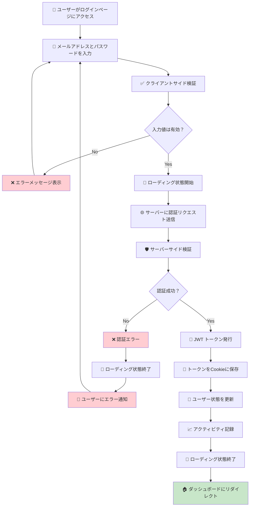
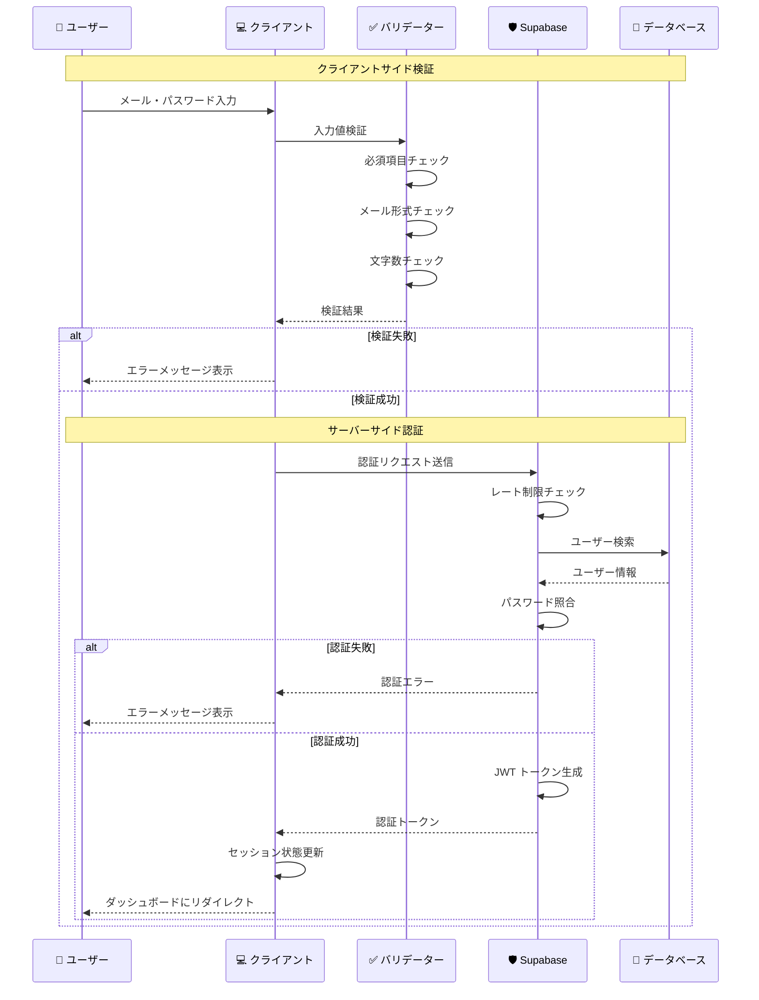

# ログインフロー

## 🎯 学習目標

- ログインの全体的な流れを理解する
- フロントエンドとバックエンドの役割分担を知る
- エラーハンドリングの重要性を学ぶ
- ユーザー体験とセキュリティのバランスを理解する
- バケットリストアプリの実装を詳細に分析する

## 🔄 ログインフローの全体像

### 📊 ログイン処理の段階



## 📱 ユーザー体験の設計

### 🎨 ログインページの構成

バケットリストアプリのログインページを分析してみましょう：

```typescript
// app/routes/auth/login.tsx より
export default function LoginPage() {
  const [email, setEmail] = useState("");
  const [password, setPassword] = useState("");
  const [error, setError] = useState<string | null>(null);
  const [loading, setLoading] = useState(false);
  const { signIn } = useAuth();
  const navigate = useNavigate();

  const handleSubmit = async (e: React.FormEvent) => {
    e.preventDefault();
    setLoading(true);
    setError(null);

    const { error } = await signIn(email, password);

    if (error) {
      setError(error.message);
    } else {
      navigate("/dashboard");
    }

    setLoading(false);
  };

  return (
    <>
      <LoadingOverlay isVisible={loading} message="サインイン中..." />
      <AppLayout>
        <div className="min-h-screen flex items-center justify-center py-12 px-4 sm:px-6 lg:px-8">
          <div className="max-w-md w-full space-y-8">
            <div>
              <h2 className="mt-6 text-center text-3xl font-extrabold text-gray-900">
                サインイン
              </h2>
            </div>
            <form className="mt-8 space-y-6" onSubmit={handleSubmit}>
              <div className="space-y-4">
                <div>
                  <Input
                    id="email"
                    name="email"
                    type="email"
                    autoComplete="email"
                    required
                    placeholder="メールアドレス"
                    value={email}
                    onChange={(e) => setEmail(e.target.value)}
                  />
                </div>
                <div>
                  <Input
                    id="password"
                    name="password"
                    type="password"
                    autoComplete="current-password"
                    required
                    placeholder="パスワード"
                    value={password}
                    onChange={(e) => setPassword(e.target.value)}
                  />
                </div>
              </div>

              {error && (
                <div className="text-red-600 text-sm text-center">{error}</div>
              )}

              <div>
                <Button type="submit" className="w-full" disabled={loading}>
                  {loading ? "サインイン中..." : "サインイン"}
                </Button>
              </div>

              <div className="text-center">
                <Link
                  to="/register"
                  className="text-blue-600 hover:text-blue-500"
                >
                  アカウントをお持ちでない方はこちら
                </Link>
              </div>
            </form>
          </div>
        </div>
      </AppLayout>
    </>
  );
}
```

### 🎯 UX設計のポイント

#### 1. **明確なフィードバック**

```typescript
// ローディング状態の表示
<LoadingOverlay isVisible={loading} message="サインイン中..." />

// ボタンの状態変化
<Button type="submit" className="w-full" disabled={loading}>
  {loading ? "サインイン中..." : "サインイン"}
</Button>
```

#### 2. **親しみやすいエラーメッセージ**

```typescript
// ユーザーフレンドリーなエラー処理
const getErrorMessage = (error: AuthError) => {
  switch (error.code) {
    case 'invalid_credentials':
      return 'メールアドレスまたはパスワードが正しくありません';
    case 'email_not_confirmed':
      return 'メールアドレスの確認が必要です。確認メールをご確認ください';
    case 'too_many_requests':
      return 'ログイン試行回数が上限に達しました。しばらく待ってから再度お試しください';
    default:
      return 'ログインできませんでした。もう一度お試しください';
  }
};
```

#### 3. **アクセシビリティの配慮**

```typescript
// 適切なHTML属性
<Input
  id="email"
  name="email"
  type="email"
  autoComplete="email"    // ブラウザの自動入力を有効化
  required               // HTML5バリデーション
  placeholder="メールアドレス"
  aria-describedby="email-error"  // スクリーンリーダー対応
/>
```

## 🔐 認証処理の詳細実装

### 📝 クライアントサイドの処理

```typescript
// app/features/auth/lib/auth-context.tsx より
const signIn = async (email: string, password: string) => {
  try {
    // 1. 入力検証
    if (!email || !password) {
      return { error: { message: "メールアドレスとパスワードは必須です" } };
    }

    // 2. メールアドレス形式の基本チェック
    const emailRegex = /^[^\s@]+@[^\s@]+\.[^\s@]+$/;
    if (!emailRegex.test(email)) {
      return { error: { message: "メールアドレスの形式が正しくありません" } };
    }

    // 3. Supabase Auth でのログイン処理
    const { error } = await supabase.auth.signInWithPassword({
      email: email.toLowerCase().trim(),
      password,
    });

    if (error) {
      // エラーのみログ出力
      console.error("Sign in failed:", error.message);
    } else {
      // 4. 成功時の処理
      updateActivity();
    }

    return { error };
  } catch (error) {
    console.error("Unexpected sign in error:", error);
    return { error: { message: "予期しないエラーが発生しました" } };
  }
};
```

### 🛡️ セキュリティ検証の段階



## 🍪 セッション初期化フロー

### 📱 認証状態の管理

```typescript
// app/features/auth/lib/auth-context.tsx より
export function AuthProvider({ children }: { children: React.ReactNode }) {
  const [user, setUser] = useState<User | null>(null);
  const [session, setSession] = useState<Session | null>(null);
  const [loading, setLoading] = useState(true);
  const [lastActivity, setLastActivity] = useState<Date>(new Date());

  useEffect(() => {
    // セキュリティ強化：初期セッション取得
    const getInitialSession = async () => {
      try {
        // SSR環境では何もしない
        if (typeof window === "undefined") {
          setLoading(false);
          return;
        }

        const {
          data: { session },
          error,
        } = await supabase.auth.getSession();

        if (error) {
          console.error("Error getting session:", error);
          setLoading(false);
          return;
        }

        // セッション検証
        if (validateSession(session)) {
          setSession(session);
          setUser(session?.user ?? null);
          updateActivity();
        } else {
          // 無効なセッションは削除
          await supabase.auth.signOut();
          setSession(null);
          setUser(null);
        }

        setLoading(false);
      } catch (error) {
        console.error("Unexpected error getting session:", error);
        setLoading(false);
      }
    };

    getInitialSession();

    // セキュリティ強化：認証状態変化の監視
    const {
      data: { subscription },
    } = supabase.auth.onAuthStateChange(async (event, session) => {
      // セッション検証
      if (session && !validateSession(session)) {
        console.warn("Invalid session detected, signing out");
        await supabase.auth.signOut();
        return;
      }

      setSession(session);
      setUser(session?.user ?? null);
      setLoading(false);

      if (session) {
        updateActivity();
      }

      // セキュリティ強化：特定イベントでの追加チェック
      if (event === "TOKEN_REFRESHED" && session) {
        // トークン更新時の検証
        if (!validateSession(session)) {
          console.warn("Token refresh resulted in invalid session");
          await supabase.auth.signOut();
        }
      }
    });

    return () => subscription.unsubscribe();
  }, [validateSession, updateActivity]);
}
```

## 🌐 サーバーサイドレンダリング対応

### 🔄 SSR でのログインフロー

バケットリストアプリでは React Router v7 の SSR に対応しています：

```typescript
// app/lib/auth-server.ts より
export async function getServerAuth(request: Request): Promise<ServerAuthResult> {
  try {
    const cookieHeader = request.headers.get("Cookie") || "";
    const cookies = parseCookies(cookieHeader);

    // Cookie から認証トークンを取得
    const { access_token, refresh_token, expires_at } = extractSupabaseTokens(cookies);

    // アクセストークンがない場合
    if (!access_token) {
      return {
        user: null,
        isAuthenticated: false,
        session: null,
      };
    }

    // トークンの有効期限チェック
    if (isTokenExpired(expires_at)) {
      return {
        user: null,
        isAuthenticated: false,
        session: null,
      };
    }

    // JWT の検証とユーザー情報取得
    const user = await validateJwtToken(access_token);

    if (!user) {
      return {
        user: null,
        isAuthenticated: false,
        session: null,
      };
    }

    // 認証成功
    return {
      user,
      isAuthenticated: true,
      session: {
        access_token,
        refresh_token: refresh_token || "",
        expires_at,
      },
    };
  } catch (error) {
    return {
      user: null,
      isAuthenticated: false,
      session: null,
    };
  }
}
```

### 🔐 保護されたルートでの使用

```typescript
// ダッシュボードのloader例
export async function loader({ request }: Route.LoaderArgs) {
  const authResult = await getServerAuth(request);

  if (!authResult.isAuthenticated) {
    // 未認証の場合はログインページにリダイレクト
    throw new Response(null, {
      status: 302,
      headers: {
        Location: "/login",
      },
    });
  }

  // 認証済みの場合はデータを取得
  const supabase = await createAuthenticatedSupabaseClient(authResult);
  const { data: items } = await supabase
    .from("bucket_items")
    .select("*")
    .eq("user_id", authResult.user.id);

  return {
    dashboardData: { items },
    user: authResult.user
  };
}
```

## ❌ エラーハンドリング戦略

### 🎯 エラーの分類と対応

```typescript
interface LoginError {
  type: 'validation' | 'authentication' | 'network' | 'unknown';
  code?: string;
  message: string;
  action?: 'retry' | 'redirect' | 'contact_support';
}

function handleLoginError(error: any): LoginError {
  // ネットワークエラー
  if (error.name === 'NetworkError' || !navigator.onLine) {
    return {
      type: 'network',
      message: 'インターネット接続を確認してください',
      action: 'retry'
    };
  }

  // Supabase 認証エラー
  if (error.message?.includes('Invalid login credentials')) {
    return {
      type: 'authentication',
      code: 'invalid_credentials',
      message: 'メールアドレスまたはパスワードが正しくありません',
      action: 'retry'
    };
  }

  if (error.message?.includes('Email not confirmed')) {
    return {
      type: 'authentication',
      code: 'email_not_confirmed',
      message: 'メールアドレスの確認が必要です',
      action: 'contact_support'
    };
  }

  // レート制限
  if (error.message?.includes('too_many_requests')) {
    return {
      type: 'authentication',
      code: 'rate_limit',
      message: 'ログイン試行回数が上限に達しました。しばらく待ってから再度お試しください',
      action: 'retry'
    };
  }

  // その他のエラー
  return {
    type: 'unknown',
    message: 'ログインできませんでした。問題が続く場合はサポートにお問い合わせください',
    action: 'contact_support'
  };
}
```

### 🔄 エラー表示のUI

```typescript
function ErrorMessage({ error }: { error: LoginError }) {
  const getErrorIcon = (type: string) => {
    switch (type) {
      case 'network': return '📶';
      case 'authentication': return '🔐';
      case 'validation': return '⚠️';
      default: return '❌';
    }
  };

  const getActionButton = (action?: string) => {
    switch (action) {
      case 'retry':
        return <Button onClick={() => window.location.reload()}>再試行</Button>;
      case 'contact_support':
        return <Link to="/support">サポートに連絡</Link>;
      default:
        return null;
    }
  };

  return (
    <div className="bg-red-50 border border-red-200 rounded-lg p-4">
      <div className="flex items-center">
        <span className="text-2xl mr-2">{getErrorIcon(error.type)}</span>
        <div className="flex-1">
          <p className="text-red-800 font-medium">{error.message}</p>
          {error.action && (
            <div className="mt-2">
              {getActionButton(error.action)}
            </div>
          )}
        </div>
      </div>
    </div>
  );
}
```

## 📊 ログイン分析とモニタリング

### 📈 ログイン成功率の追跡

```typescript
// ログイン試行の記録
interface LoginAttempt {
  timestamp: Date;
  email: string;
  success: boolean;
  errorType?: string;
  userAgent: string;
  ipAddress: string;
}

function trackLoginAttempt(attempt: LoginAttempt) {
  // 本番環境では適切な分析サービスに送信
  if (process.env.NODE_ENV === 'production') {
    analytics.track('login_attempt', {
      success: attempt.success,
      error_type: attempt.errorType,
      timestamp: attempt.timestamp.toISOString()
    });
  }
  
  // 開発環境ではコンソールに出力
  console.log('Login Attempt:', attempt);
}

// 使用例
const handleLogin = async (email: string, password: string) => {
  const startTime = Date.now();
  
  try {
    const result = await signIn(email, password);
    
    trackLoginAttempt({
      timestamp: new Date(),
      email: email,
      success: !result.error,
      errorType: result.error?.code,
      userAgent: navigator.userAgent,
      ipAddress: await getClientIP()
    });
    
    // パフォーマンス計測
    const duration = Date.now() - startTime;
    console.log(`Login took ${duration}ms`);
    
    return result;
  } catch (error) {
    trackLoginAttempt({
      timestamp: new Date(),
      email: email,
      success: false,
      errorType: 'unexpected_error',
      userAgent: navigator.userAgent,
      ipAddress: await getClientIP()
    });
    throw error;
  }
};
```

## 🎯 重要なポイント

### ✅ 実装時のベストプラクティス

1. **段階的な検証**: クライアント → サーバー → データベース
2. **明確なフィードバック**: ローディング状態とエラーメッセージ
3. **セキュリティ優先**: 適切な検証と制限
4. **ユーザビリティ**: 分かりやすいUI/UX
5. **アクセシビリティ**: 全てのユーザーが使える設計

### ❌ よくある実装ミス

```typescript
// ❌ 悪い例
const badLogin = async () => {
  // 検証なし
  const result = await fetch('/api/login', {
    method: 'POST',
    body: JSON.stringify({ email, password }) // 検証なし
  });
  
  // エラーハンドリングなし
  const data = await result.json();
  localStorage.setItem('token', data.token); // セキュリティリスク
  
  // ユーザーフィードバックなし
  window.location.href = '/dashboard';
};

// ✅ 良い例  
const goodLogin = async (email: string, password: string) => {
  try {
    // 1. 入力検証
    if (!validateEmail(email) || !validatePassword(password)) {
      throw new Error('入力値が無効です');
    }
    
    // 2. ローディング状態開始
    setLoading(true);
    setError(null);
    
    // 3. セキュアな認証処理
    const result = await signIn(email, password);
    
    if (result.error) {
      // 4. エラーハンドリング
      setError(getErrorMessage(result.error));
      return;
    }
    
    // 5. 成功時の処理
    navigate('/dashboard');
    
  } catch (error) {
    setError('予期しないエラーが発生しました');
  } finally {
    // 6. ローディング状態終了
    setLoading(false);
  }
};
```

## 🚀 次のステップ

ログインフローの実装について理解できたら、**Level 3: 認可の実装** に進みましょう。

Level 3 では、認証されたユーザーに適切な権限を与える仕組みについて詳しく学習します：

- ロールベースアクセス制御
- ページ・API の保護方法
- 権限システムの設計
- 実際の認可実装

認証（身元確認）ができたので、次は認可（権限管理）を学びましょう！