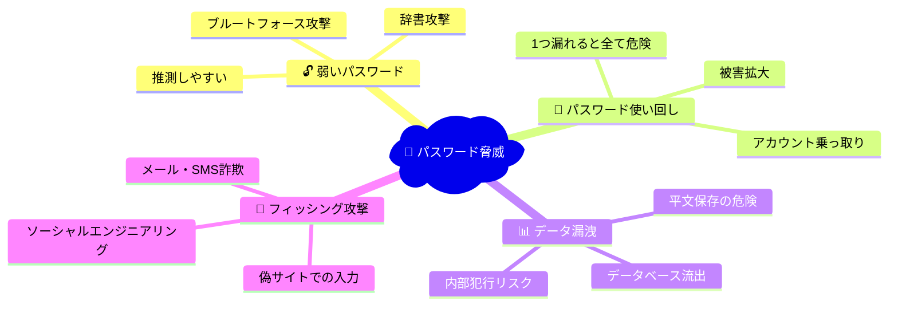
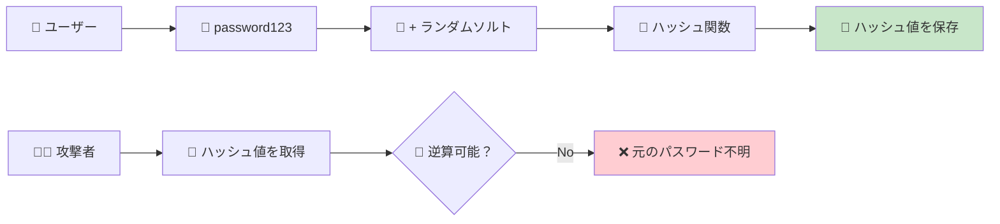
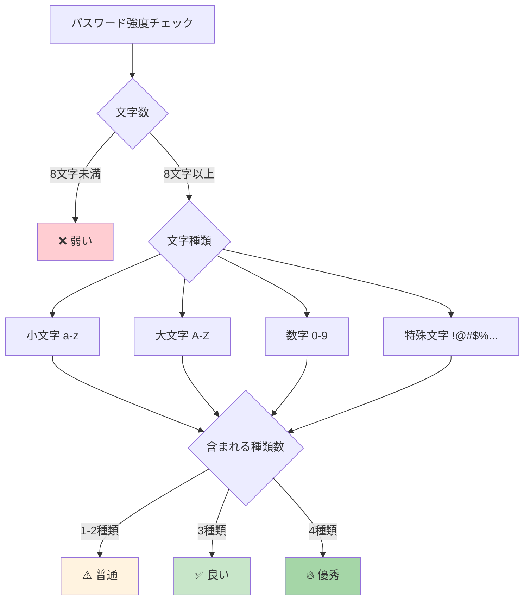
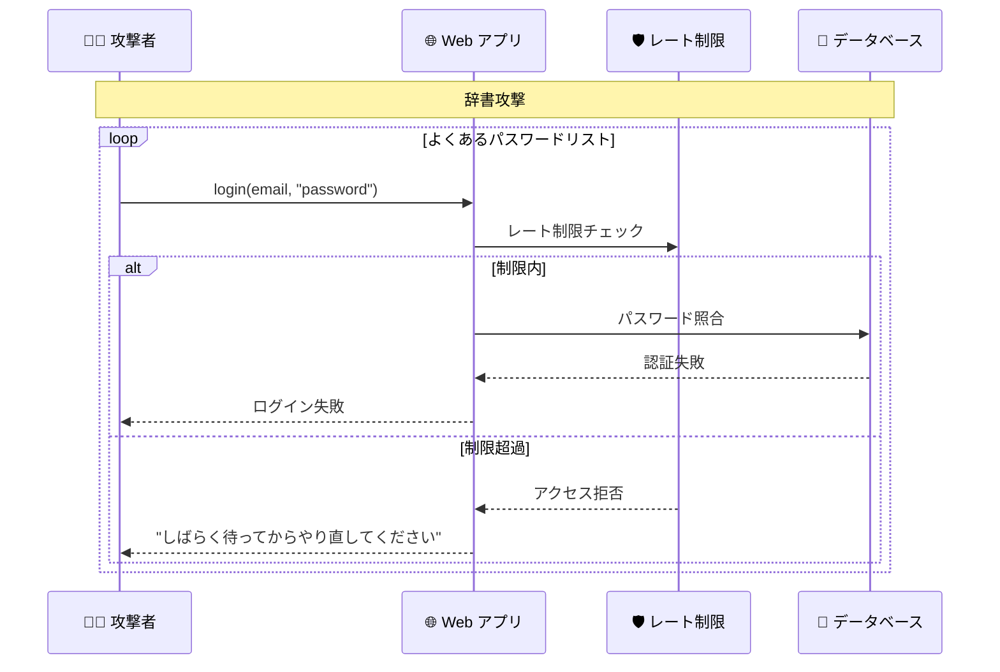
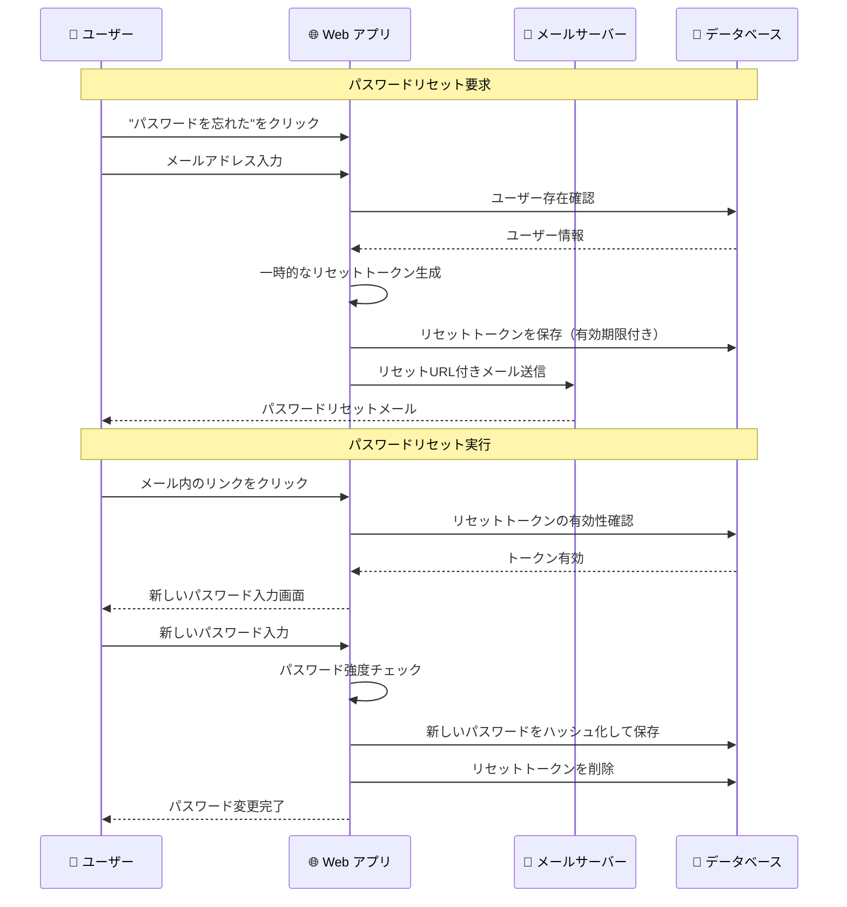

# パスワードセキュリティ

## 🎯 学習目標

- パスワードの安全な取り扱い方法を理解する
- パスワードハッシュ化の仕組みを知る
- 強力なパスワードの条件と検証方法を学ぶ
- ソルトとレインボーテーブル攻撃について理解する
- バケットリストアプリでのパスワード処理を分析する

## 🔐 パスワードセキュリティの重要性

### 😱 パスワード関連の脅威



### 📈 実際の被害統計

- **2023年**: 世界で 33億件のパスワード漏洩
- **最も使われる危険なパスワード**: "123456", "password", "qwerty"
- **パスワード使い回し率**: 約65%のユーザーが同じパスワードを複数サイトで使用

## 🧂 パスワードハッシュ化とソルト

### 🤔 なぜハッシュ化が必要なのか

```typescript
// ❌ 絶対にやってはいけない例
const users = [
  { email: "user1@example.com", password: "password123" },  // 平文保存！
  { email: "user2@example.com", password: "qwerty" }        // 危険！
];

// もしデータベースが漏洩したら...
// → すべてのパスワードが丸見え 😱
```

```typescript
// ✅ 正しい例: ハッシュ化して保存
const users = [
  { 
    email: "user1@example.com", 
    password_hash: "$2b$10$rO0H0.7.6.4.2.8.Kk.vwOe7G4.8.Y.2.6.4.K"  // ハッシュ化済み
  },
  { 
    email: "user2@example.com", 
    password_hash: "$2b$10$aB1H9.3.7.2.9.1.Jm.xQr8F2.1.9.7.3.2.L"  // ハッシュ化済み
  }
];

// データベースが漏洩しても...
// → ハッシュからもとのパスワードを復元することは困難 ✅
```

### 🔄 ハッシュ化の流れ



### 🧂 ソルト（Salt）の重要性

#### ソルトなしの場合（危険）

```typescript
// ❌ ソルトなしハッシュ化
const password1 = "password123";
const password2 = "password123";

const hash1 = sha256(password1); // → a1b2c3d4e5f6...
const hash2 = sha256(password2); // → a1b2c3d4e5f6... (同じハッシュ！)

// 問題:
// 1. 同じパスワードは同じハッシュになる
// 2. レインボーテーブル攻撃が可能
// 3. パターン分析で推測される
```

#### ソルトありの場合（安全）

```typescript
// ✅ ソルト付きハッシュ化
const password1 = "password123";
const password2 = "password123";
const salt1 = generateRandomSalt(); // → "x9k2m5p8"
const salt2 = generateRandomSalt(); // → "f4j7q1n3"

const hash1 = bcrypt(password1 + salt1); // → $2b$10$x9k2m5p8...
const hash2 = bcrypt(password2 + salt2); // → $2b$10$f4j7q1n3... (異なるハッシュ！)

// 利点:
// 1. 同じパスワードでも異なるハッシュ
// 2. レインボーテーブル攻撃を無効化
// 3. 辞書攻撃の効率を大幅に下げる
```

## 🔍 バケットリストアプリでのパスワード処理

### Supabase でのパスワード管理

私たちのプロジェクトでは **Supabase** がパスワード処理を担当しています：

```typescript
// app/features/auth/lib/auth-context.tsx より
const signUp = async (email: string, password: string) => {
  try {
    // 入力検証
    if (!email || !password) {
      return { error: { message: "メールアドレスとパスワードは必須です" } };
    }

    // パスワード強度チェック
    if (password.length < 8) {
      return {
        error: { message: "パスワードは8文字以上である必要があります" },
      };
    }

    // Supabase に登録（Supabase がハッシュ化を処理）
    const { error } = await supabase.auth.signUp({
      email: email.toLowerCase().trim(),
      password,
    });

    if (error) {
      console.error("Sign up failed:", error.message);
    }

    return { error };
  } catch (error) {
    console.error("Unexpected sign up error:", error);
    return { error: { message: "予期しないエラーが発生しました" } };
  }
};
```

### 🛡️ クライアントサイドでの追加検証

```typescript
// app/lib/security-utils.ts より
export const validators = {
  password: (
    password: string,
  ): { valid: boolean; score: number; feedback: string[] } => {
    const feedback: string[] = [];
    let score = 0;

    if (password.length >= 8) score += 1;
    else feedback.push("8文字以上である必要があります");

    if (/[a-z]/.test(password)) score += 1;
    else feedback.push("小文字を含める必要があります");

    if (/[A-Z]/.test(password)) score += 1;
    else feedback.push("大文字を含める必要があります");

    if (/\d/.test(password)) score += 1;
    else feedback.push("数字を含める必要があります");

    if (/[!@#$%^&*(),.?":{}|<>]/.test(password)) score += 1;
    else feedback.push("特殊文字を含めることを推奨します");

    return {
      valid: score >= 3,
      score,
      feedback,
    };
  },
};
```

## 💪 強力なパスワードの条件

### 📏 パスワード強度の基準



### 🎯 パスワード強度スコア

```typescript
// パスワード強度を数値で評価
function calculatePasswordStrength(password: string): {
  score: number;
  level: string;
  suggestions: string[];
} {
  let score = 0;
  const suggestions: string[] = [];

  // 長さによる得点
  if (password.length >= 8) score += 2;
  else if (password.length >= 6) score += 1;
  else suggestions.push("もっと長いパスワードにしてください");

  // 文字種類による得点
  if (/[a-z]/.test(password)) score += 1;
  else suggestions.push("小文字を含めてください");

  if (/[A-Z]/.test(password)) score += 1;
  else suggestions.push("大文字を含めてください");

  if (/\d/.test(password)) score += 1;
  else suggestions.push("数字を含めてください");

  if (/[!@#$%^&*(),.?":{}|<>]/.test(password)) score += 1;
  else suggestions.push("特殊文字を含めることを推奨します");

  // 複雑性による得点
  if (password.length >= 12) score += 1;
  if (/(?=.*[a-z])(?=.*[A-Z])(?=.*\d)(?=.*[!@#$%^&*])/.test(password)) score += 1;

  // レベル判定
  let level: string;
  if (score >= 7) level = "非常に強い";
  else if (score >= 5) level = "強い";
  else if (score >= 3) level = "普通";
  else level = "弱い";

  return { score, level, suggestions };
}

// 使用例
const result = calculatePasswordStrength("MySecure123!");
console.log(result);
// {
//   score: 6,
//   level: "強い",
//   suggestions: ["特殊文字を含めることを推奨します"]
// }
```

## 🚫 よくあるパスワードの問題

### ❌ 避けるべきパスワードパターン

```typescript
const commonBadPasswords = [
  // 単純すぎる
  "123456", "password", "qwerty", "abc123",
  
  // 個人情報ベース
  "tanaka1980", "tokyo123", "birthday",
  
  // キーボードパターン
  "asdfgh", "123qwe", "qwerty123",
  
  // 辞書にある単語
  "welcome", "admin", "user", "guest"
];

function isCommonPassword(password: string): boolean {
  return commonBadPasswords.includes(password.toLowerCase());
}
```

### 🔍 パスワード推測攻撃の例



## 🛡️ パスワード攻撃対策

### 1. レート制限の実装

```typescript
// app/lib/security-utils.ts より
class RateLimit {
  private attempts: Map<string, number[]> = new Map();
  private maxAttempts: number;
  private windowMs: number;

  constructor(maxAttempts: number = 5, windowMs: number = 15 * 60 * 1000) {
    this.maxAttempts = maxAttempts;
    this.windowMs = windowMs;
  }

  isAllowed(key: string): boolean {
    const now = Date.now();
    const attempts = this.attempts.get(key) || [];

    // 古い試行を削除
    const recentAttempts = attempts.filter(
      (time) => now - time < this.windowMs,
    );

    if (recentAttempts.length >= this.maxAttempts) {
      return false;
    }

    recentAttempts.push(now);
    this.attempts.set(key, recentAttempts);

    return true;
  }

  getRemainingTime(key: string): number {
    const attempts = this.attempts.get(key) || [];
    if (attempts.length === 0) return 0;

    const oldestAttempt = Math.min(...attempts);
    const timeToReset = this.windowMs - (Date.now() - oldestAttempt);

    return Math.max(0, timeToReset);
  }
}

// グローバルレート制限インスタンス
export const authRateLimit = new RateLimit(5, 15 * 60 * 1000); // 15分間で5回まで
```

### 2. アカウントロックアウト

```typescript
// ログイン失敗時の処理
async function handleLoginAttempt(email: string, password: string) {
  const clientIP = getClientIP();
  const identifier = `${email}:${clientIP}`;

  // レート制限チェック
  if (!authRateLimit.isAllowed(identifier)) {
    const remainingTime = authRateLimit.getRemainingTime(identifier);
    return {
      error: {
        message: `ログイン試行回数が上限に達しました。${Math.ceil(remainingTime / 1000)}秒後に再試行してください。`
      }
    };
  }

  // 認証処理
  const result = await supabase.auth.signInWithPassword({ email, password });
  
  if (result.error) {
    // 失敗をログに記録
    console.warn(`Login failed for ${email} from ${clientIP}`);
  }

  return result;
}
```

### 3. パスワード強度の可視化

```typescript
// リアルタイムパスワード強度表示
function PasswordStrengthIndicator({ password }: { password: string }) {
  const strength = calculatePasswordStrength(password);
  
  const getColor = (level: string) => {
    switch (level) {
      case "非常に強い": return "bg-green-500";
      case "強い": return "bg-blue-500";
      case "普通": return "bg-yellow-500";
      case "弱い": return "bg-red-500";
      default: return "bg-gray-300";
    }
  };

  return (
    <div className="mt-2">
      <div className="flex items-center space-x-2">
        <div className="flex-1 bg-gray-200 rounded-full h-2">
          <div 
            className={`h-2 rounded-full transition-all duration-300 ${getColor(strength.level)}`}
            style={{ width: `${(strength.score / 8) * 100}%` }}
          />
        </div>
        <span className="text-sm font-medium">{strength.level}</span>
      </div>
      
      {strength.suggestions.length > 0 && (
        <ul className="mt-1 text-xs text-gray-600">
          {strength.suggestions.map((suggestion, index) => (
            <li key={index}>• {suggestion}</li>
          ))}
        </ul>
      )}
    </div>
  );
}
```

## 🔄 パスワードリセット機能

### 安全なパスワードリセットフロー



### リセット機能の実装例

```typescript
// パスワードリセット要求
const requestPasswordReset = async (email: string) => {
  try {
    // メールアドレス検証
    const sanitizedEmail = sanitizeString(email);
    if (!validateEmail(sanitizedEmail)) {
      return { error: '有効なメールアドレスを入力してください' };
    }

    // Supabase でパスワードリセットメール送信
    const { data, error } = await supabase.auth.resetPasswordForEmail(sanitizedEmail, {
      redirectTo: `${window.location.origin}/auth/reset-password`
    });

    if (error) {
      return { error: error.message };
    }

    return { 
      data, 
      error: null,
      message: 'パスワードリセット用のメールを送信しました。メールをご確認ください。'
    };
  } catch (error) {
    return { error: 'パスワードリセット中にエラーが発生しました' };
  }
};
```

## 🎯 重要なポイント

### ✅ 覚えておくべきこと

1. **パスワードは絶対に平文保存しない**: 必ずハッシュ化して保存
2. **ソルトは必須**: レインボーテーブル攻撃を防ぐため
3. **強力なパスワードを推奨**: 長さ + 複数の文字種類
4. **レート制限は必須**: ブルートフォース攻撃対策
5. **パスワードリセット機能**: 安全な実装が重要

### ❌ 絶対にやってはいけないこと

```typescript
// ❌ 危険な例
const badExamples = {
  // 平文保存
  password: "user_password_123",
  
  // 単純なハッシュ（ソルトなし）
  passwordHash: md5("user_password_123"),
  
  // パスワードをログに出力
  console.log("User password:", password),
  
  // パスワードをURLに含める
  url: "/reset?password=newpassword123",
  
  // パスワードをJavaScriptで平文処理
  localStorage.setItem("password", password)
};
```

### 🛡️ セキュリティのベストプラクティス

1. **bcrypt や Argon2 などの強力なハッシュ関数を使用**
2. **適切なソルト長（最低16バイト）**
3. **適切なハッシュ計算コスト（bcrypt の場合は10-12）**
4. **パスワード履歴の管理（過去のパスワードの再利用防止）**
5. **定期的なセキュリティ監査**

## 🚀 次のステップ

パスワードセキュリティについて理解できたら、次は **[ログインフロー](./login-flow.md)** で、認証処理の全体的な流れを学びましょう。

実際のユーザー体験から技術的な実装まで、ログインの仕組みを包括的に理解できます。