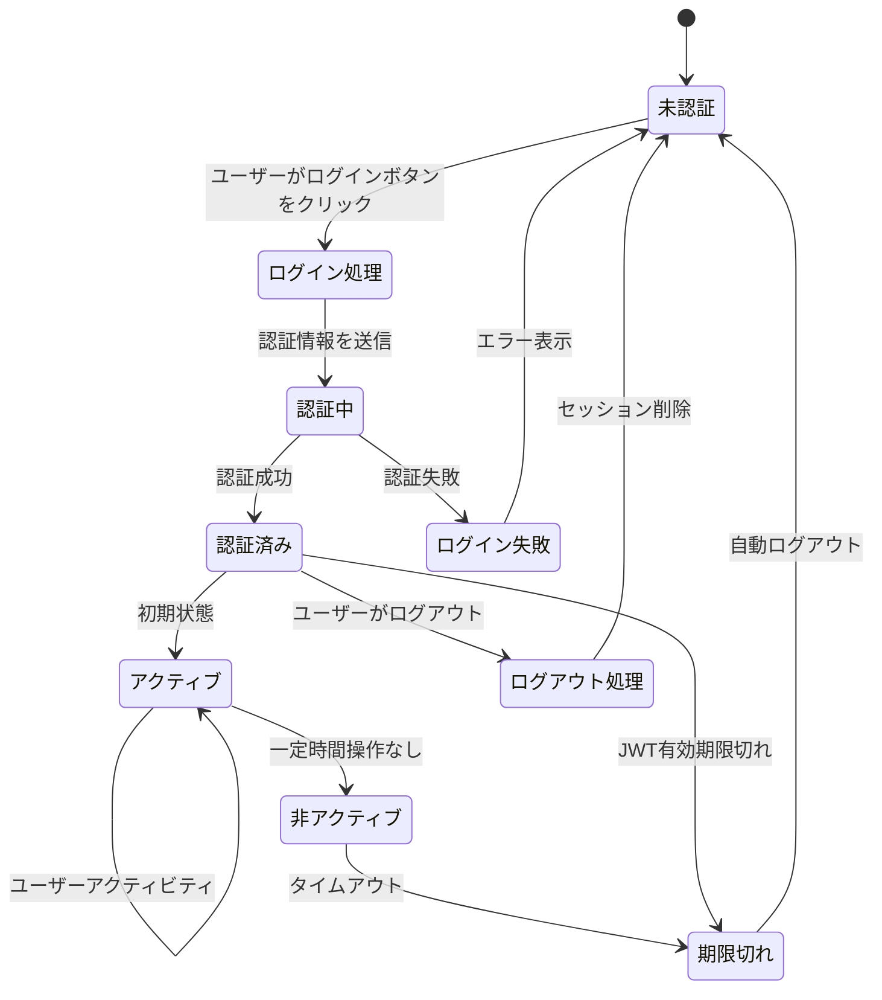
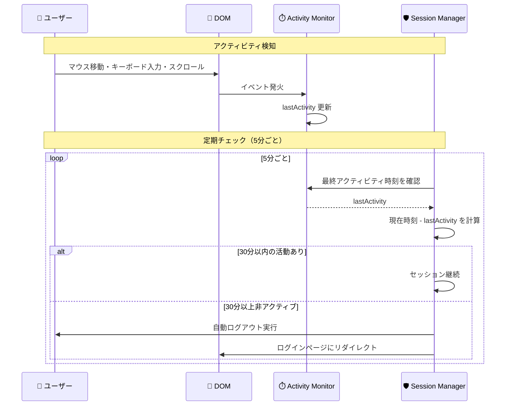
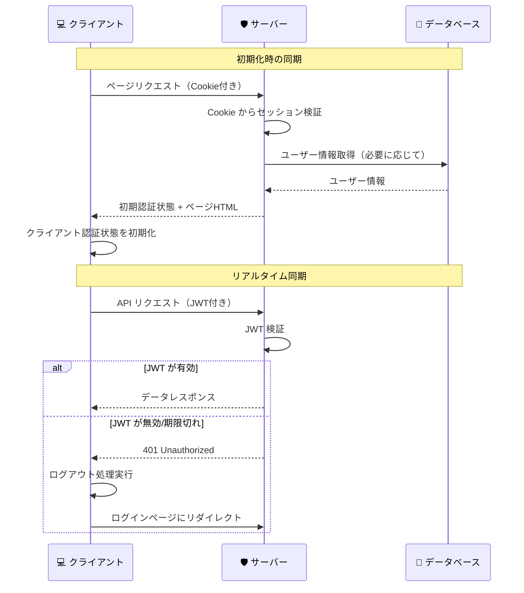

# セッション管理

## 🎯 学習目標

- セッション管理の基本概念を理解する
- Cookie とローカルストレージの違いと使い分けを知る
- セッションの安全な管理方法を学ぶ
- アクティビティ監視とタイムアウト機能を理解する
- バケットリストアプリでの実装を詳しく分析する

## 📝 セッション管理とは

### 🤔 セッションが必要な理由

HTTP は **ステートレス** なプロトコルです：

```
HTTP の特徴:
👤 ユーザー: 「ログインします」
🌐 サーバー: 「OK、認証しました」

（次のリクエスト）
👤 ユーザー: 「データを取得したいです」
🌐 サーバー: 「あなた誰ですか？」（前のやり取りを覚えていない）
```

**セッション管理** により、この問題を解決します：

```
セッション管理あり:
👤 ユーザー: 「ログインします」
🌐 サーバー: 「OK、このトークンを持っていてください 🎫」

（次のリクエスト）
👤 ユーザー: 「データを取得したいです（トークン 🎫 を提示）」
🌐 サーバー: 「トークンを確認... あなたは認証済みユーザーですね！」
```

## 🍪 データの保存場所

### 比較表

| 保存場所 | セキュリティ | 期限 | JavaScript からのアクセス | 使用例 |
|----------|--------------|------|---------------------------|--------|
| **Cookie** | ⭐⭐⭐⭐ | 設定可能 | HttpOnly なら不可 | 認証トークン |
| **localStorage** | ⭐⭐ | 永続的 | 可能 | ユーザー設定 |
| **sessionStorage** | ⭐⭐ | タブを閉じるまで | 可能 | 一時的なデータ |
| **メモリ** | ⭐⭐⭐⭐⭐ | ページリロードまで | 可能 | セッション状態 |

### 🍪 Cookie の詳細

#### Cookie の属性

```typescript
// セキュアな Cookie の設定例
document.cookie = [
  `${name}=${value}`,
  'HttpOnly',           // XSS攻撃対策: JavaScriptからアクセス不可
  'Secure',             // HTTPS必須
  'SameSite=Strict',    // CSRF攻撃対策
  'Path=/',             // サイト全体で有効
  `Max-Age=${86400}`    // 24時間で期限切れ
].join('; ');
```

#### バケットリストアプリでの Cookie 使用

```typescript
// app/features/auth/lib/auth-context.tsx より
const signOut = async () => {
  try {
    await supabase.auth.signOut();

    // セキュリティ強化：セッション情報の完全クリア
    if (typeof window !== "undefined") {
      try {
        // 🔐 Cookie削除（Supabase認証情報）
        document.cookie.split(";").forEach((cookie) => {
          const [name] = cookie.split("=");
          if (name.trim().includes("supabase")) {
            document.cookie = `${name.trim()}=; Path=/; Expires=Thu, 01 Jan 1970 00:00:01 GMT; SameSite=strict`;
          }
        });

        // 🛡️ localStorage のフォールバック削除（既存データ対応）
        Object.keys(localStorage).forEach((key) => {
          if (key.includes("supabase")) {
            localStorage.removeItem(key);
          }
        });
      } catch (error) {
        console.warn("Failed to clear session data:", error);
      }
    }
  } catch (error) {
    console.error("Unexpected sign out error:", error);
  }
};
```

## 🔄 セッションライフサイクル



## 🕐 アクティビティ監視とタイムアウト

### 📊 アクティビティ監視の実装

バケットリストアプリでは、ユーザーの操作を監視してセッションの有効性を管理しています：

```typescript
// app/features/auth/lib/auth-context.tsx より
export function AuthProvider({ children }: { children: React.ReactNode }) {
  const [lastActivity, setLastActivity] = useState<Date>(new Date());

  // セキュリティ強化：アクティビティ追跡
  const updateActivity = useCallback(() => {
    setLastActivity(new Date());
  }, []);

  // セキュリティ強化：非アクティブ時のセッション管理
  useEffect(() => {
    if (!session || typeof window === "undefined") return;

    const checkInactivity = () => {
      const now = new Date();
      const timeSinceLastActivity = now.getTime() - lastActivity.getTime();
      const maxInactivity = 30 * 60 * 1000; // 30分

      if (timeSinceLastActivity > maxInactivity) {
        signOut();
      }
    };

    // アクティビティ監視
    const activityEvents = [
      "mousedown",
      "mousemove", 
      "keypress",
      "scroll",
      "touchstart",
    ];

    const handleActivity = () => {
      updateActivity();
    };

    activityEvents.forEach((event) => {
      document.addEventListener(event, handleActivity, { passive: true });
    });

    // 5分ごとにアクティビティチェック
    const inactivityCheck = setInterval(checkInactivity, 5 * 60 * 1000);

    return () => {
      activityEvents.forEach((event) => {
        document.removeEventListener(event, handleActivity);
      });
      clearInterval(inactivityCheck);
    };
  }, [session, lastActivity, updateActivity]);
}
```

### 🔍 アクティビティ監視の流れ



## 🔐 セッション検証

### JWT セッションの検証

```typescript
// app/features/auth/lib/auth-context.tsx より
// セキュリティ強化：セッション検証
const validateSession = useCallback((session: Session | null): boolean => {
  if (!session) return false;

  // JWTの有効期限チェック
  const now = Math.floor(Date.now() / 1000);
  if (session.expires_at && session.expires_at < now) {
    console.warn("Session expired");
    return false;
  }

  // ユーザー情報の整合性チェック
  if (!session.user || !session.user.id || !session.user.email) {
    console.warn("Invalid user data in session");
    return false;
  }

  return true;
}, []);
```

### 🕐 定期的なセッション検証

```typescript
// セキュリティ強化：認証状態変化の監視
const {
  data: { subscription },
} = supabase.auth.onAuthStateChange(async (event, session) => {
  // セッション検証
  if (session && !validateSession(session)) {
    console.warn("Invalid session detected, signing out");
    await supabase.auth.signOut();
    return;
  }

  setSession(session);
  setUser(session?.user ?? null);
  setLoading(false);

  if (session) {
    updateActivity();
  }

  // セキュリティ強化：特定イベントでの追加チェック
  if (event === "TOKEN_REFRESHED" && session) {
    // トークン更新時の検証
    if (!validateSession(session)) {
      console.warn("Token refresh resulted in invalid session");
      await supabase.auth.signOut();
    }
  }
});
```

## 🌐 サーバーサイドセッション管理

### SSR でのセッション検証

```typescript
// app/lib/auth-server.ts より
export async function getServerAuth(request: Request): Promise<ServerAuthResult> {
  try {
    const cookieHeader = request.headers.get("Cookie") || "";
    const cookies = parseCookies(cookieHeader);

    // Extract Supabase tokens from cookies
    const { access_token, refresh_token, expires_at } = extractSupabaseTokens(cookies);

    // If no access token found, user is not authenticated
    if (!access_token) {
      return {
        user: null,
        isAuthenticated: false,
        session: null,
      };
    }

    // Check if token is expired
    if (isTokenExpired(expires_at)) {
      return {
        user: null,
        isAuthenticated: false,
        session: null,
      };
    }

    // Validate the JWT token and get user
    const user = await validateJwtToken(access_token);

    if (!user) {
      return {
        user: null,
        isAuthenticated: false,
        session: null,
      };
    }

    // Return successful authentication result
    return {
      user,
      isAuthenticated: true,
      session: {
        access_token,
        refresh_token: refresh_token || "",
        expires_at,
      },
    };
  } catch (error) {
    return {
      user: null,
      isAuthenticated: false,
      session: null,
    };
  }
}
```

### 🔍 Cookie 解析の詳細

```typescript
// app/lib/auth-server.ts より
function extractSupabaseTokens(cookies: Record<string, string>): {
  access_token: string | null;
  refresh_token: string | null;
  expires_at: number | null;
} {
  let access_token: string | null = null;
  let refresh_token: string | null = null;
  let expires_at: number | null = null;

  // Look for Supabase session data in cookies
  for (const [key, value] of Object.entries(cookies)) {
    if (key.includes("supabase") || key.startsWith("sb-")) {
      try {
        // Try to parse as JSON (Supabase stores session as JSON in cookies)
        const parsed = JSON.parse(value);

        if (parsed.access_token) {
          access_token = parsed.access_token;
        }
        if (parsed.refresh_token) {
          refresh_token = parsed.refresh_token;
        }
        if (parsed.expires_at) {
          expires_at = parsed.expires_at;
        }

        // If we found session data, break
        if (access_token && refresh_token) {
          break;
        }
      } catch {
        // If not JSON, check if it's a direct token
        if (value.length > 20 && (value.includes(".") || value.startsWith("ey"))) {
          // Looks like a JWT token
          if (key.includes("access") || key.includes("token")) {
            access_token = value;
          } else if (key.includes("refresh")) {
            refresh_token = value;
          }
        }
      }
    }
  }

  return { access_token, refresh_token, expires_at };
}
```

## 🚀 パフォーマンス最適化

### キャッシュ戦略

```typescript
// セッション状態のメモ化
const memoizedAuth = useMemo(() => ({
  user,
  session,
  loading,
  isAuthenticated: !!user,
}), [user, session, loading]);

// 認証チェックの最適化
const debouncedValidateSession = useCallback(
  debounce((session: Session | null) => {
    if (session) {
      validateSession(session);
    }
  }, 1000),
  [validateSession]
);
```

### 🎯 認証状態の一元管理

```typescript
// app/features/auth/lib/auth-context.tsx より
const value = {
  user,
  session,
  loading,
  signIn,
  signUp,
  signOut,
};

return <AuthContext.Provider value={value}>{children}</AuthContext.Provider>;
```

## 🔄 セッション同期

### クライアント・サーバー間での状態同期



## 🛡️ セキュリティ対策

### 1. セッション固定攻撃対策

```typescript
// ログイン成功後にセッションIDを再生成
const handleSuccessfulLogin = async (session: Session) => {
  // 古いセッション情報をクリア
  clearOldSession();
  
  // 新しいセッション情報を設定
  setSession(session);
  setUser(session.user);
  
  // アクティビティ記録
  updateActivity();
};
```

### 2. セッションハイジャック対策

```typescript
// ユーザーエージェントとIPアドレスの監視
const validateSessionIntegrity = (session: Session) => {
  const storedUserAgent = localStorage.getItem('session.userAgent');
  const currentUserAgent = navigator.userAgent;
  
  if (storedUserAgent && storedUserAgent !== currentUserAgent) {
    console.warn('User agent changed, possible session hijacking');
    return false;
  }
  
  return true;
};
```

### 3. 同時セッション制限

```typescript
// 複数タブでの同時ログイン検知
useEffect(() => {
  const handleStorageChange = (e: StorageEvent) => {
    if (e.key === 'supabase.auth.token') {
      if (e.newValue === null) {
        // 他のタブでログアウトされた
        signOut();
      } else if (e.newValue !== e.oldValue) {
        // 他のタブで新しいログインが発生
        location.reload();
      }
    }
  };

  window.addEventListener('storage', handleStorageChange);
  return () => window.removeEventListener('storage', handleStorageChange);
}, []);
```

## 📊 セッション監視とデバッグ

### デバッグ用のセッション情報表示

```typescript
// 開発環境でのセッションデバッガー
export function SessionDebugger() {
  const { user, session, loading } = useAuth();

  if (process.env.NODE_ENV !== 'development') return null;

  return (
    <div className="fixed bottom-4 right-4 bg-black text-white p-4 rounded text-xs max-w-sm">
      <h3 className="font-bold mb-2">Session Debug Info</h3>
      <div>Loading: {loading.toString()}</div>
      <div>User: {user?.email || 'none'}</div>
      <div>Session: {session ? 'active' : 'none'}</div>
      <div>Expires: {session?.expires_at ? new Date(session.expires_at * 1000).toLocaleString() : 'none'}</div>
      <div>Last Activity: {new Date().toLocaleString()}</div>
    </div>
  );
}
```

## 🎯 重要なポイント

### ✅ 覚えておくべきこと

1. **セッションは一時的**: 適切な期限設定が重要
2. **セキュリティとユーザビリティのバランス**: 長すぎず短すぎない期限
3. **複数の検証レイヤー**: JWT期限 + アクティビティ監視 + 整合性チェック
4. **クライアント・サーバー同期**: 両方で一貫した認証状態を維持

### ❌ よくある間違い

```typescript
// ❌ 悪い例: セッション情報を信用しすぎ
function getUserData() {
  const user = localStorage.getItem('user');
  return JSON.parse(user); // 検証なしで使用
}

// ✅ 良い例: 常に検証してから使用
function getUserData() {
  const { user, session } = useAuth();
  
  if (!session || !validateSession(session)) {
    signOut();
    return null;
  }
  
  return user;
}
```

## 🚀 次のステップ

セッション管理の仕組みが理解できたら、次は **[パスワードセキュリティ](./password-security.md)** で、パスワードの安全な取り扱いについて学びましょう。

パスワードのハッシュ化、強度チェック、安全な保存方法などを具体的に学習します。