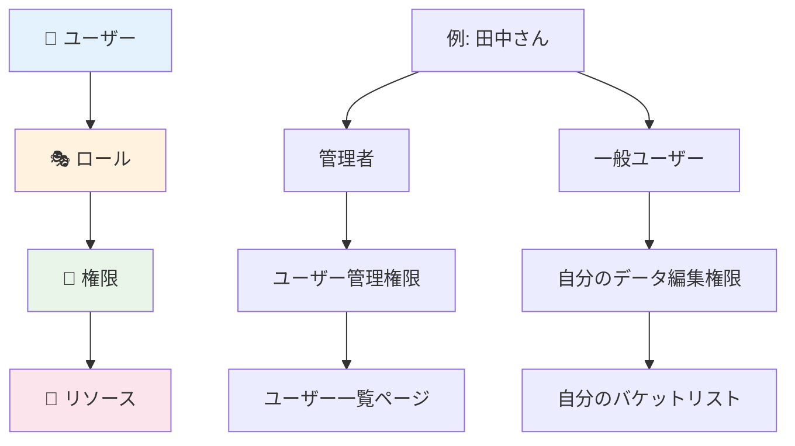

# Level 3: 認可の実装

## 🎯 このレベルの学習目標

- 認可（Authorization）の仕組みを詳しく理解する
- ロールベースアクセス制御（RBAC）を学ぶ
- ページとAPIの保護方法を知る
- 権限システムの設計原則を理解する
- バケットリストアプリでの認可実装を分析する

## 📚 学習内容

### 📖 推奨学習順序

1. **[ロールベースアクセス制御](./role-based-access.md)** - 権限システムの基本
2. **[ルート保護](./route-protection.md)** - ページレベルでのアクセス制御
3. **[権限システム設計](./permission-systems.md)** - スケーラブルな権限管理

## ⏱️ 想定学習時間

**初心者の方**: 2-3時間  
**経験者の方**: 1-2時間（復習として）

## 🔍 学習のポイント

### 重要な概念

- **ロール（Role）**: ユーザーの役割（管理者、一般ユーザーなど）
- **権限（Permission）**: 具体的な操作権限（読み取り、書き込み、削除など）
- **リソース（Resource）**: 保護対象（ページ、データ、機能など）
- **アクセス制御**: 「誰が」「何に」「どんな操作が」できるかの管理

### 認証と認可の違い（復習）

```
🔐 認証 (Authentication): 「あなたは誰ですか？」
   → ログイン処理、身元確認

🛡️ 認可 (Authorization): 「あなたに何の権限がありますか？」
   → アクセス許可、操作権限の確認
```

## 🏗️ 権限システムの階層



## 🎯 バケットリストアプリでの認可

### 📊 現在の権限設計

私たちのプロジェクトでの認可ルールを確認してみましょう：

```
📋 バケットリストアプリの権限
├── 🌐 パブリック（認証不要）
│   ├── ランディングページ
│   ├── ログイン・登録ページ
│   └── 公開されたバケットリスト
├── 🔐 認証済みユーザー
│   ├── ダッシュボード
│   ├── 自分のバケットリスト CRUD
│   ├── 自分のプロフィール編集
│   └── 公開設定の変更
└── 🚫 制限事項
    ├── 他人のプライベートリストは見れない
    ├── 他人のデータは編集できない
    └── 管理者機能は存在しない（シンプル設計）
```

### 🛡️ 実装されている保護機能

```typescript
// 例: 自分のデータのみアクセス可能
const bucketItems = await supabase
  .from("bucket_items")
  .select("*")
  .eq("user_id", authResult.user.id);  // 重要: 自分のIDでフィルタ
```

## 🎓 このレベルを完了すると

- ロールベースアクセス制御の設計ができる
- ページレベルとAPIレベルでの保護方法を理解している
- 自分のアプリケーションに適した権限システムを設計できる
- セキュリティホールを避ける実装ができる
- バケットリストアプリの認可実装を詳細に説明できる

## 📋 学習チェックリスト

学習が完了したら、以下を確認してみてください：

- [ ] ロールと権限の違いを説明できる
- [ ] ページ保護の実装方法を理解している
- [ ] API レベルでのアクセス制御ができる
- [ ] フロントエンドとバックエンド両方で認可チェックの重要性を理解している
- [ ] 権限エスカレーション攻撃について知っている
- [ ] 最小権限の原則を理解している

## 🚀 次のステップ

Level 3 を完了したら、**Level 4: セキュリティ対策** に進みましょう。

Level 4 では、実際の攻撃手法とその対策について詳しく学習します。