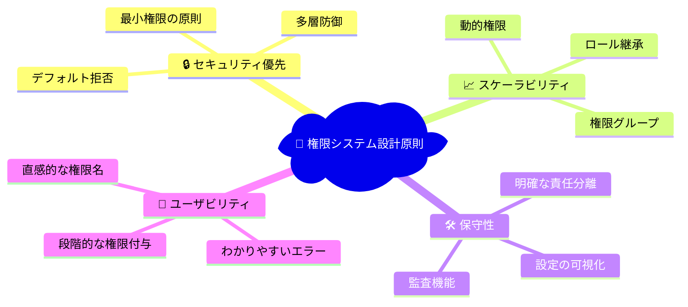

# 権限システム設計

## 🎯 学習目標

- スケーラブルな権限システムの設計原則を理解する
- 動的権限と静的権限の使い分けを学ぶ
- 権限の継承と委譲の仕組みを知る
- 実際のプロダクションレベルでの権限設計を理解する
- 権限システムの運用とメンテナンスを学ぶ

## 🏗️ 権限システムの設計原則

### 📐 基本的な設計原則



### 🎭 権限モデルの種類

#### 1. **フラットモデル（シンプル）**

```typescript
// バケットリストアプリのような小規模アプリ向け
interface SimplePermission {
  userId: string;
  resource: string;  // "bucket_items", "profile"
  actions: string[]; // ["read", "write", "delete"]
}

const userPermissions = [
  {
    userId: "user123",
    resource: "bucket_items",
    actions: ["read", "write", "delete"]
  },
  {
    userId: "user123", 
    resource: "profile",
    actions: ["read", "write"]
  }
];
```

#### 2. **階層モデル（中規模）**

```typescript
// 部署やチーム構造がある組織向け
interface HierarchicalRole {
  id: string;
  name: string;
  level: number;
  parentRole?: string;
  permissions: Permission[];
}

const roleHierarchy = [
  {
    id: "ceo",
    name: "CEO",
    level: 100,
    permissions: ["*"] // 全権限
  },
  {
    id: "director",
    name: "取締役",
    level: 80,
    parentRole: "ceo",
    permissions: ["department:*", "financial:read"]
  },
  {
    id: "manager",
    name: "部長",
    level: 60, 
    parentRole: "director",
    permissions: ["team:*", "budget:read"]
  },
  {
    id: "employee",
    name: "一般社員",
    level: 20,
    parentRole: "manager", 
    permissions: ["profile:*", "task:*"]
  }
];
```

#### 3. **ABAC モデル（大規模・複雑）**

```typescript
// Attribute-Based Access Control
// 属性に基づく動的な権限制御
interface ABACPolicy {
  id: string;
  name: string;
  conditions: PolicyCondition[];
  effect: "allow" | "deny";
}

interface PolicyCondition {
  attribute: string;  // user.department, resource.sensitivity, environment.time
  operator: "equals" | "contains" | "greater_than" | "in_range";
  value: any;
}

const policies = [
  {
    id: "working_hours_access",
    name: "営業時間内アクセス", 
    conditions: [
      { attribute: "environment.time", operator: "in_range", value: ["09:00", "18:00"] },
      { attribute: "user.department", operator: "equals", value: "sales" }
    ],
    effect: "allow"
  },
  {
    id: "sensitive_data_access",
    name: "機密情報アクセス",
    conditions: [
      { attribute: "user.clearance_level", operator: "greater_than", value: 3 },
      { attribute: "resource.classification", operator: "equals", value: "confidential" }
    ],
    effect: "allow"
  }
];
```

## 🔧 実装パターン

### 🎯 権限チェックの抽象化

```typescript
// 統一的な権限チェックインターフェース
interface PermissionChecker {
  hasPermission(
    user: User,
    resource: string,
    action: string,
    context?: Record<string, any>
  ): Promise<boolean>;
  
  getPermissions(user: User): Promise<Permission[]>;
  canAccess(user: User, path: string): Promise<boolean>;
}

// 実装例
class RoleBasedPermissionChecker implements PermissionChecker {
  async hasPermission(
    user: User,
    resource: string,
    action: string,
    context?: Record<string, any>
  ): Promise<boolean> {
    // 1. ユーザーのロールを取得
    const userRoles = await this.getUserRoles(user.id);
    
    // 2. 各ロールの権限をチェック
    for (const role of userRoles) {
      const permissions = await this.getRolePermissions(role.id);
      
      // 3. 権限マッチング
      if (this.matchesPermission(permissions, resource, action)) {
        // 4. コンテキストベースの追加チェック
        if (context && !this.checkContext(user, context)) {
          continue;
        }
        return true;
      }
    }
    
    return false;
  }

  private matchesPermission(
    permissions: Permission[],
    resource: string,
    action: string
  ): boolean {
    return permissions.some(permission => {
      // ワイルドカード権限
      if (permission.resource === "*" || permission.action === "*") {
        return true;
      }
      
      // 完全一致
      if (permission.resource === resource && permission.action === action) {
        return true;
      }
      
      // パターンマッチング
      const resourcePattern = new RegExp(permission.resource.replace("*", ".*"));
      const actionPattern = new RegExp(permission.action.replace("*", ".*"));
      
      return resourcePattern.test(resource) && actionPattern.test(action);
    });
  }
}
```

### 🚀 高性能な権限キャッシュ

```typescript
// 権限チェックの高速化
class CachedPermissionChecker implements PermissionChecker {
  private cache = new Map<string, { permissions: Permission[]; expiry: number }>();
  private readonly CACHE_TTL = 5 * 60 * 1000; // 5分

  async hasPermission(
    user: User,
    resource: string,
    action: string
  ): Promise<boolean> {
    const cacheKey = `${user.id}:permissions`;
    let cached = this.cache.get(cacheKey);

    // キャッシュの有効性チェック
    if (!cached || cached.expiry < Date.now()) {
      const permissions = await this.fetchUserPermissions(user.id);
      cached = {
        permissions,
        expiry: Date.now() + this.CACHE_TTL
      };
      this.cache.set(cacheKey, cached);
    }

    // 権限チェック実行
    return this.checkPermissionInMemory(cached.permissions, resource, action);
  }

  // 権限変更時のキャッシュ無効化
  invalidateUserCache(userId: string) {
    this.cache.delete(`${userId}:permissions`);
  }

  // 定期的なキャッシュクリーンアップ
  startCacheCleanup() {
    setInterval(() => {
      const now = Date.now();
      for (const [key, value] of this.cache.entries()) {
        if (value.expiry < now) {
          this.cache.delete(key);
        }
      }
    }, 60000); // 1分ごと
  }
}
```

## 🔄 動的権限システム

### 📊 リソースベースの権限

```typescript
// リソースの所有者に対する動的権限
interface ResourceOwnership {
  resourceType: string;
  resourceId: string;
  ownerId: string;
  permissions: string[];
}

class ResourceBasedPermissionChecker {
  async hasPermission(
    user: User,
    resource: string,
    action: string,
    resourceId?: string
  ): Promise<boolean> {
    // 1. 静的権限をチェック
    const hasStaticPermission = await this.checkStaticPermission(user, resource, action);
    if (hasStaticPermission) return true;

    // 2. リソース所有権をチェック
    if (resourceId) {
      const isOwner = await this.checkResourceOwnership(user.id, resource, resourceId);
      if (isOwner) {
        return this.checkOwnerPermission(action);
      }
    }

    // 3. 共有権限をチェック
    if (resourceId) {
      const hasSharedPermission = await this.checkSharedPermission(
        user.id, 
        resource, 
        resourceId, 
        action
      );
      if (hasSharedPermission) return true;
    }

    return false;
  }

  private async checkResourceOwnership(
    userId: string,
    resourceType: string,
    resourceId: string
  ): Promise<boolean> {
    // データベースから所有権を確認
    const ownership = await db.query(`
      SELECT owner_id FROM ${resourceType} 
      WHERE id = ? AND owner_id = ?
    `, [resourceId, userId]);

    return ownership.length > 0;
  }

  private checkOwnerPermission(action: string): boolean {
    // 所有者は読み取り・編集・削除が可能
    const ownerActions = ["read", "write", "delete"];
    return ownerActions.includes(action);
  }
}
```

### 🤝 権限の委譲と共有

```typescript
// 権限の委譲システム
interface PermissionDelegation {
  id: string;
  fromUserId: string;
  toUserId: string;
  permissions: string[];
  resourceType?: string;
  resourceId?: string;
  expiresAt?: Date;
  createdAt: Date;
}

class DelegationManager {
  async delegatePermission(
    fromUser: User,
    toUserId: string,
    permissions: string[],
    options?: {
      resourceType?: string;
      resourceId?: string;
      expiresAt?: Date;
    }
  ): Promise<void> {
    // 1. 委譲者が権限を持っているかチェック
    for (const permission of permissions) {
      const [resource, action] = permission.split(":");
      const hasPermission = await this.permissionChecker.hasPermission(
        fromUser, 
        resource, 
        action,
        options?.resourceId
      );
      
      if (!hasPermission) {
        throw new Error(`権限 ${permission} を委譲する権限がありません`);
      }
    }

    // 2. 委譲レコードを作成
    await db.insert("permission_delegations", {
      fromUserId: fromUser.id,
      toUserId,
      permissions: JSON.stringify(permissions),
      resourceType: options?.resourceType,
      resourceId: options?.resourceId,
      expiresAt: options?.expiresAt,
      createdAt: new Date()
    });

    // 3. キャッシュを無効化
    this.permissionChecker.invalidateUserCache(toUserId);
  }

  async revokeDelegation(delegationId: string, fromUserId: string): Promise<void> {
    await db.update("permission_delegations", 
      { id: delegationId, fromUserId },
      { revokedAt: new Date() }
    );
  }

  async getDelegatedPermissions(userId: string): Promise<Permission[]> {
    const delegations = await db.query(`
      SELECT * FROM permission_delegations 
      WHERE toUserId = ? 
        AND revokedAt IS NULL 
        AND (expiresAt IS NULL OR expiresAt > NOW())
    `, [userId]);

    return delegations.flatMap(d => JSON.parse(d.permissions));
  }
}
```

## 🎯 コンテキスト依存権限

### 🕐 時間ベースの権限

```typescript
// 時間制限付き権限
interface TimeBasedPermission {
  userId: string;
  permission: string;
  allowedTimeRanges: TimeRange[];
  timezone: string;
}

interface TimeRange {
  startTime: string; // "09:00"
  endTime: string;   // "18:00"
  daysOfWeek: number[]; // [1,2,3,4,5] (月-金)
}

class TimeBasedPermissionChecker {
  async hasPermission(
    user: User,
    resource: string,
    action: string,
    currentTime: Date = new Date()
  ): Promise<boolean> {
    const permission = `${resource}:${action}`;
    const timePermissions = await this.getTimeBasedPermissions(user.id, permission);

    if (timePermissions.length === 0) {
      // 時間制限なし
      return this.basePermissionChecker.hasPermission(user, resource, action);
    }

    // 現在時刻が許可時間内かチェック
    for (const timePermission of timePermissions) {
      if (this.isWithinAllowedTime(currentTime, timePermission)) {
        return true;
      }
    }

    return false;
  }

  private isWithinAllowedTime(
    currentTime: Date,
    timePermission: TimeBasedPermission
  ): boolean {
    // タイムゾーン変換
    const userTime = new Date(currentTime.toLocaleString("en-US", {
      timeZone: timePermission.timezone
    }));

    const currentDay = userTime.getDay();
    const currentTimeString = userTime.toTimeString().slice(0, 5); // "HH:MM"

    return timePermission.allowedTimeRanges.some(range => {
      return range.daysOfWeek.includes(currentDay) &&
             currentTimeString >= range.startTime &&
             currentTimeString <= range.endTime;
    });
  }
}
```

### 🌍 場所ベースの権限

```typescript
// 地理的制限付き権限
interface LocationBasedPermission {
  userId: string;
  permission: string;
  allowedLocations: Location[];
  radius: number; // メートル
}

interface Location {
  latitude: number;
  longitude: number;
  name?: string;
}

class LocationBasedPermissionChecker {
  async hasPermission(
    user: User,
    resource: string,
    action: string,
    userLocation?: { latitude: number; longitude: number }
  ): Promise<boolean> {
    const permission = `${resource}:${action}`;
    const locationPermissions = await this.getLocationBasedPermissions(user.id, permission);

    if (locationPermissions.length === 0 || !userLocation) {
      // 場所制限なし、または位置情報なし
      return this.basePermissionChecker.hasPermission(user, resource, action);
    }

    // 許可された場所内かチェック
    for (const locationPermission of locationPermissions) {
      if (this.isWithinAllowedLocation(userLocation, locationPermission)) {
        return true;
      }
    }

    return false;
  }

  private isWithinAllowedLocation(
    userLocation: { latitude: number; longitude: number },
    locationPermission: LocationBasedPermission
  ): boolean {
    return locationPermission.allowedLocations.some(allowedLocation => {
      const distance = this.calculateDistance(
        userLocation.latitude,
        userLocation.longitude,
        allowedLocation.latitude,
        allowedLocation.longitude
      );
      return distance <= locationPermission.radius;
    });
  }

  private calculateDistance(lat1: number, lon1: number, lat2: number, lon2: number): number {
    // Haversine formula for calculating distance
    const R = 6371000; // Earth's radius in meters
    const dLat = (lat2 - lat1) * Math.PI / 180;
    const dLon = (lon2 - lon1) * Math.PI / 180;
    const a = Math.sin(dLat/2) * Math.sin(dLat/2) +
              Math.cos(lat1 * Math.PI / 180) * Math.cos(lat2 * Math.PI / 180) *
              Math.sin(dLon/2) * Math.sin(dLon/2);
    const c = 2 * Math.atan2(Math.sqrt(a), Math.sqrt(1-a));
    return R * c;
  }
}
```

## 📊 権限システムの監視と監査

### 📈 権限使用状況の分析

```typescript
// 権限使用の追跡
interface PermissionAuditLog {
  id: string;
  userId: string;
  resource: string;
  action: string;
  allowed: boolean;
  timestamp: Date;
  ipAddress: string;
  userAgent: string;
  context?: Record<string, any>;
}

class PermissionAuditor {
  async logPermissionCheck(
    user: User,
    resource: string,
    action: string,
    allowed: boolean,
    request?: Request
  ): Promise<void> {
    const auditLog: PermissionAuditLog = {
      id: crypto.randomUUID(),
      userId: user.id,
      resource,
      action,
      allowed,
      timestamp: new Date(),
      ipAddress: this.getClientIP(request),
      userAgent: request?.headers.get("User-Agent") || "",
      context: {
        sessionId: user.sessionId,
        roles: user.roles?.map(r => r.name)
      }
    };

    await db.insert("permission_audit_logs", auditLog);

    // 異常なアクセスパターンの検知
    if (!allowed) {
      await this.checkForSuspiciousActivity(user.id, resource, action);
    }
  }

  async checkForSuspiciousActivity(
    userId: string,
    resource: string,
    action: string
  ): Promise<void> {
    // 過去1時間の失敗回数をチェック
    const recentFailures = await db.query(`
      SELECT COUNT(*) as count FROM permission_audit_logs 
      WHERE userId = ? 
        AND resource = ? 
        AND action = ? 
        AND allowed = false 
        AND timestamp > DATE_SUB(NOW(), INTERVAL 1 HOUR)
    `, [userId, resource, action]);

    if (recentFailures[0].count > 10) {
      // アラート送信
      await this.sendSecurityAlert({
        type: "suspicious_permission_access",
        userId,
        resource,
        action,
        failureCount: recentFailures[0].count
      });
    }
  }

  async generatePermissionReport(
    startDate: Date,
    endDate: Date
  ): Promise<PermissionReport> {
    const stats = await db.query(`
      SELECT 
        resource,
        action,
        COUNT(*) as total_attempts,
        SUM(CASE WHEN allowed = true THEN 1 ELSE 0 END) as successful_attempts,
        COUNT(DISTINCT userId) as unique_users
      FROM permission_audit_logs 
      WHERE timestamp BETWEEN ? AND ?
      GROUP BY resource, action
      ORDER BY total_attempts DESC
    `, [startDate, endDate]);

    return {
      period: { startDate, endDate },
      stats,
      topResources: stats.slice(0, 10),
      securityIssues: await this.findSecurityIssues(startDate, endDate)
    };
  }
}
```

### 🚨 リアルタイム権限監視

```typescript
// リアルタイム監視システム
class PermissionMonitor {
  private eventEmitter = new EventEmitter();

  async monitorPermission(
    user: User,
    resource: string,
    action: string,
    allowed: boolean
  ): Promise<void> {
    // 権限チェック結果を記録
    await this.auditor.logPermissionCheck(user, resource, action, allowed);

    // リアルタイム監視
    if (!allowed) {
      this.eventEmitter.emit("permission_denied", {
        userId: user.id,
        resource,
        action,
        timestamp: new Date()
      });
    }

    // 特権アクセスの監視
    if (this.isPrivilegedAction(resource, action) && allowed) {
      this.eventEmitter.emit("privileged_access", {
        userId: user.id,
        resource,
        action,
        timestamp: new Date()
      });
    }
  }

  setupAlerts() {
    // 権限拒否アラート
    this.eventEmitter.on("permission_denied", async (event) => {
      const recentDenials = await this.getRecentDenials(event.userId);
      if (recentDenials.length > 5) {
        await this.sendAlert("repeated_permission_denials", event);
      }
    });

    // 特権アクセスアラート
    this.eventEmitter.on("privileged_access", async (event) => {
      await this.sendAlert("privileged_access_notification", event);
    });
  }

  private isPrivilegedAction(resource: string, action: string): boolean {
    const privilegedActions = [
      "admin:*",
      "user:delete",
      "system:config",
      "security:*"
    ];

    return privilegedActions.some(privileged => {
      const [privResource, privAction] = privileged.split(":");
      return (privResource === "*" || privResource === resource) &&
             (privAction === "*" || privAction === action);
    });
  }
}
```

## 🎯 重要なポイント

### ✅ 設計のベストプラクティス

1. **明確な責任分離**: 認証・認可・監査の分離
2. **スケーラブルな設計**: 将来の要件変更に対応
3. **パフォーマンス考慮**: キャッシュと最適化
4. **監査機能**: 権限使用の完全な追跡

### 🚨 避けるべき落とし穴

```typescript
// ❌ 悪い例: 複雑すぎる権限設計
const overComplexPermission = {
  user: "john",
  canAccess: "documents",
  when: "monday AND (time > 9AM OR manager_approved)",
  where: "office OR (home AND vpn_connected)",
  if: "project_member AND not_on_vacation AND security_training_completed"
};

// ✅ 良い例: シンプルで理解しやすい設計
const simplePermission = {
  role: "project_member",
  resource: "project_documents", 
  actions: ["read", "comment"],
  conditions: ["during_business_hours"]
};
```

### 🛡️ セキュリティ原則

- **デフォルト拒否**: 明示的に許可されていない限りアクセス拒否
- **最小権限**: 必要最小限の権限のみ付与
- **定期的な見直し**: 権限の棚卸しと不要権限の削除
- **監査証跡**: すべての権限チェックを記録

## 🚀 次のステップ

権限システム設計について理解できたら、**Level 4: セキュリティ対策** に進みましょう。

Level 4 では、実際の攻撃手法とその防御策について詳しく学習します：

- 入力値検証とサニタイゼーション
- XSS/CSRF攻撃の防止
- SQLインジェクション対策
- レート制限とDDoS対策

認可システムを作ったので、次はそれを守るセキュリティ対策を学びましょう！