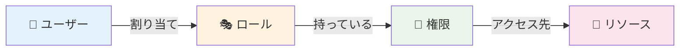
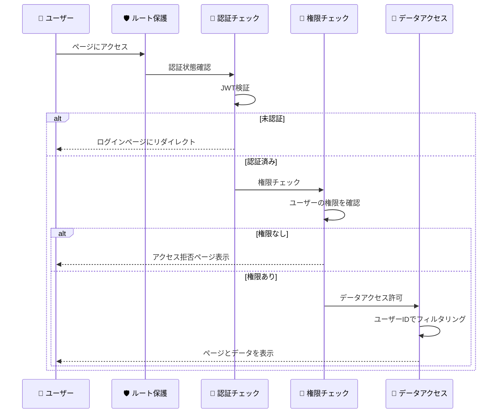

# ロールベースアクセス制御

## 🎯 学習目標

- ロールベースアクセス制御（RBAC）の基本概念を理解する
- ロール、権限、リソースの関係を学ぶ
- 実際のWebアプリケーションでの権限設計を知る
- バケットリストアプリでのシンプルな権限管理を分析する

## 🎭 ロールベースアクセス制御とは

### 📝 基本概念

**RBAC (Role-Based Access Control)** は、ユーザーの「役割」に基づいてアクセス権限を管理する仕組みです。



### 🏢 身近な例で理解する

#### 会社でのロール分け

```
🏢 株式会社サンプル
├── 👑 社長
│   ├── 全ての情報にアクセス可能
│   ├── 人事権限
│   └── 財務権限
├── 👨‍💼 部長
│   ├── 部署の情報にアクセス可能
│   ├── 部下の評価権限
│   └── 予算管理権限
├── 👨‍💻 一般社員
│   ├── 自分の業務情報にアクセス可能
│   ├── 共用資料の閲覧権限
│   └── 自分のタスク管理権限
└── 🆔 インターン
    ├── 限定的な情報にアクセス可能
    ├── 指定された資料の閲覧権限
    └── 研修資料のアクセス権限
```

#### ECサイトでのロール分け

```
🛒 オンラインショップ
├── 🛡️ システム管理者
│   ├── サーバー管理
│   ├── セキュリティ設定
│   └── システム監視
├── 👨‍💼 店舗管理者
│   ├── 商品管理
│   ├── 注文管理
│   └── 売上分析
├── 📦 商品担当者
│   ├── 商品情報編集
│   ├── 在庫管理
│   └── 商品画像アップロード
└── 🛍️ 一般顧客
    ├── 商品閲覧
    ├── カート操作
    └── 注文履歴確認
```

## 🔧 RBACの構成要素

### 1. 👤 ユーザー（Users）

実際にシステムを使用する人やサービス

```typescript
interface User {
  id: string;
  email: string;
  name: string;
  roles: Role[];  // 複数のロールを持つ場合もある
  createdAt: Date;
  isActive: boolean;
}
```

### 2. 🎭 ロール（Roles）

ユーザーの役割や職責を表す

```typescript
interface Role {
  id: string;
  name: string;
  description: string;
  permissions: Permission[];
  createdAt: Date;
  isActive: boolean;
}

// 例
const roles = [
  {
    id: "admin",
    name: "管理者",
    description: "システム全体の管理権限",
    permissions: ["user:read", "user:write", "system:config"]
  },
  {
    id: "user",
    name: "一般ユーザー",
    description: "基本的な機能の利用権限",
    permissions: ["profile:read", "profile:write", "content:read"]
  }
];
```

### 3. 🔑 権限（Permissions）

具体的な操作やアクセス権限

```typescript
interface Permission {
  id: string;
  resource: string;  // 対象リソース
  action: string;    // 操作
  description: string;
}

// 例: RESTful APIの操作に対応
const permissions = [
  { resource: "users", action: "read", description: "ユーザー情報の閲覧" },
  { resource: "users", action: "write", description: "ユーザー情報の編集" },
  { resource: "users", action: "delete", description: "ユーザーの削除" },
  { resource: "posts", action: "read", description: "投稿の閲覧" },
  { resource: "posts", action: "write", description: "投稿の作成・編集" },
];
```

### 4. 📄 リソース（Resources）

保護対象となるデータや機能

```typescript
interface Resource {
  id: string;
  name: string;
  type: "page" | "api" | "data" | "feature";
  path?: string;  // URLパスなど
  description: string;
}

// 例
const resources = [
  {
    id: "dashboard",
    name: "ダッシュボード",
    type: "page",
    path: "/dashboard"
  },
  {
    id: "user_api",
    name: "ユーザーAPI",
    type: "api",
    path: "/api/users"
  },
  {
    id: "bucket_items",
    name: "バケットリストデータ",
    type: "data"
  }
];
```

## 🎯 バケットリストアプリでの権限設計

### 📊 シンプルな権限モデル

私たちのプロジェクトは **シンプルな個人用アプリ** なので、複雑なロール管理は避けています：

```typescript
// 実際には明示的なロールシステムはなく、認証状態で判断
interface AuthState {
  user: User | null;
  isAuthenticated: boolean;
  // ロール情報は user オブジェクトに含まれる場合もある
}

// シンプルな権限チェック
function hasPermission(user: User | null, resource: string, action: string): boolean {
  // 未認証の場合
  if (!user) {
    return resource === "public" && action === "read";
  }

  // 認証済みの場合
  switch (resource) {
    case "bucket_items":
      return action === "read" || action === "write" || action === "delete";
    case "profile":
      return action === "read" || action === "write";
    case "dashboard":
      return action === "read";
    default:
      return false;
  }
}
```

### 🛡️ 実装されている保護レイヤー

#### 1. **ルートレベルの保護**

```typescript
// app/features/auth/components/auth-guard.tsx より
export function withAuth<T extends object>(
  Component: React.ComponentType<T>,
  options: WithAuthOptions = {},
) {
  const { redirectTo = "/login", showLoadingSpinner = true } = options;

  return function AuthenticatedComponent(props: T) {
    const { user, loading } = useAuth();
    const navigate = useNavigate();

    useEffect(() => {
      if (!loading && !user) {
        navigate(redirectTo);  // 未認証なら ログインページへ
      }
    }, [user, loading, navigate]);

    if (loading && showLoadingSpinner) {
      return <div className="min-h-screen flex items-center justify-center">
        <div>読み込み中...</div>
      </div>;
    }

    if (!user) {
      return <div className="min-h-screen flex items-center justify-center">
        <div className="text-center">
          <h2 className="text-2xl font-bold mb-4">認証が必要です</h2>
          <Link to={redirectTo}>
            <Button>ログインする</Button>
          </Link>
        </div>
      </div>;
    }

    return <Component {...props} />;
  };
}
```

#### 2. **データレベルの保護**

```typescript
// app/lib/auth-server.ts より
export async function createAuthenticatedSupabaseClient(
  authResult: ServerAuthResult,
) {
  if (!authResult.isAuthenticated || !authResult.session?.access_token) {
    throw new Error("Cannot create authenticated client without valid session");
  }

  // Service Role Key を使用してRLSをバイパス
  // セキュリティはアプリケーション層で管理
  const client = createClient<Database>(supabaseUrl, supabaseServiceKey, {
    auth: {
      autoRefreshToken: false,
      persistSession: false,
    },
    db: {
      schema: "public",
    },
    global: {
      headers: {
        // ユーザーコンテキストを追加（アプリケーションレベルセキュリティ用）
        "X-User-ID": authResult.user?.id || "",
      },
    },
  });

  return client;
}
```

#### 3. **クエリレベルの保護**

```typescript
// データ取得時は必ずユーザーIDでフィルタリング
const { data: items } = await supabase
  .from("bucket_items")
  .select("*")
  .eq("user_id", authResult.user.id);  // 重要: 自分のデータのみ

// 公開データの場合は is_public フラグもチェック
const { data: publicItems } = await supabase
  .from("bucket_items")
  .select("*")
  .eq("is_public", true);  // 公開設定されたもののみ
```

## 🔄 権限チェックの流れ



## 🏗️ より高度なRBACの例

### 🎪 多段階ロールシステム

```typescript
// より複雑なアプリケーションでの例
interface ExtendedUser {
  id: string;
  email: string;
  roles: UserRole[];
}

interface UserRole {
  roleId: string;
  assignedAt: Date;
  assignedBy: string;
  expiresAt?: Date;  // 期限付きロール
}

interface Role {
  id: string;
  name: string;
  level: number;     // ロールの階層
  permissions: Permission[];
  parentRole?: string;  // 継承関係
}

// 例: 継承関係のあるロール
const roleHierarchy = [
  {
    id: "super_admin",
    name: "スーパー管理者",
    level: 100,
    permissions: ["*"]  // 全権限
  },
  {
    id: "admin",
    name: "管理者",
    level: 80,
    parentRole: "super_admin",
    permissions: ["user:*", "content:*", "system:read"]
  },
  {
    id: "moderator",
    name: "モデレーター",
    level: 60,
    parentRole: "admin",
    permissions: ["content:moderate", "user:read"]
  },
  {
    id: "user",
    name: "一般ユーザー",
    level: 10,
    permissions: ["profile:read", "profile:write", "content:read"]
  }
];
```

### 🔧 動的権限チェック

```typescript
class PermissionChecker {
  static hasPermission(
    user: ExtendedUser,
    requiredPermission: string,
    resource?: any
  ): boolean {
    // 1. ユーザーのロールを取得
    const userRoles = this.getUserRoles(user);
    
    // 2. 各ロールの権限をチェック
    for (const role of userRoles) {
      if (this.roleHasPermission(role, requiredPermission)) {
        // 3. リソース固有の権限チェック
        if (resource && !this.checkResourcePermission(user, role, resource)) {
          continue;
        }
        return true;
      }
    }
    
    return false;
  }

  static roleHasPermission(role: Role, requiredPermission: string): boolean {
    // ワイルドカード権限チェック
    if (role.permissions.includes("*")) {
      return true;
    }
    
    // 完全一致
    if (role.permissions.includes(requiredPermission)) {
      return true;
    }
    
    // パターンマッチング（例: "user:*" は "user:read" を含む）
    const permissionPatterns = role.permissions.filter(p => p.endsWith("*"));
    for (const pattern of permissionPatterns) {
      const prefix = pattern.slice(0, -1);
      if (requiredPermission.startsWith(prefix)) {
        return true;
      }
    }
    
    return false;
  }

  static checkResourcePermission(
    user: ExtendedUser,
    role: Role,
    resource: any
  ): boolean {
    // リソース固有のロジック
    if (resource.ownerId && resource.ownerId === user.id) {
      return true;  // 自分のリソースなら常にアクセス可能
    }
    
    if (resource.isPublic) {
      return true;  // 公開リソースなら誰でもアクセス可能
    }
    
    // 管理者権限があれば全てのリソースにアクセス可能
    if (role.level >= 80) {
      return true;
    }
    
    return false;
  }
}
```

## 🛡️ セキュリティ考慮事項

### ❌ よくある権限管理の落とし穴

#### 1. **フロントエンドのみでの権限チェック**

```typescript
// ❌ 危険: クライアントサイドのみでの制御
function DangerousAdminPanel() {
  const { user } = useAuth();
  
  // JavaScriptで簡単に書き換え可能
  if (user.role !== 'admin') {
    return <div>権限がありません</div>;
  }
  
  // 危険: APIコールに制限なし
  return (
    <button onClick={() => deleteAllUsers()}>
      全ユーザー削除  {/* サーバーで権限チェックしていないと実行される！ */}
    </button>
  );
}

// ✅ 安全: サーバーサイドでも権限チェック
async function deleteAllUsers() {
  const response = await fetch('/api/admin/delete-users', {
    method: 'DELETE',
    headers: {
      'Authorization': `Bearer ${getToken()}`
    }
  });
  
  if (response.status === 403) {
    alert('権限がありません');
  }
}

// サーバーサイド（API）
app.delete('/api/admin/delete-users', authenticateToken, (req, res) => {
  // サーバーサイドで権限チェック必須
  if (!hasRole(req.user, 'admin')) {
    return res.status(403).json({ error: '権限がありません' });
  }
  
  // 実際の削除処理
  deleteUsers();
  res.json({ success: true });
});
```

#### 2. **権限エスカレーション攻撃**

```typescript
// ❌ 危険: 権限昇格の脆弱性
function updateUserRole(userId: string, newRole: string) {
  // 自分より上位のロールを設定されると危険
  if (newRole === 'admin') {
    // チェックなしで管理者に昇格
    updateRole(userId, newRole);
  }
}

// ✅ 安全: 適切な権限チェック
function updateUserRole(currentUser: User, userId: string, newRole: string) {
  // 1. 自分より上位のロールは設定できない
  if (getRoleLevel(newRole) >= getRoleLevel(currentUser.role)) {
    throw new Error('自分より上位のロールは設定できません');
  }
  
  // 2. 自分のロールを変更することはできない
  if (userId === currentUser.id) {
    throw new Error('自分のロールは変更できません');
  }
  
  // 3. 対象ユーザーが自分より上位の場合は変更不可
  const targetUser = getUser(userId);
  if (getRoleLevel(targetUser.role) >= getRoleLevel(currentUser.role)) {
    throw new Error('上位ユーザーのロールは変更できません');
  }
  
  updateRole(userId, newRole);
}
```

## 🎯 重要なポイント

### ✅ 覚えておくべきこと

1. **多層防御**: フロントエンド + バックエンド両方で権限チェック
2. **最小権限の原則**: 必要最小限の権限のみを与える
3. **権限の分離**: 管理者でも全ての操作ができるわけではない
4. **定期的な権限見直し**: 不要になった権限は削除する

### 🛡️ ベストプラクティス

- **明示的な権限付与**: デフォルトは「アクセス拒否」
- **権限の継承**: 階層的なロール設計
- **監査ログ**: 権限変更の記録
- **テスト**: 権限チェックのテストケース作成

## 🚀 次のステップ

ロールベースアクセス制御の基本が理解できたら、次は **[ルート保護](./route-protection.md)** で、具体的なページレベルでの保護実装について学びましょう。

ページ遷移時の認証チェック、保護されたルートの実装、エラーハンドリングなどを詳しく学習します。