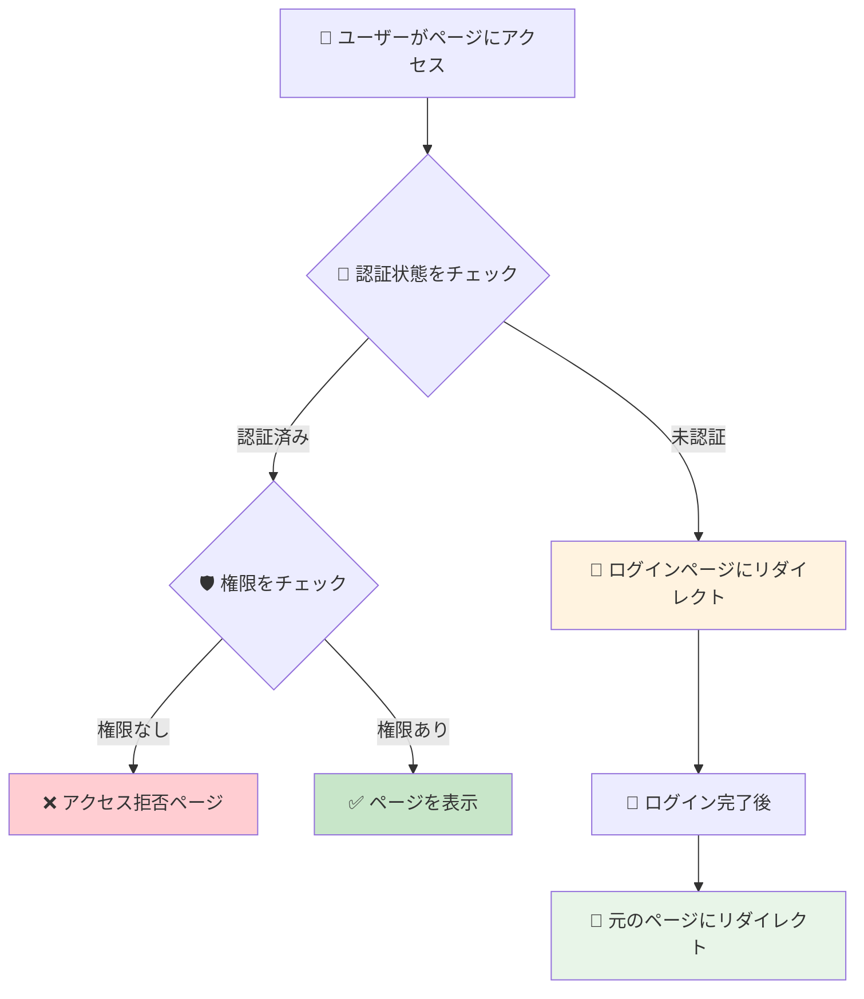
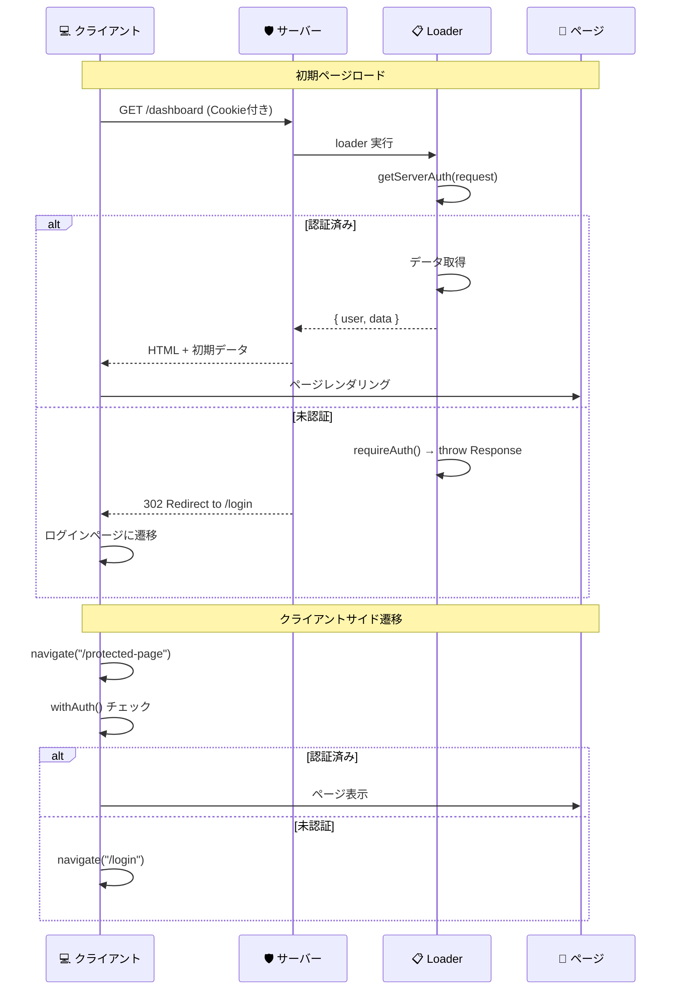

# ルート保護

## 🎯 学習目標

- ページレベルでのアクセス制御を理解する
- React Router での認証ガードの実装を学ぶ
- SSR環境での認証チェックを知る
- 適切なリダイレクト処理を理解する
- バケットリストアプリでの実装を詳しく分析する

## 🛡️ ルート保護とは

### 📝 基本概念

**ルート保護** とは、特定のページやルートに対して、適切な権限を持つユーザーのみがアクセスできるようにする仕組みです。



### 🏠 実際の例で理解する

#### ネットバンキングサイトの場合

```
🏦 ネットバンキング
├── 🌐 パブリック（誰でもアクセス可能）
│   ├── トップページ
│   ├── サービス紹介
│   └── ログインページ
├── 🔐 認証必須（ログイン後のみ）
│   ├── 口座残高確認
│   ├── 振込履歴
│   └── 各種設定
└── 👑 高セキュリティ（追加認証必須）
    ├── 大金額振込
    ├── 登録情報変更
    └── セキュリティ設定
```

## 🎭 保護レベルの分類

### 1. 🌐 パブリックルート

```typescript
// 誰でもアクセス可能
const publicRoutes = [
  "/",           // ランディングページ
  "/about",      // サービス紹介
  "/contact",    // お問い合わせ
  "/login",      // ログインページ
  "/register",   // 登録ページ
  "/public/*",   // 公開コンテンツ
];
```

### 2. 🔐 認証必須ルート

```typescript
// ログイン必須
const authenticatedRoutes = [
  "/dashboard",     // ダッシュボード
  "/profile",       // プロフィール
  "/settings",      // 設定
  "/bucket-list/*", // バケットリスト機能
];
```

### 3. 👑 管理者限定ルート

```typescript
// 管理者権限必須
const adminRoutes = [
  "/admin/*",        // 管理画面全般
  "/admin/users",    // ユーザー管理
  "/admin/system",   // システム設定
];
```

## 🛠️ バケットリストアプリでの実装

### 🎭 HOC パターンによる保護

```typescript
// app/features/auth/components/auth-guard.tsx より
interface WithAuthOptions {
  redirectTo?: string;
  showLoadingSpinner?: boolean;
}

export function withAuth<T extends object>(
  Component: React.ComponentType<T>,
  options: WithAuthOptions = {},
) {
  const { redirectTo = "/login", showLoadingSpinner = true } = options;

  return function AuthenticatedComponent(props: T) {
    const { user, loading } = useAuth();
    const navigate = useNavigate();

    useEffect(() => {
      if (!loading && !user) {
        navigate(redirectTo);
      }
    }, [user, loading, navigate]);

    if (loading && showLoadingSpinner) {
      return (
        <div className="min-h-screen flex items-center justify-center">
          <div>読み込み中...</div>
        </div>
      );
    }

    if (!user) {
      return (
        <div className="min-h-screen flex items-center justify-center">
          <div className="text-center">
            <h2 className="text-2xl font-bold mb-4">認証が必要です</h2>
            <Link to={redirectTo}>
              <Button>ログインする</Button>
            </Link>
          </div>
        </div>
      );
    }

    return <Component {...props} />;
  };
}
```

### 🔧 HOC の使用例

```typescript
// 保護されたコンポーネントの作成
const ProtectedDashboard = withAuth(Dashboard, {
  redirectTo: "/login",
  showLoadingSpinner: true
});

// React Router でのルート定義
const router = createBrowserRouter([
  {
    path: "/",
    element: <LandingPage />  // パブリック
  },
  {
    path: "/login", 
    element: <LoginPage />    // パブリック
  },
  {
    path: "/dashboard",
    element: <ProtectedDashboard />  // 保護済み
  },
  {
    path: "/bucket-list",
    element: withAuth(BucketListPage)()  // インライン保護
  }
]);
```

### 🎣 カスタムフックによる保護

```typescript
// app/features/auth/components/auth-guard.tsx より
// 認証チェック用のカスタムフック
export function useRequireAuth(redirectTo: string = "/login") {
  const { user, loading } = useAuth();
  const navigate = useNavigate();

  useEffect(() => {
    if (!loading && !user) {
      navigate(redirectTo);
    }
  }, [user, loading, navigate, redirectTo]);

  return { user, loading, isAuthenticated: !!user };
}

// 使用例
function ProtectedPage() {
  const { isAuthenticated, loading } = useRequireAuth("/login");

  if (loading) {
    return <div>読み込み中...</div>;
  }

  if (!isAuthenticated) {
    return null; // useRequireAuth がリダイレクトを実行
  }

  return (
    <div>
      <h1>保護されたページ</h1>
      <p>認証済みユーザーのみ閲覧可能</p>
    </div>
  );
}
```

## 🌐 SSR でのルート保護

### 📊 サーバーサイドでの認証チェック

React Router v7 の SSR 環境では、サーバーサイドでも認証チェックが必要です：

```typescript
// app/lib/auth-server.ts より
export async function requireAuth(
  request: Request,
  redirectTo: string = "/login",
): Promise<ServerAuthResult> {
  const authResult = await getServerAuth(request);

  if (!authResult.isAuthenticated) {
    throw new Response(null, {
      status: 302,
      headers: {
        Location: redirectTo,
      },
    });
  }

  return authResult;
}
```

### 🔄 Loader での認証チェック

```typescript
// 保護されたページの loader 例
export async function loader({ request }: Route.LoaderArgs) {
  // 1. 認証チェック（失敗時は自動リダイレクト）
  const authResult = await requireAuth(request, "/login");

  // 2. 認証済みユーザーのデータを取得
  const supabase = await createAuthenticatedSupabaseClient(authResult);
  
  const { data: bucketItems, error } = await supabase
    .from("bucket_items")
    .select("*")
    .eq("user_id", authResult.user.id);

  if (error) {
    throw new Response("データの取得に失敗しました", { status: 500 });
  }

  return {
    bucketItems,
    user: authResult.user
  };
}

// ページコンポーネント
export default function BucketListPage() {
  const { bucketItems, user } = useLoaderData<typeof loader>();

  return (
    <AuthenticatedLayout>
      <h1>{user.email}さんのバケットリスト</h1>
      <BucketItemsList items={bucketItems} />
    </AuthenticatedLayout>
  );
}
```

### 🔒 認証状態の同期



## 🔄 リダイレクト処理の最適化

### 📍 元のURLの保存

```typescript
// ログイン後に元のページに戻る仕組み
export function redirectToLogin(currentPath: string) {
  const loginUrl = new URL("/login", window.location.origin);
  loginUrl.searchParams.set("redirect", currentPath);
  window.location.href = loginUrl.toString();
}

// ログインページでのリダイレクト処理
export default function LoginPage() {
  const [searchParams] = useSearchParams();
  const navigate = useNavigate();
  const redirectTo = searchParams.get("redirect") || "/dashboard";

  const handleLoginSuccess = () => {
    navigate(redirectTo);
  };

  // ...
}
```

### 🎯 スマートリダイレクト

```typescript
// より高度なリダイレクト管理
class RedirectManager {
  private static readonly REDIRECT_KEY = "auth_redirect";

  static saveRedirectPath(path: string) {
    if (typeof window !== "undefined") {
      sessionStorage.setItem(this.REDIRECT_KEY, path);
    }
  }

  static getRedirectPath(): string | null {
    if (typeof window !== "undefined") {
      return sessionStorage.getItem(this.REDIRECT_KEY);
    }
    return null;
  }

  static clearRedirectPath() {
    if (typeof window !== "undefined") {
      sessionStorage.removeItem(this.REDIRECT_KEY);
    }
  }

  static getDefaultRedirectPath(user: User): string {
    // ユーザーの役割に応じたデフォルトページ
    if (user.role === "admin") {
      return "/admin/dashboard";
    }
    return "/dashboard";
  }
}

// 使用例
export function handleAuthenticationRequired() {
  const currentPath = window.location.pathname;
  RedirectManager.saveRedirectPath(currentPath);
  navigate("/login");
}

export function handleLoginSuccess(user: User) {
  const redirectPath = RedirectManager.getRedirectPath() 
    || RedirectManager.getDefaultRedirectPath(user);
  
  RedirectManager.clearRedirectPath();
  navigate(redirectPath);
}
```

## 🎨 ユーザー体験の向上

### ⏳ ローディング状態の管理

```typescript
function AuthenticatedRoute({ children }: { children: React.ReactNode }) {
  const { user, loading, error } = useAuth();

  if (loading) {
    return (
      <div className="min-h-screen flex items-center justify-center">
        <div className="text-center">
          <div className="animate-spin rounded-full h-12 w-12 border-b-2 border-blue-600 mx-auto mb-4"></div>
          <p className="text-gray-600">認証状態を確認中...</p>
        </div>
      </div>
    );
  }

  if (error) {
    return (
      <div className="min-h-screen flex items-center justify-center">
        <div className="text-center">
          <p className="text-red-600 mb-4">認証エラーが発生しました</p>
          <Button onClick={() => window.location.reload()}>
            再試行
          </Button>
        </div>
      </div>
    );
  }

  if (!user) {
    return (
      <div className="min-h-screen flex items-center justify-center">
        <div className="text-center">
          <h2 className="text-2xl font-bold mb-4">ログインが必要です</h2>
          <p className="text-gray-600 mb-6">このページを表示するにはログインしてください</p>
          <Link to="/login">
            <Button className="px-6 py-2">ログインする</Button>
          </Link>
        </div>
      </div>
    );
  }

  return <>{children}</>;
}
```

### 🎯 プログレッシブな認証体験

```typescript
// 段階的な認証要求
function ProgressiveAuthGuard({ 
  requiredLevel, 
  children 
}: { 
  requiredLevel: "basic" | "verified" | "premium";
  children: React.ReactNode;
}) {
  const { user } = useAuth();

  if (!user) {
    return <LoginPrompt />;
  }

  switch (requiredLevel) {
    case "verified":
      if (!user.emailVerified) {
        return <EmailVerificationPrompt />;
      }
      break;
    
    case "premium":
      if (!user.isPremium) {
        return <PremiumUpgradePrompt />;
      }
      break;
  }

  return <>{children}</>;
}

// 使用例
<ProgressiveAuthGuard requiredLevel="verified">
  <PremiumFeature />
</ProgressiveAuthGuard>
```

## 🚨 セキュリティ考慮事項

### ❌ よくあるセキュリティホール

#### 1. **クライアントサイドのみでの保護**

```typescript
// ❌ 危険: クライアントサイドのみ
function BadProtection() {
  const isAdmin = localStorage.getItem("isAdmin") === "true";
  
  return (
    <div>
      {isAdmin && (
        <button onClick={deleteAllData}>
          全データ削除  {/* JavaScriptで簡単にバイパス可能 */}
        </button>
      )}
    </div>
  );
}

// ✅ 安全: サーバーサイドでも保護
function GoodProtection() {
  const { user, hasPermission } = useAuth();
  
  return (
    <div>
      {hasPermission("admin:delete") && (
        <button onClick={async () => {
          // サーバーサイドで権限チェック
          const response = await fetch("/api/admin/delete-all", {
            method: "DELETE",
            headers: {
              "Authorization": `Bearer ${getToken()}`
            }
          });
          
          if (response.status === 403) {
            alert("権限がありません");
          }
        }}>
          全データ削除
        </button>
      )}
    </div>
  );
}
```

#### 2. **URL直接アクセスの脆弱性**

```typescript
// ❌ 問題: ルート定義のみで保護していない
const router = createBrowserRouter([
  {
    path: "/admin",
    element: <AdminPanel />  // 直接アクセス可能
  }
]);

// ✅ 解決: すべてのルートを適切に保護
const router = createBrowserRouter([
  {
    path: "/admin",
    element: <AdminGuard><AdminPanel /></AdminGuard>,
    loader: async ({ request }) => {
      // サーバーサイドでも権限チェック
      const auth = await requireAuth(request);
      if (!hasAdminRole(auth.user)) {
        throw new Response(null, { 
          status: 403, 
          statusText: "Forbidden" 
        });
      }
      return null;
    }
  }
]);
```

### 🔐 ディープリンク保護

```typescript
// 深い階層のルートもすべて保護
const protectedRoutes = [
  "/dashboard",
  "/dashboard/settings",
  "/dashboard/settings/security",  // 深い階層も忘れずに
  "/bucket-list",
  "/bucket-list/edit/*",
  "/profile",
  "/profile/edit"
];

function isProtectedRoute(pathname: string): boolean {
  return protectedRoutes.some(route => 
    route.endsWith("*") 
      ? pathname.startsWith(route.slice(0, -1))
      : pathname === route
  );
}

// ルート変更時の保護
function useRouteProtection() {
  const location = useLocation();
  const { user, loading } = useAuth();
  const navigate = useNavigate();

  useEffect(() => {
    if (!loading && isProtectedRoute(location.pathname) && !user) {
      navigate("/login");
    }
  }, [location.pathname, user, loading, navigate]);
}
```

## 🎯 重要なポイント

### ✅ ベストプラクティス

1. **多層防御**: フロントエンド + バックエンド + データベース
2. **早期チェック**: ページアクセス時に即座に認証確認
3. **適切なフィードバック**: 分かりやすいエラーメッセージ
4. **シームレスな体験**: スムーズなリダイレクト処理

### 🚨 セキュリティルール

- **サーバーサイドで必ず検証**: クライアントサイドは補助的な役割のみ
- **最小権限の原則**: 必要最小限のページのみアクセス許可
- **セッション検証**: ページアクセス時に認証状態を再確認
- **監査ログ**: アクセス試行を記録

## 🚀 次のステップ

ルート保護の実装について理解できたら、次は **[権限システム設計](./permission-systems.md)** で、より高度な権限管理システムの設計について学びましょう。

大規模アプリケーションでのスケーラブルな権限管理、動的権限の実装、権限の継承などを詳しく学習します。