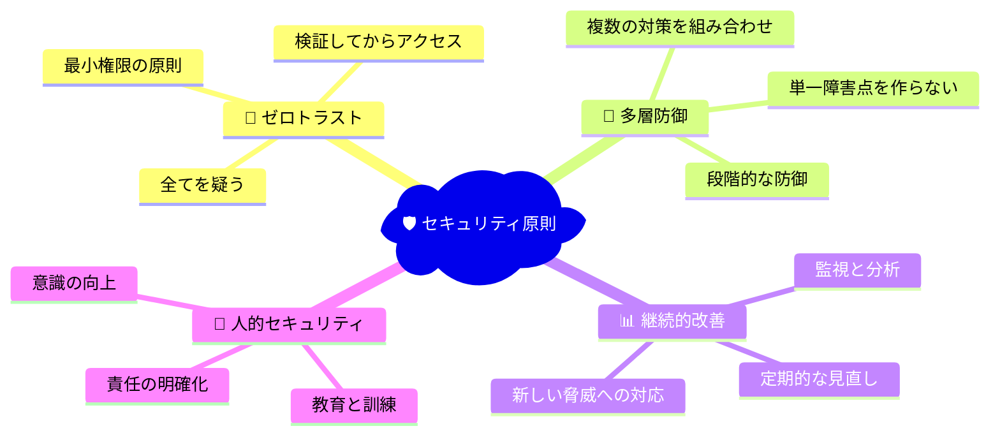
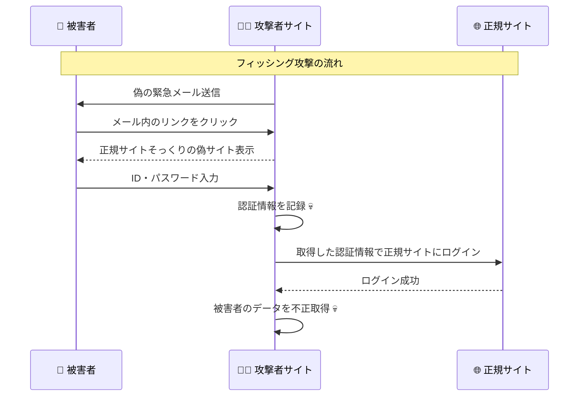
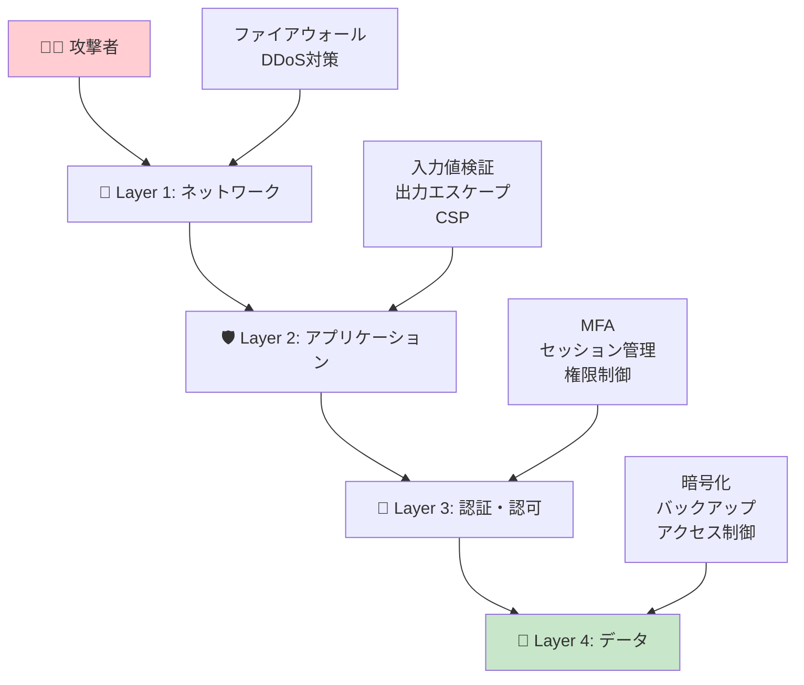

# Level 4: セキュリティ対策

## 🎯 このレベルの学習目標

- 実際の攻撃手法とその対策を理解する
- 入力値検証とサニタイゼーションの重要性を学ぶ
- XSS、CSRF、SQLインジェクションなどの脅威と対策を知る
- レート制限とDDoS対策を理解する
- バケットリストアプリでの実装されているセキュリティ対策を分析する

## 📚 学習内容

### 📖 推奨学習順序

1. **[入力値検証](./input-validation.md)** - 全てのセキュリティの基盤
2. **[XSS攻撃対策](./xss-prevention.md)** - クロスサイトスクリプティング防止
3. **[CSRF攻撃対策](./csrf-protection.md)** - クロスサイトリクエストフォージェリ対策
4. **[レート制限](./rate-limiting.md)** - ブルートフォースとDDoS対策

## ⏱️ 想定学習時間

**初心者の方**: 3-4時間  
**経験者の方**: 2時間（復習として）

## 🔍 学習のポイント

### 重要な概念

- **多層防御**: 複数のセキュリティ対策を組み合わせる
- **入力値検証**: 信頼できないデータは全て検証する
- **出力エスケープ**: 表示時にHTMLエスケープを行う
- **CSRFトークン**: 正当なリクエストであることを証明
- **レート制限**: 異常なアクセスパターンを制限

### セキュリティの原則



## 🚨 主要な脅威と対策

### 📊 脅威の分類

| 脅威 | 危険度 | 発生頻度 | 対策の優先度 | バケットリストアプリでの実装 |
|------|--------|----------|--------------|------------------------------|
| **XSS攻撃** | 🔴 高 | 🟡 中 | 🔴 最優先 | ✅ 入力値サニタイズ実装済み |
| **CSRF攻撃** | 🟡 中 | 🟢 低 | 🟡 重要 | ✅ SameSite Cookie設定済み |
| **SQLインジェクション** | 🔴 高 | 🟢 低 | 🔴 最優先 | ✅ Supabase ORM使用で対策済み |
| **ブルートフォース攻撃** | 🟡 中 | 🔴 高 | 🟡 重要 | ✅ レート制限実装済み |
| **セッションハイジャック** | 🔴 高 | 🟢 低 | 🔴 最優先 | ✅ セキュアCookie設定済み |

### 🛠️ 実装されている対策の概要

バケットリストアプリで実際に実装されているセキュリティ対策：

```typescript
// 1. 入力値検証とサニタイズ
export function sanitizeString(input: string): string {
  return input
    .replace(/&/g, "&amp;")
    .replace(/</g, "&lt;")
    .replace(/>/g, "&gt;")
    .replace(/"/g, "&quot;")
    .replace(/'/g, "&#x27;")
    .trim();
}

// 2. レート制限
export const authRateLimit = new RateLimit(5, 15 * 60 * 1000);

// 3. セキュアCookie設定
document.cookie = `${name}=...; SameSite=strict; Secure; HttpOnly`;

// 4. CSP (Content Security Policy)
const csp = [
  "default-src 'self'",
  "script-src 'self' 'unsafe-inline'",
  "connect-src 'self' https://*.supabase.co"
].join("; ");
```

## 🎓 このレベルを完了すると

- 主要な Web セキュリティ脅威を理解し、対策できる
- 入力値検証の重要性と実装方法を知っている
- XSS、CSRF、SQLインジェクション攻撃を防げる
- レート制限によるDDoS対策ができる
- セキュリティヘッダーの設定ができる
- バケットリストアプリのセキュリティ実装を詳細に説明できる

## 📋 学習チェックリスト

学習が完了したら、以下を確認してみてください：

- [ ] 入力値検証とサニタイゼーションの違いを理解している
- [ ] XSS攻撃の種類とそれぞれの対策を知っている
- [ ] CSRFトークンの仕組みを理解している
- [ ] SQLインジェクション攻撃とその対策を説明できる
- [ ] レート制限のアルゴリズムを理解している
- [ ] セキュリティヘッダーの役割を知っている
- [ ] セキュアCookieの設定ができる

## ⚡ 実際の攻撃例

### 🎣 フィッシング攻撃のシナリオ



### 🛡️ 多層防御による対策



## 🚀 次のステップ

Level 4 を完了したら、**Level 5: 高度なトピック** に進みましょう。

Level 5 では、より高度な認証認可技術について学習します：

- SSR環境での認証
- マイクロサービスアーキテクチャでの認証
- OAuth統合
- 最新のセキュリティトレンド

実際の攻撃に対する防御策を身につけた後は、最新の技術トレンドを学びましょう！