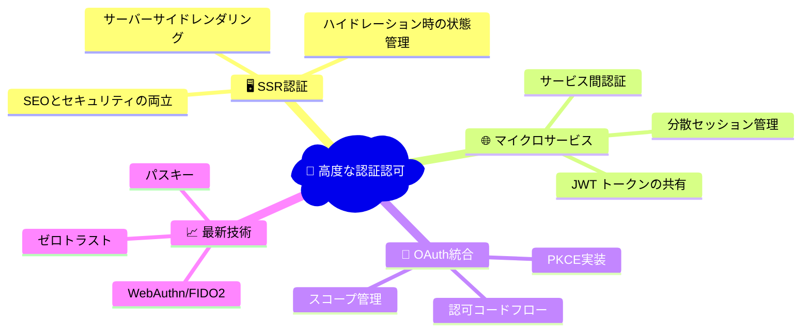
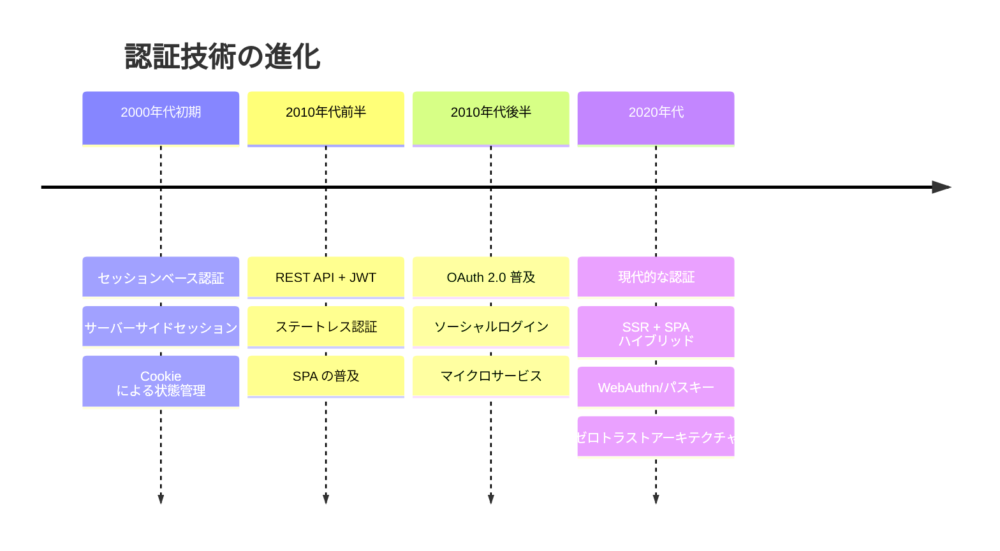
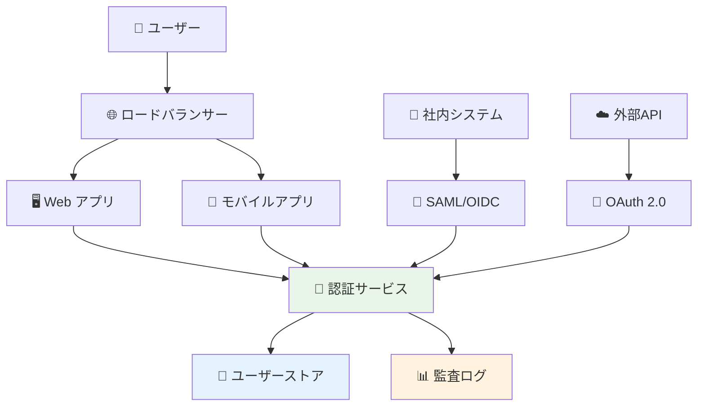

# Level 5: 高度なトピック

## 🎯 このレベルの学習目標

- SSR環境での認証実装の詳細を理解する
- マイクロサービスアーキテクチャでの認証設計を学ぶ
- OAuth 2.0とOpenID Connectの実装を理解する
- 最新のセキュリティトレンドと技術を知る
- 実際のプロダクション環境での運用課題を学ぶ

## 📚 学習内容

### 📖 推奨学習順序

1. **[SSR認証](./ssr-authentication.md)** - Server-Side Rendering環境での認証
2. **[マイクロサービス認証](./microservices-auth.md)** - 分散システムでの認証設計
3. **[OAuth統合](./oauth-integration.md)** - OAuth 2.0とOpenID Connectの詳細実装
4. **[最新トレンド](./security-trends.md)** - 現代的なセキュリティ技術と将来展望

## ⏱️ 想定学習時間

**初心者の方**: 4-5時間  
**経験者の方**: 2-3時間（復習として）

## 🎓 前提知識

Level 5 を学習する前に、以下を理解していることが必要です：

- [ ] 基本的な認証・認可の概念（Level 1-3）
- [ ] セキュリティ対策の基本（Level 4）
- [ ] JWT の仕組みと実装
- [ ] React Router v7 の基本的な使い方
- [ ] Node.js/TypeScript での開発経験

## 🔍 学習のポイント

### 重要な概念



### アーキテクチャの進化



## 🏗️ バケットリストアプリでの実装

### 現在の高度な機能

バケットリストアプリで既に実装されている高度な機能を確認しましょう：

```typescript
// 1. SSR認証（React Router v7）
// app/routes/_authenticated.tsx
export async function loader({ request }: LoaderFunctionArgs) {
  const session = await getSession(request.headers.get("Cookie"));
  
  if (!session?.user) {
    throw redirect("/auth/signin");
  }
  
  return json({ user: session.user });
}

// 2. セキュアCookie管理
// app/features/auth/lib/auth-context.tsx
const signOut = async () => {
  // セキュリティ強化：セッション情報の完全クリア
  document.cookie.split(";").forEach((cookie) => {
    const [name] = cookie.split("=");
    if (name.trim().includes("supabase")) {
      document.cookie = `${name.trim()}=; Path=/; Expires=Thu, 01 Jan 1970 00:00:01 GMT; SameSite=strict`;
    }
  });
};

// 3. 権限ベースルート保護
// app/features/auth/components/auth-guard.tsx
export function withAuth<T extends object>(
  Component: React.ComponentType<T>,
  options: WithAuthOptions = {}
) {
  return function AuthenticatedComponent(props: T) {
    const { user, loading } = useAuth();
    
    if (!user) {
      return <div>認証が必要です</div>;
    }
    
    return <Component {...props} />;
  };
}
```

## 🎯 実用的なシナリオ

### 🏢 エンタープライズ環境での課題



## 📊 Level 5 で学ぶ技術スタック

| 技術 | 概要 | 実装レベル | 学習優先度 |
|------|------|------------|------------|
| **SSR認証** | React Router v7での認証実装 | ✅ 実装済み | 🔴 必須 |
| **JWT検証** | サーバーサイドでのトークン検証 | ✅ 実装済み | 🔴 必須 |
| **OAuth 2.0** | 第三者認証プロバイダー連携 | 🟡 部分実装 | 🟡 重要 |
| **マイクロサービス** | 分散システムでの認証 | ❌ 未実装 | 🟢 参考 |
| **WebAuthn** | 生体認証・ハードウェアキー | ❌ 未実装 | 🟢 参考 |
| **RBAC詳細** | 細かい権限制御システム | 🟡 部分実装 | 🟡 重要 |

## 🔧 実装する機能

Level 5 では以下の機能を段階的に実装・理解していきます：

### 1. 📱 SSR環境での認証最適化

```typescript
// React Router v7 でのハイドレーション最適化
export function ClientHydrationOptimizer() {
  const [isHydrated, setIsHydrated] = useState(false);
  
  useEffect(() => {
    setIsHydrated(true);
  }, []);
  
  // SSR時とクライアント時で異なるコンテンツを安全に表示
  if (!isHydrated) {
    return <div>Loading...</div>;
  }
  
  return <AuthenticatedContent />;
}
```

### 2. 🌐 マイクロサービス対応

```typescript
// JWT を使ったサービス間認証
interface ServiceAuthConfig {
  serviceName: string;
  sharedSecret: string;
  allowedServices: string[];
}

class ServiceAuthenticator {
  async authenticateService(token: string): Promise<boolean> {
    // サービス間認証の実装
    return jwt.verify(token, process.env.SERVICE_SECRET);
  }
}
```

### 3. 🔐 OAuth プロバイダー統合

```typescript
// GitHub, Google などの OAuth プロバイダー
const oauthProviders = {
  github: {
    clientId: process.env.GITHUB_CLIENT_ID,
    redirectUri: '/auth/callback/github'
  },
  google: {
    clientId: process.env.GOOGLE_CLIENT_ID,
    redirectUri: '/auth/callback/google'
  }
};
```

## 🎓 このレベルを完了すると

- SSR環境での認証実装の課題と解決策を理解している
- マイクロサービスアーキテクチャでの認証設計ができる
- OAuth 2.0 / OpenID Connect の実装ができる
- 最新のセキュリティトレンドを知っている
- エンタープライズレベルの認証システムを設計できる

## 📋 学習チェックリスト

学習が完了したら、以下を確認してみてください：

- [ ] SSRでの認証状態管理を理解している
- [ ] ハイドレーション時の問題と対策を知っている
- [ ] JWT の分散環境での使用方法を理解している
- [ ] OAuth 2.0 の認可コードフローを実装できる
- [ ] PKCE の仕組みと実装方法を知っている
- [ ] マイクロサービス間の認証を設計できる
- [ ] WebAuthn の基本概念を理解している
- [ ] ゼロトラストアーキテクチャの原則を知っている

## 🚀 実践プロジェクト

Level 5 の学習と並行して、以下の実践課題に取り組むことをお勧めします：

1. **SSR認証の改善**: バケットリストアプリのSSR認証を最適化
2. **OAuth統合**: GitHub または Google ログインの追加
3. **権限システム拡張**: より細かい権限制御の実装
4. **監視・ログ**: 認証イベントの監視システム構築

## 🌟 次のステップ

Level 5 を完了すると、現代的な Web アプリケーションの認証認可システムを完全に理解し、実装できるようになります。

さらに学習を続けたい場合は：

- 実際のプロダクション環境での運用経験を積む
- セキュリティコンサルタントやアーキテクトとしてのキャリアを検討
- オープンソースの認証ライブラリへの貢献
- 最新の研究論文やカンファレンス資料の学習

Level 5 の学習を始めましょう！最初は **[SSR認証](./ssr-authentication.md)** から始めることをお勧めします。