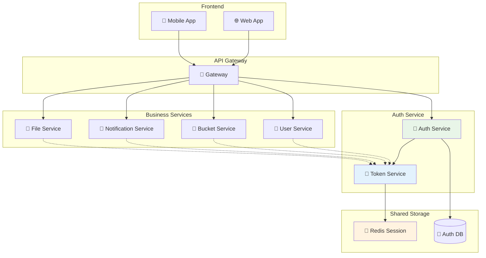

# マイクロサービス認証

## 🎯 学習目標

- マイクロサービスアーキテクチャでの認証の課題を理解する
- JWT を使ったサービス間認証の実装を学ぶ
- 分散セッション管理の方法を知る
- サービスメッシュでの認証を理解する
- 実際のプロダクション環境での運用課題を学ぶ

## 🌐 マイクロサービス認証とは

### 📝 基本概念

**マイクロサービス認証** は、複数の独立したサービス間で認証・認可を統一的に管理し、セキュアな通信を実現する仕組みです。



### 🤔 マイクロサービスでの認証の課題

#### 1. **分散認証の複雑さ**

```typescript
// 単一アプリ vs マイクロサービス
const challenges = {
  monolith: {
    authentication: "1つのアプリで完結",
    session: "メモリまたは単一DB",
    security: "内部通信は信頼"
  },
  microservices: {
    authentication: "複数サービス間で共有",
    session: "分散セッション管理が必要",
    security: "サービス間も認証が必要"
  }
};

// 問題例：各サービスが独自に認証チェック
const problemScenario = {
  userService: "独自のJWT検証ロジック",
  bucketService: "独自のJWT検証ロジック", 
  notificationService: "独自のJWT検証ロジック",
  issues: [
    "JWT検証ロジックの重複",
    "認証情報の同期問題",
    "セキュリティ設定の不整合"
  ]
};
```

#### 2. **トークン共有と管理**

```typescript
// JWT トークンの伝播パターン
interface TokenPropagation {
  frontend: "ユーザーからJWT受信";
  gateway: "トークン検証とルーティング";
  services: "サービス間でトークン伝達";
  challenges: [
    "トークンの期限管理",
    "リフレッシュトークンの扱い",
    "サービス間の信頼関係"
  ];
}
```

## 🔧 JWT ベースの分散認証

### 🎫 統一的なJWT設計

```typescript
// マイクロサービス用のJWTペイロード設計
interface MicroserviceJWTPayload {
  // 標準クレーム
  iss: string;     // issuer: "auth-service"
  sub: string;     // subject: user ID
  aud: string[];   // audience: ["user-service", "bucket-service"]
  exp: number;     // expiration time
  iat: number;     // issued at
  jti: string;     // JWT ID（トークン追跡用）
  
  // カスタムクレーム
  user: {
    id: string;
    email: string;
    roles: string[];
    permissions: string[];
  };
  
  // サービス固有の情報
  services: {
    [serviceName: string]: {
      permissions: string[];
      expires?: number;
    };
  };
  
  // セッション情報
  session: {
    id: string;
    device?: string;
    ip?: string;
  };
}

// JWT生成サービス
export class MicroserviceJWTService {
  private readonly secretKey: string;
  private readonly issuer: string;
  
  constructor() {
    this.secretKey = process.env.JWT_SECRET!;
    this.issuer = process.env.SERVICE_NAME || "auth-service";
  }

  async generateToken(
    user: User, 
    audience: string[],
    sessionInfo: SessionInfo
  ): Promise<string> {
    const payload: MicroserviceJWTPayload = {
      iss: this.issuer,
      sub: user.id,
      aud: audience,
      exp: Math.floor(Date.now() / 1000) + (60 * 60), // 1時間
      iat: Math.floor(Date.now() / 1000),
      jti: crypto.randomUUID(),
      
      user: {
        id: user.id,
        email: user.email,
        roles: user.roles,
        permissions: user.permissions
      },
      
      services: this.buildServicePermissions(user, audience),
      
      session: {
        id: sessionInfo.id,
        device: sessionInfo.device,
        ip: sessionInfo.ip
      }
    };

    return jwt.sign(payload, this.secretKey, { algorithm: 'HS256' });
  }

  private buildServicePermissions(user: User, audience: string[]) {
    const servicePermissions: { [key: string]: any } = {};
    
    audience.forEach(service => {
      switch (service) {
        case "user-service":
          servicePermissions[service] = {
            permissions: this.getUserServicePermissions(user)
          };
          break;
        case "bucket-service":
          servicePermissions[service] = {
            permissions: this.getBucketServicePermissions(user)
          };
          break;
        default:
          servicePermissions[service] = {
            permissions: ["read"]
          };
      }
    });

    return servicePermissions;
  }
}
```

### 🛡️ JWT検証ミドルウェア

```typescript
// 各マイクロサービスで使用する共通JWT検証ミドルウェア
export class JWTVerificationMiddleware {
  private readonly secretKey: string;
  private readonly serviceName: string;
  private readonly redis: RedisClient;

  constructor() {
    this.secretKey = process.env.JWT_SECRET!;
    this.serviceName = process.env.SERVICE_NAME!;
    this.redis = new RedisClient();
  }

  async verify(req: Request, res: Response, next: NextFunction) {
    try {
      // 1. トークン取得
      const token = this.extractToken(req);
      if (!token) {
        return res.status(401).json({ error: "Token missing" });
      }

      // 2. JWT検証
      const payload = jwt.verify(token, this.secretKey) as MicroserviceJWTPayload;

      // 3. Audience検証
      if (!payload.aud.includes(this.serviceName)) {
        return res.status(401).json({ error: "Token not valid for this service" });
      }

      // 4. ブラックリスト確認
      const isBlacklisted = await this.checkBlacklist(payload.jti);
      if (isBlacklisted) {
        return res.status(401).json({ error: "Token has been revoked" });
      }

      // 5. サービス固有の権限確認
      const servicePermissions = payload.services[this.serviceName];
      if (!servicePermissions) {
        return res.status(403).json({ error: "No permissions for this service" });
      }

      // 6. リクエストに認証情報を追加
      req.auth = {
        user: payload.user,
        session: payload.session,
        permissions: servicePermissions.permissions,
        tokenId: payload.jti
      };

      next();
    } catch (error) {
      if (error instanceof jwt.TokenExpiredError) {
        return res.status(401).json({ error: "Token expired" });
      }
      if (error instanceof jwt.JsonWebTokenError) {
        return res.status(401).json({ error: "Invalid token" });
      }
      
      console.error("JWT verification error:", error);
      return res.status(500).json({ error: "Authentication service error" });
    }
  }

  private extractToken(req: Request): string | null {
    const authHeader = req.headers.authorization;
    if (authHeader && authHeader.startsWith('Bearer ')) {
      return authHeader.substring(7);
    }
    return null;
  }

  private async checkBlacklist(tokenId: string): Promise<boolean> {
    try {
      const result = await this.redis.get(`blacklist:${tokenId}`);
      return result !== null;
    } catch (error) {
      console.error("Blacklist check error:", error);
      // Redis障害時は安全側に倒してトークンを受け入れる
      return false;
    }
  }

  // 特定の権限が必要なエンドポイント用
  requirePermission(permission: string) {
    return (req: Request, res: Response, next: NextFunction) => {
      if (!req.auth?.permissions.includes(permission)) {
        return res.status(403).json({ 
          error: `Permission '${permission}' required` 
        });
      }
      next();
    };
  }
}

// 使用例
const app = express();
const jwtMiddleware = new JWTVerificationMiddleware();

// 全てのAPIエンドポイントでJWT検証
app.use('/api', jwtMiddleware.verify.bind(jwtMiddleware));

// 特定の権限が必要なエンドポイント
app.delete('/api/bucket-items/:id', 
  jwtMiddleware.requirePermission('bucket:delete'),
  deleteBucketItem
);
```

## 🚪 API Gateway での集約認証

### 🌐 統一認証エントリポイント

```typescript
// API Gateway での認証処理
export class APIGatewayAuth {
  private authService: AuthService;
  private tokenService: TokenService;
  private serviceDiscovery: ServiceDiscovery;

  constructor() {
    this.authService = new AuthService();
    this.tokenService = new TokenService();
    this.serviceDiscovery = new ServiceDiscovery();
  }

  async authenticateRequest(req: Request): Promise<AuthResult> {
    try {
      // 1. トークン検証
      const token = this.extractToken(req);
      if (!token) {
        return { success: false, error: "No token provided" };
      }

      const tokenValidation = await this.tokenService.validate(token);
      if (!tokenValidation.valid) {
        return { success: false, error: "Invalid token" };
      }

      // 2. ユーザー情報取得
      const user = await this.authService.getUser(tokenValidation.userId);
      if (!user || !user.active) {
        return { success: false, error: "User not found or inactive" };
      }

      // 3. ルート別権限チェック
      const requiredPermissions = this.getRequiredPermissions(req.path, req.method);
      const hasPermission = this.checkPermissions(user.permissions, requiredPermissions);
      
      if (!hasPermission) {
        return { success: false, error: "Insufficient permissions" };
      }

      // 4. 対象サービスの決定
      const targetService = await this.serviceDiscovery.resolveService(req.path);
      
      // 5. サービス用トークン生成
      const serviceToken = await this.tokenService.generateServiceToken(
        user,
        [targetService],
        tokenValidation.sessionInfo
      );

      return {
        success: true,
        user,
        serviceToken,
        targetService
      };

    } catch (error) {
      console.error("Gateway auth error:", error);
      return { success: false, error: "Authentication service error" };
    }
  }

  async routeRequest(req: Request, authResult: AuthResult): Promise<Response> {
    if (!authResult.success) {
      return new Response(JSON.stringify({ error: authResult.error }), {
        status: 401,
        headers: { 'Content-Type': 'application/json' }
      });
    }

    // サービス間通信用のヘッダーを追加
    const serviceHeaders = {
      ...req.headers,
      'Authorization': `Bearer ${authResult.serviceToken}`,
      'X-User-ID': authResult.user.id,
      'X-User-Roles': authResult.user.roles.join(','),
      'X-Request-ID': crypto.randomUUID()
    };

    // 対象サービスにリクエストを転送
    const serviceURL = await this.serviceDiscovery.getServiceURL(authResult.targetService);
    
    return fetch(`${serviceURL}${req.path}`, {
      method: req.method,
      headers: serviceHeaders,
      body: req.body
    });
  }

  private getRequiredPermissions(path: string, method: string): string[] {
    // ルーティング設定に基づいて必要な権限を決定
    const routeConfig = {
      'GET /api/bucket-items': ['bucket:read'],
      'POST /api/bucket-items': ['bucket:write'],
      'DELETE /api/bucket-items': ['bucket:delete'],
      'GET /api/users/profile': ['user:read'],
      'PUT /api/users/profile': ['user:write']
    };

    const routeKey = `${method} ${path}`;
    return routeConfig[routeKey] || [];
  }
}
```

### 🔄 サービス間通信の認証

```typescript
// サービス間通信用の認証クライアント
export class ServiceAuthClient {
  private readonly serviceSecret: string;
  private readonly serviceName: string;

  constructor() {
    this.serviceSecret = process.env.SERVICE_SECRET!;
    this.serviceName = process.env.SERVICE_NAME!;
  }

  // 他のサービスを呼び出すときの認証付きリクエスト
  async callService(
    targetService: string,
    endpoint: string,
    options: RequestInit = {},
    userContext?: UserContext
  ): Promise<Response> {
    // サービス間通信用のトークン生成
    const serviceToken = this.generateServiceToken(targetService, userContext);

    const headers = {
      ...options.headers,
      'Authorization': `Service ${serviceToken}`,
      'X-Source-Service': this.serviceName,
      'X-Request-ID': crypto.randomUUID()
    };

    if (userContext) {
      headers['X-User-ID'] = userContext.userId;
      headers['X-User-Roles'] = userContext.roles.join(',');
    }

    const serviceURL = await this.discoverService(targetService);
    
    return fetch(`${serviceURL}${endpoint}`, {
      ...options,
      headers
    });
  }

  private generateServiceToken(targetService: string, userContext?: UserContext): string {
    const payload = {
      iss: this.serviceName,
      aud: targetService,
      iat: Math.floor(Date.now() / 1000),
      exp: Math.floor(Date.now() / 1000) + 300, // 5分間有効
      user: userContext || null
    };

    return jwt.sign(payload, this.serviceSecret);
  }

  // サービス間通信の検証
  async verifyServiceRequest(req: Request): Promise<ServiceAuthResult> {
    const authHeader = req.headers.get('Authorization');
    
    if (!authHeader || !authHeader.startsWith('Service ')) {
      return { valid: false, error: 'Service token missing' };
    }

    try {
      const token = authHeader.substring(8);
      const payload = jwt.verify(token, this.serviceSecret);
      
      // 対象サービスの確認
      if (payload.aud !== this.serviceName) {
        return { valid: false, error: 'Token not intended for this service' };
      }

      return {
        valid: true,
        sourceService: payload.iss,
        userContext: payload.user
      };
    } catch (error) {
      return { valid: false, error: 'Invalid service token' };
    }
  }
}

// 使用例：Bucket Service から User Service を呼び出し
export class BucketService {
  private authClient: ServiceAuthClient;

  constructor() {
    this.authClient = new ServiceAuthClient();
  }

  async createBucketItem(item: CreateBucketItemRequest, userContext: UserContext) {
    // ユーザー情報を確認するため User Service を呼び出し
    const userResponse = await this.authClient.callService(
      'user-service',
      `/api/users/${userContext.userId}`,
      { method: 'GET' },
      userContext
    );

    if (!userResponse.ok) {
      throw new Error('User verification failed');
    }

    const user = await userResponse.json();
    
    // バケットアイテムの作成処理
    return this.createItem({ ...item, userId: user.id });
  }
}
```

## 🗄️ 分散セッション管理

### 🔄 Redis ベースのセッション共有

```typescript
// 分散セッション管理
export class DistributedSessionManager {
  private redis: RedisClient;
  private readonly sessionTTL: number = 60 * 60 * 24 * 7; // 7日間

  constructor() {
    this.redis = new RedisClient({
      host: process.env.REDIS_HOST,
      port: parseInt(process.env.REDIS_PORT || '6379'),
      // Redis Cluster 設定（高可用性）
      enableReadyCheck: true,
      maxRetriesPerRequest: 3
    });
  }

  async createSession(user: User, deviceInfo: DeviceInfo): Promise<Session> {
    const sessionId = crypto.randomUUID();
    const session: Session = {
      id: sessionId,
      userId: user.id,
      email: user.email,
      roles: user.roles,
      permissions: user.permissions,
      device: deviceInfo,
      createdAt: Date.now(),
      lastAccessedAt: Date.now(),
      expiresAt: Date.now() + (this.sessionTTL * 1000)
    };

    // Redis に保存
    await this.redis.setex(
      `session:${sessionId}`,
      this.sessionTTL,
      JSON.stringify(session)
    );

    // ユーザーごとのアクティブセッション一覧も更新
    await this.redis.sadd(`user:sessions:${user.id}`, sessionId);
    await this.redis.expire(`user:sessions:${user.id}`, this.sessionTTL);

    return session;
  }

  async getSession(sessionId: string): Promise<Session | null> {
    try {
      const sessionData = await this.redis.get(`session:${sessionId}`);
      if (!sessionData) return null;

      const session: Session = JSON.parse(sessionData);

      // 有効期限チェック
      if (Date.now() > session.expiresAt) {
        await this.destroySession(sessionId);
        return null;
      }

      // 最終アクセス時刻を更新
      session.lastAccessedAt = Date.now();
      await this.redis.setex(
        `session:${sessionId}`,
        this.sessionTTL,
        JSON.stringify(session)
      );

      return session;
    } catch (error) {
      console.error("Session retrieval error:", error);
      return null;
    }
  }

  async destroySession(sessionId: string): Promise<void> {
    try {
      // セッションデータ取得（ユーザーIDのため）
      const sessionData = await this.redis.get(`session:${sessionId}`);
      if (sessionData) {
        const session: Session = JSON.parse(sessionData);
        
        // ユーザーのセッション一覧から削除
        await this.redis.srem(`user:sessions:${session.userId}`, sessionId);
      }

      // セッションデータ削除
      await this.redis.del(`session:${sessionId}`);
      
      // JWTブラックリストに追加（既発行トークンの無効化）
      const tokenId = await this.getTokenIdForSession(sessionId);
      if (tokenId) {
        await this.redis.setex(`blacklist:${tokenId}`, this.sessionTTL, '1');
      }

    } catch (error) {
      console.error("Session destruction error:", error);
      throw error;
    }
  }

  async getUserSessions(userId: string): Promise<Session[]> {
    try {
      const sessionIds = await this.redis.smembers(`user:sessions:${userId}`);
      const sessions: Session[] = [];

      for (const sessionId of sessionIds) {
        const session = await this.getSession(sessionId);
        if (session) {
          sessions.push(session);
        }
      }

      return sessions;
    } catch (error) {
      console.error("Get user sessions error:", error);
      return [];
    }
  }

  // セキュリティ：デバイス変更の検出
  async validateDeviceFingerprint(
    sessionId: string, 
    currentDevice: DeviceInfo
  ): Promise<boolean> {
    const session = await this.getSession(sessionId);
    if (!session) return false;

    // デバイスフィンガープリントの比較
    const deviceChanged = (
      session.device.userAgent !== currentDevice.userAgent ||
      session.device.platform !== currentDevice.platform ||
      session.device.language !== currentDevice.language
    );

    if (deviceChanged) {
      // セキュリティログに記録
      await this.logSecurityEvent('device_change_detected', {
        sessionId,
        userId: session.userId,
        originalDevice: session.device,
        currentDevice
      });

      // オプション：セッションを無効化
      // await this.destroySession(sessionId);
      return false;
    }

    return true;
  }
}
```

### 🔒 セッション同期と一貫性

```typescript
// マルチリージョン対応のセッション同期
export class GlobalSessionManager {
  private localRedis: RedisClient;
  private globalRedis: RedisClient;
  private readonly syncInterval: number = 30000; // 30秒

  constructor() {
    this.localRedis = new RedisClient({ /* local config */ });
    this.globalRedis = new RedisClient({ /* global config */ });
    
    // 定期同期の開始
    this.startSessionSync();
  }

  async createGlobalSession(session: Session): Promise<void> {
    // ローカルとグローバルの両方に保存
    const sessionKey = `session:${session.id}`;
    const sessionData = JSON.stringify(session);

    await Promise.all([
      this.localRedis.setex(sessionKey, this.sessionTTL, sessionData),
      this.globalRedis.setex(sessionKey, this.sessionTTL, sessionData)
    ]);

    // 同期キューに追加
    await this.globalRedis.lpush('session:sync:queue', JSON.stringify({
      type: 'create',
      sessionId: session.id,
      timestamp: Date.now()
    }));
  }

  async getSessionWithFallback(sessionId: string): Promise<Session | null> {
    // まずローカルキャッシュから取得
    let session = await this.getSessionFromLocal(sessionId);
    
    if (!session) {
      // ローカルにない場合はグローバルから取得
      session = await this.getSessionFromGlobal(sessionId);
      
      if (session) {
        // ローカルキャッシュに保存
        await this.cacheSessionLocally(session);
      }
    }

    return session;
  }

  private startSessionSync(): void {
    setInterval(async () => {
      try {
        await this.syncSessionChanges();
      } catch (error) {
        console.error("Session sync error:", error);
      }
    }, this.syncInterval);
  }

  private async syncSessionChanges(): Promise<void> {
    // 同期キューからイベントを処理
    const syncEvents = await this.globalRedis.lrange('session:sync:queue', 0, 100);
    
    for (const eventData of syncEvents) {
      const event = JSON.parse(eventData);
      
      switch (event.type) {
        case 'create':
        case 'update':
          await this.syncSessionFromGlobal(event.sessionId);
          break;
        case 'destroy':
          await this.removeSessionFromLocal(event.sessionId);
          break;
      }
    }

    // 処理済みイベントを削除
    if (syncEvents.length > 0) {
      await this.globalRedis.ltrim('session:sync:queue', syncEvents.length, -1);
    }
  }
}
```

## 🔒 サービスメッシュとの統合

### 🌐 Istio/Envoy での認証

```yaml
# Istio での JWT認証設定
apiVersion: security.istio.io/v1beta1
kind: RequestAuthentication
metadata:
  name: bucket-list-jwt
  namespace: bucket-list
spec:
  selector:
    matchLabels:
      app: bucket-service
  jwtRules:
  - issuer: "https://auth.bucket-list.com"
    jwksUri: "https://auth.bucket-list.com/.well-known/jwks.json"
    audiences:
    - bucket-service
    - user-service
---
apiVersion: security.istio.io/v1beta1
kind: AuthorizationPolicy
metadata:
  name: bucket-list-authz
  namespace: bucket-list
spec:
  selector:
    matchLabels:
      app: bucket-service
  rules:
  - from:
    - source:
        requestPrincipals: ["https://auth.bucket-list.com/*"]
    to:
    - operation:
        methods: ["GET", "POST", "PUT", "DELETE"]
    when:
    - key: custom.user_roles
      values: ["user", "admin"]
```

```typescript
// サービスメッシュとの連携
export class ServiceMeshAuthIntegration {
  // Envoy プロキシからの認証情報を取得
  extractAuthFromHeaders(headers: Headers): ServiceMeshAuth | null {
    // Envoy が設定する認証ヘッダーを読み取り
    const userInfo = headers.get('x-user-info');
    const userRoles = headers.get('x-user-roles');
    const jwtPayload = headers.get('x-jwt-payload');

    if (!userInfo) return null;

    try {
      return {
        user: JSON.parse(atob(userInfo)),
        roles: userRoles?.split(',') || [],
        jwtPayload: jwtPayload ? JSON.parse(atob(jwtPayload)) : null
      };
    } catch (error) {
      console.error("Error parsing service mesh auth headers:", error);
      return null;
    }
  }

  // サービスメッシュのメトリクスを取得
  async getAuthMetrics(): Promise<AuthMetrics> {
    // Prometheus メトリクスエンドポイントから認証関連メトリクスを取得
    const response = await fetch('http://localhost:15000/stats/prometheus');
    const metrics = await response.text();
    
    return this.parseAuthMetrics(metrics);
  }
}
```

## 🔍 監視とデバッグ

### 📊 分散トレーシング

```typescript
// OpenTelemetry を使った認証トレーシング
import { trace, SpanKind } from '@opentelemetry/api';

export class AuthTracing {
  private tracer = trace.getTracer('auth-service');

  async traceAuthOperation<T>(
    operationName: string,
    operation: () => Promise<T>,
    attributes?: Record<string, string>
  ): Promise<T> {
    return this.tracer.startActiveSpan(
      operationName,
      {
        kind: SpanKind.SERVER,
        attributes: {
          'service.name': 'auth-service',
          'auth.operation': operationName,
          ...attributes
        }
      },
      async (span) => {
        try {
          const result = await operation();
          span.setStatus({ code: trace.SpanStatusCode.OK });
          return result;
        } catch (error) {
          span.setStatus({
            code: trace.SpanStatusCode.ERROR,
            message: error.message
          });
          span.recordException(error);
          throw error;
        } finally {
          span.end();
        }
      }
    );
  }

  // JWT検証のトレーシング
  async traceJWTVerification(token: string, serviceName: string) {
    return this.traceAuthOperation(
      'jwt.verify',
      async () => {
        const payload = jwt.verify(token, process.env.JWT_SECRET!);
        return payload;
      },
      {
        'jwt.service': serviceName,
        'jwt.algorithm': 'HS256'
      }
    );
  }

  // セッション操作のトレーシング
  async traceSessionOperation(operation: string, sessionId: string, userId?: string) {
    return this.traceAuthOperation(
      `session.${operation}`,
      async () => {
        // セッション操作の実行
      },
      {
        'session.id': sessionId,
        'user.id': userId || 'unknown'
      }
    );
  }
}
```

### 🚨 アラートとモニタリング

```typescript
// 認証関連のアラート設定
export class AuthMonitoring {
  private metrics = {
    authAttempts: 0,
    authFailures: 0,
    tokenValidations: 0,
    tokenFailures: 0,
    sessionCreations: 0,
    sessionDestructions: 0
  };

  // メトリクス収集
  recordAuthAttempt(success: boolean, userId?: string, ip?: string) {
    this.metrics.authAttempts++;
    if (!success) {
      this.metrics.authFailures++;
      
      // 高頻度の失敗をアラート
      this.checkAuthFailureRate(userId, ip);
    }
  }

  recordTokenValidation(success: boolean, service: string) {
    this.metrics.tokenValidations++;
    if (!success) {
      this.metrics.tokenFailures++;
    }
  }

  private async checkAuthFailureRate(userId?: string, ip?: string) {
    const failureRate = this.metrics.authFailures / this.metrics.authAttempts;
    
    if (failureRate > 0.5 && this.metrics.authAttempts > 10) {
      await this.sendAlert('high_auth_failure_rate', {
        rate: failureRate,
        attempts: this.metrics.authAttempts,
        userId,
        ip,
        timestamp: Date.now()
      });
    }
  }

  // Prometheus メトリクス出力
  getPrometheusMetrics(): string {
    return `
# HELP auth_attempts_total Total number of authentication attempts
# TYPE auth_attempts_total counter
auth_attempts_total ${this.metrics.authAttempts}

# HELP auth_failures_total Total number of authentication failures
# TYPE auth_failures_total counter
auth_failures_total ${this.metrics.authFailures}

# HELP token_validations_total Total number of token validations
# TYPE token_validations_total counter
token_validations_total ${this.metrics.tokenValidations}

# HELP token_failures_total Total number of token validation failures
# TYPE token_failures_total counter
token_failures_total ${this.metrics.tokenFailures}
    `.trim();
  }
}
```

## 🎯 重要なポイント

### ✅ マイクロサービス認証のベストプラクティス

1. **統一的なJWT設計**: 全サービスで共通のJWT形式を使用
2. **適切な権限分離**: サービス毎に必要最小限の権限のみ付与
3. **分散セッション管理**: Redis等を使った高可用性セッション
4. **サービス間認証**: 内部通信も適切に認証
5. **監視とトレーシング**: 分散システムでの認証状況を可視化

### ❌ 避けるべき落とし穴

```typescript
// ❌ 悪い例
const badMicroservicesAuth = {
  // 各サービスが独自にユーザー情報を管理
  userInfoInEachService: "データの不整合が発生",
  
  // サービス間通信が認証なし
  unprotectedServiceCalls: "内部攻撃に脆弱",
  
  // JWT検証ロジックの重複
  duplicatedJWTLogic: "メンテナンスが困難",
  
  // セッション情報の分散
  distributedSessions: "同期問題とパフォーマンス劣化"
};

// ✅ 良い例  
const goodMicroservicesAuth = {
  // 中央認証サービス
  centralizedAuth: "統一的な認証・認可",
  
  // API Gateway での集約
  gatewayAuth: "認証の一元管理",
  
  // 共通JWT検証ライブラリ
  sharedAuthLib: "一貫した検証ロジック",
  
  // 分散セッション管理
  distributedSessions: "高可用性とスケーラビリティ"
};
```

## 🚀 次のステップ

マイクロサービス認証について理解できたら、次は **[OAuth統合](./oauth-integration.md)** で、OAuth 2.0とOpenID Connectの詳細実装について学びましょう。

第三者認証プロバイダーとの統合、認可コードフロー、PKCEの実装などを詳しく学習します。