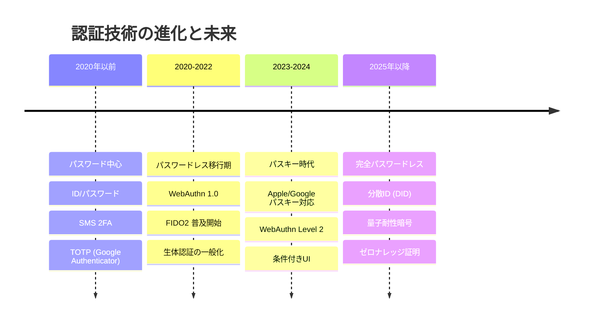
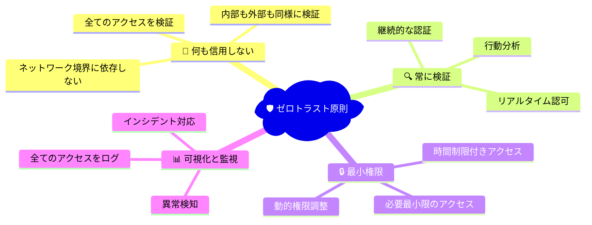

# 最新セキュリティトレンド

## 🎯 学習目標

- WebAuthn/FIDO2とパスキーの仕組みを理解する
- ゼロトラストアーキテクチャの原則を学ぶ
- 現代的な認証技術のトレンドを知る
- 将来的なセキュリティ技術の展望を理解する
- 実際のプロダクション導入における考慮事項を学ぶ

## 🔮 認証技術の進化

### 📈 技術トレンドの概観



### 🌟 現在の主要トレンド

```typescript
// 2024年現在の認証技術スタック
const modernAuthStack = {
  // パスワードレス認証
  passwordless: {
    technologies: ["WebAuthn", "FIDO2", "Passkeys"],
    benefits: ["フィッシング耐性", "ユーザビリティ向上", "運用コスト削減"],
    adoption: "急速に普及中"
  },

  // 生体認証
  biometrics: {
    technologies: ["指紋", "Face ID", "Touch ID", "Windows Hello"],
    useCases: ["デバイス認証", "アプリケーション認証"],
    challenges: ["プライバシー", "デバイス依存"]
  },

  // ゼロトラスト
  zeroTrust: {
    principles: ["何も信用しない", "常に検証", "最小権限"],
    technologies: ["条件付きアクセス", "デバイス信頼", "リスクベース認証"],
    scope: "エンタープライズ中心から一般化へ"
  },

  // 分散アイデンティティ
  decentralizedIdentity: {
    technologies: ["DID", "Verifiable Credentials", "Self-Sovereign Identity"],
    vision: "ユーザーが自分のIDを完全制御",
    status: "実験・概念実証段階"
  }
};
```

## 🔐 WebAuthn / FIDO2 / パスキー

### 📝 基本概念と仕組み

```mermaid
sequenceDiagram
    participant U as 👤 ユーザー
    participant B as 🌐 ブラウザ
    participant S as 🖥️ サーバー
    participant A as 🔐 認証器<br/>(Touch ID/FaceID)

    Note over U,A: WebAuthn 登録フロー
    U->>B: パスキー登録開始
    B->>S: 登録リクエスト
    S-->>B: Challenge + オプション
    B->>A: 認証器に登録要求
    A->>A: 公開鍵ペア生成
    A->>A: 生体認証/PIN確認
    A-->>B: 公開鍵 + Attestation
    B->>S: 登録情報送信
    S->>S: 公開鍵保存
    S-->>B: 登録完了
    
    Note over U,A: WebAuthn 認証フロー
    U->>B: パスキーでログイン
    B->>S: 認証リクエスト
    S-->>B: Challenge
    B->>A: 認証器に署名要求
    A->>A: 生体認証/PIN確認
    A->>A: 秘密鍵で署名
    A-->>B: 署名
    B->>S: 署名送信
    S->>S: 公開鍵で署名検証
    S-->>B: 認証完了
    
    style A fill:#e8f5e8
    style S fill:#e3f2fd
```

### 🔧 WebAuthn実装

```typescript
// WebAuthn/パスキーの実装
export class WebAuthnManager {
  private readonly rpID: string;
  private readonly rpName: string;
  private readonly origin: string;

  constructor() {
    this.rpID = process.env.WEBAUTHN_RP_ID || 'localhost';
    this.rpName = process.env.WEBAUTHN_RP_NAME || 'Bucket List App';
    this.origin = process.env.WEBAUTHN_ORIGIN || 'http://localhost:3000';
  }

  // パスキー登録の開始
  async startRegistration(user: User): Promise<PublicKeyCredentialCreationOptions> {
    const challenge = crypto.getRandomValues(new Uint8Array(32));
    
    // チャレンジをセッションに保存（後で検証用）
    await this.saveChallenge(user.id, challenge, 'registration');

    const options: PublicKeyCredentialCreationOptions = {
      rp: {
        id: this.rpID,
        name: this.rpName
      },
      
      user: {
        id: new TextEncoder().encode(user.id),
        name: user.email,
        displayName: user.name || user.email
      },
      
      challenge: challenge,
      
      pubKeyCredParams: [
        { alg: -7, type: "public-key" },   // ES256
        { alg: -257, type: "public-key" }  // RS256
      ],
      
      authenticatorSelection: {
        authenticatorAttachment: "platform", // デバイス内蔵認証器を優先
        userVerification: "preferred",       // 生体認証/PINを推奨
        residentKey: "preferred"            // パスキー（discoverable credential）
      },
      
      attestation: "none", // 一般的にはattestation不要
      
      timeout: 60000, // 60秒
      
      // 既存のクレデンシャルを除外
      excludeCredentials: await this.getUserCredentials(user.id)
    };

    return options;
  }

  // パスキー登録の完了
  async completeRegistration(
    userId: string,
    credential: PublicKeyCredential,
    expectedChallenge: ArrayBuffer
  ): Promise<void> {
    // チャレンジの検証
    const savedChallenge = await this.getChallenge(userId, 'registration');
    if (!savedChallenge || !this.compareBuffers(savedChallenge, expectedChallenge)) {
      throw new Error('Invalid challenge');
    }

    const response = credential.response as AuthenticatorAttestationResponse;
    
    // Attestation Object の解析
    const attestationObject = this.parseAttestationObject(response.attestationObject);
    const authData = attestationObject.authData;
    
    // 基本検証
    this.verifyRegistrationData(authData, credential.id);
    
    // 公開鍵の抽出
    const publicKey = this.extractPublicKey(authData);
    
    // データベースに保存
    await this.saveCredential({
      userId,
      credentialId: credential.id,
      publicKey: publicKey,
      counter: this.getCounter(authData),
      deviceType: this.getDeviceType(authData),
      createdAt: new Date()
    });

    // チャレンジを削除
    await this.clearChallenge(userId, 'registration');
  }

  // パスキー認証の開始
  async startAuthentication(userHandle?: string): Promise<PublicKeyCredentialRequestOptions> {
    const challenge = crypto.getRandomValues(new Uint8Array(32));
    
    let allowCredentials: PublicKeyCredentialDescriptor[] = [];
    
    if (userHandle) {
      // 特定ユーザーの認証（username入力後）
      await this.saveChallenge(userHandle, challenge, 'authentication');
      allowCredentials = await this.getUserCredentials(userHandle);
    } else {
      // パスキー自動発見（username入力なし）
      await this.saveChallenge('global', challenge, 'authentication');
    }

    const options: PublicKeyCredentialRequestOptions = {
      challenge: challenge,
      rpId: this.rpID,
      allowCredentials: allowCredentials.length > 0 ? allowCredentials : undefined,
      userVerification: "preferred",
      timeout: 60000
    };

    return options;
  }

  // パスキー認証の完了
  async completeAuthentication(
    credential: PublicKeyCredential,
    expectedChallenge: ArrayBuffer
  ): Promise<User> {
    const response = credential.response as AuthenticatorAssertionResponse;
    
    // 保存されたクレデンシャル情報を取得
    const savedCredential = await this.getCredential(credential.id);
    if (!savedCredential) {
      throw new Error('Credential not found');
    }

    // チャレンジの検証
    const savedChallenge = await this.getChallenge(savedCredential.userId, 'authentication');
    if (!savedChallenge || !this.compareBuffers(savedChallenge, expectedChallenge)) {
      throw new Error('Invalid challenge');
    }

    // 署名の検証
    const isValid = await this.verifySignature(
      savedCredential.publicKey,
      response.authenticatorData,
      response.clientDataJSON,
      response.signature,
      expectedChallenge
    );

    if (!isValid) {
      throw new Error('Invalid signature');
    }

    // カウンター検証（リプレイ攻撃対策）
    const authData = new DataView(response.authenticatorData);
    const counter = authData.getUint32(33, false); // Big endian
    
    if (counter !== 0 && counter <= savedCredential.counter) {
      throw new Error('Invalid counter - possible replay attack');
    }

    // カウンター更新
    await this.updateCredentialCounter(credential.id, counter);

    // チャレンジを削除
    await this.clearChallenge(savedCredential.userId, 'authentication');

    // ユーザー情報を返す
    return await this.getUser(savedCredential.userId);
  }

  // 条件付きUI（Conditional UI）のサポート
  async isConditionalUIAvailable(): Promise<boolean> {
    if (!window.PublicKeyCredential) {
      return false;
    }

    try {
      const available = await PublicKeyCredential.isConditionalMediationAvailable();
      return available;
    } catch {
      return false;
    }
  }

  // 署名検証
  private async verifySignature(
    publicKey: ArrayBuffer,
    authenticatorData: ArrayBuffer,
    clientDataJSON: ArrayBuffer,
    signature: ArrayBuffer,
    expectedChallenge: ArrayBuffer
  ): Promise<boolean> {
    // Client Data の検証
    const clientData = JSON.parse(new TextDecoder().decode(clientDataJSON));
    
    if (clientData.type !== 'webauthn.get') {
      return false;
    }

    if (clientData.origin !== this.origin) {
      return false;
    }

    const receivedChallenge = this.base64UrlDecode(clientData.challenge);
    if (!this.compareBuffers(receivedChallenge, expectedChallenge)) {
      return false;
    }

    // 署名データの構築
    const clientDataHash = await crypto.subtle.digest('SHA-256', clientDataJSON);
    const signedData = new Uint8Array(authenticatorData.byteLength + clientDataHash.byteLength);
    signedData.set(new Uint8Array(authenticatorData), 0);
    signedData.set(new Uint8Array(clientDataHash), authenticatorData.byteLength);

    // 公開鍵のインポート
    const cryptoKey = await crypto.subtle.importKey(
      'spki',
      publicKey,
      {
        name: 'ECDSA',
        namedCurve: 'P-256'
      },
      false,
      ['verify']
    );

    // 署名検証
    return await crypto.subtle.verify(
      {
        name: 'ECDSA',
        hash: 'SHA-256'
      },
      cryptoKey,
      signature,
      signedData
    );
  }

  // ユーティリティメソッド
  private compareBuffers(a: ArrayBuffer, b: ArrayBuffer): boolean {
    if (a.byteLength !== b.byteLength) return false;
    const view1 = new Uint8Array(a);
    const view2 = new Uint8Array(b);
    for (let i = 0; i < view1.length; i++) {
      if (view1[i] !== view2[i]) return false;
    }
    return true;
  }

  private base64UrlDecode(base64url: string): ArrayBuffer {
    const base64 = base64url.replace(/-/g, '+').replace(/_/g, '/');
    const padded = base64.padEnd(base64.length + (4 - base64.length % 4) % 4, '=');
    const binary = atob(padded);
    const bytes = new Uint8Array(binary.length);
    for (let i = 0; i < binary.length; i++) {
      bytes[i] = binary.charCodeAt(i);
    }
    return bytes.buffer;
  }
}
```

### 🌐 フロントエンド統合

```typescript
// React でのWebAuthn統合
export function useWebAuthn() {
  const [isAvailable, setIsAvailable] = useState(false);
  const [isConditionalUIAvailable, setIsConditionalUIAvailable] = useState(false);

  useEffect(() => {
    checkWebAuthnAvailability();
  }, []);

  const checkWebAuthnAvailability = async () => {
    if (!window.PublicKeyCredential) {
      setIsAvailable(false);
      return;
    }

    setIsAvailable(true);

    try {
      const conditionalAvailable = await PublicKeyCredential.isConditionalMediationAvailable();
      setIsConditionalUIAvailable(conditionalAvailable);
    } catch {
      setIsConditionalUIAvailable(false);
    }
  };

  const registerPasskey = async (user: User) => {
    if (!isAvailable) {
      throw new Error('WebAuthn is not available');
    }

    try {
      // サーバーから登録オプションを取得
      const response = await fetch('/api/webauthn/register/start', {
        method: 'POST',
        headers: { 'Content-Type': 'application/json' },
        body: JSON.stringify({ userId: user.id })
      });

      const options = await response.json();

      // ArrayBufferに変換
      options.challenge = Uint8Array.from(atob(options.challenge), c => c.charCodeAt(0));
      options.user.id = Uint8Array.from(atob(options.user.id), c => c.charCodeAt(0));

      // WebAuthn API呼び出し
      const credential = await navigator.credentials.create({
        publicKey: options
      }) as PublicKeyCredential;

      // サーバーに登録完了を送信
      const registrationResponse = await fetch('/api/webauthn/register/complete', {
        method: 'POST',
        headers: { 'Content-Type': 'application/json' },
        body: JSON.stringify({
          id: credential.id,
          rawId: btoa(String.fromCharCode(...new Uint8Array(credential.rawId))),
          response: {
            attestationObject: btoa(String.fromCharCode(...new Uint8Array(credential.response.attestationObject))),
            clientDataJSON: btoa(String.fromCharCode(...new Uint8Array(credential.response.clientDataJSON)))
          },
          type: credential.type
        })
      });

      if (!registrationResponse.ok) {
        throw new Error('Registration failed');
      }

      return true;
    } catch (error) {
      console.error('Passkey registration error:', error);
      throw error;
    }
  };

  const authenticateWithPasskey = async (conditional = false) => {
    if (!isAvailable) {
      throw new Error('WebAuthn is not available');
    }

    try {
      // サーバーから認証オプションを取得
      const response = await fetch('/api/webauthn/authenticate/start', {
        method: 'POST'
      });

      const options = await response.json();
      options.challenge = Uint8Array.from(atob(options.challenge), c => c.charCodeAt(0));

      // 条件付きUI使用時の設定
      const credentialRequestOptions: any = { publicKey: options };
      if (conditional && isConditionalUIAvailable) {
        credentialRequestOptions.mediation = 'conditional';
      }

      // WebAuthn API呼び出し
      const credential = await navigator.credentials.get(credentialRequestOptions) as PublicKeyCredential;

      // サーバーに認証完了を送信
      const authResponse = await fetch('/api/webauthn/authenticate/complete', {
        method: 'POST',
        headers: { 'Content-Type': 'application/json' },
        body: JSON.stringify({
          id: credential.id,
          rawId: btoa(String.fromCharCode(...new Uint8Array(credential.rawId))),
          response: {
            authenticatorData: btoa(String.fromCharCode(...new Uint8Array(credential.response.authenticatorData))),
            clientDataJSON: btoa(String.fromCharCode(...new Uint8Array(credential.response.clientDataJSON))),
            signature: btoa(String.fromCharCode(...new Uint8Array(credential.response.signature)))
          },
          type: credential.type
        })
      });

      if (!authResponse.ok) {
        throw new Error('Authentication failed');
      }

      const user = await authResponse.json();
      return user;
    } catch (error) {
      console.error('Passkey authentication error:', error);
      throw error;
    }
  };

  return {
    isAvailable,
    isConditionalUIAvailable,
    registerPasskey,
    authenticateWithPasskey
  };
}

// パスキー対応ログインコンポーネント
export function PasskeyLoginForm() {
  const { isAvailable, isConditionalUIAvailable, authenticateWithPasskey } = useWebAuthn();
  const [loading, setLoading] = useState(false);

  // 条件付きUIでパスキー認証を開始
  useEffect(() => {
    if (isConditionalUIAvailable) {
      authenticateWithPasskey(true).catch(() => {
        // エラーは無視（ユーザーがキャンセルした場合など）
      });
    }
  }, [isConditionalUIAvailable]);

  const handlePasskeyLogin = async () => {
    setLoading(true);
    try {
      const user = await authenticateWithPasskey(false);
      window.location.href = '/dashboard';
    } catch (error) {
      console.error('Passkey login failed:', error);
    } finally {
      setLoading(false);
    }
  };

  if (!isAvailable) {
    return null;
  }

  return (
    <div className="space-y-4">
      <button
        onClick={handlePasskeyLogin}
        disabled={loading}
        className="w-full flex items-center justify-center px-4 py-2 border border-transparent rounded-md shadow-sm text-sm font-medium text-white bg-indigo-600 hover:bg-indigo-700 disabled:opacity-50"
      >
        {loading ? (
          <div className="animate-spin rounded-full h-4 w-4 border-b-2 border-white mr-2" />
        ) : (
          <KeyIcon className="h-5 w-5 mr-2" />
        )}
        パスキーでログイン
      </button>

      {isConditionalUIAvailable && (
        <p className="text-sm text-gray-500 text-center">
          または、メールアドレス入力時にパスキーが自動表示されます
        </p>
      )}
    </div>
  );
}
```

## 🏛️ ゼロトラストアーキテクチャ

### 📝 ゼロトラストの原則



### 🔧 ゼロトラスト実装

```typescript
// ゼロトラストアクセス制御
export class ZeroTrustAccessControl {
  private riskEngine: RiskAssessmentEngine;
  private policyEngine: PolicyEngine;
  private deviceTrust: DeviceTrustManager;

  constructor() {
    this.riskEngine = new RiskAssessmentEngine();
    this.policyEngine = new PolicyEngine();
    this.deviceTrust = new DeviceTrustManager();
  }

  async evaluateAccess(request: AccessRequest): Promise<AccessDecision> {
    // 1. コンテキスト収集
    const context = await this.gatherContext(request);
    
    // 2. リスクアセスメント
    const riskScore = await this.riskEngine.assessRisk(context);
    
    // 3. ポリシー評価
    const policyDecision = await this.policyEngine.evaluate(context, riskScore);
    
    // 4. デバイス信頼度チェック
    const deviceTrustScore = await this.deviceTrust.evaluateDevice(context.device);
    
    // 5. 最終判定
    return this.makeAccessDecision(policyDecision, riskScore, deviceTrustScore);
  }

  private async gatherContext(request: AccessRequest): Promise<AccessContext> {
    return {
      user: await this.getUserContext(request.userId),
      device: await this.getDeviceContext(request.deviceId),
      network: await this.getNetworkContext(request.clientIP),
      resource: await this.getResourceContext(request.resourceId),
      time: new Date(),
      location: await this.getLocationContext(request.clientIP),
      behavior: await this.getBehaviorContext(request.userId)
    };
  }

  private async getUserContext(userId: string): Promise<UserContext> {
    return {
      id: userId,
      roles: await this.getUserRoles(userId),
      permissions: await this.getUserPermissions(userId),
      lastLogin: await this.getLastLoginTime(userId),
      mfaStatus: await this.getMFAStatus(userId),
      complianceStatus: await this.getComplianceStatus(userId)
    };
  }

  private async getDeviceContext(deviceId: string): Promise<DeviceContext> {
    const device = await this.deviceTrust.getDevice(deviceId);
    
    return {
      id: deviceId,
      type: device?.type || 'unknown',
      os: device?.os || 'unknown',
      trustScore: device?.trustScore || 0,
      lastSeen: device?.lastSeen,
      isManaged: device?.isManaged || false,
      complianceStatus: device?.complianceStatus || 'unknown',
      encryptionEnabled: device?.encryptionEnabled || false
    };
  }

  private async getNetworkContext(clientIP: string): Promise<NetworkContext> {
    return {
      ip: clientIP,
      location: await this.getIPLocation(clientIP),
      isp: await this.getISP(clientIP),
      isVPN: await this.isVPNConnection(clientIP),
      isTor: await this.isTorConnection(clientIP),
      reputation: await this.getIPReputation(clientIP)
    };
  }
}

// リスクアセスメントエンジン
export class RiskAssessmentEngine {
  async assessRisk(context: AccessContext): Promise<RiskScore> {
    const factors: RiskFactor[] = [];

    // ユーザーリスク
    factors.push(await this.assessUserRisk(context.user));
    
    // デバイスリスク
    factors.push(await this.assessDeviceRisk(context.device));
    
    // ネットワークリスク
    factors.push(await this.assessNetworkRisk(context.network));
    
    // 行動リスク
    factors.push(await this.assessBehaviorRisk(context.behavior));
    
    // 時間・場所リスク
    factors.push(await this.assessTemporalRisk(context.time, context.location));

    return this.calculateOverallRisk(factors);
  }

  private async assessUserRisk(user: UserContext): Promise<RiskFactor> {
    let score = 0;
    const reasons: string[] = [];

    // MFA未設定
    if (!user.mfaStatus.enabled) {
      score += 30;
      reasons.push('MFA not enabled');
    }

    // 長期間ログインなし
    const daysSinceLastLogin = user.lastLogin ? 
      Math.floor((Date.now() - user.lastLogin.getTime()) / (1000 * 60 * 60 * 24)) : 999;
    
    if (daysSinceLastLogin > 90) {
      score += 20;
      reasons.push('Long time since last login');
    }

    // コンプライアンス違反
    if (user.complianceStatus !== 'compliant') {
      score += 25;
      reasons.push('Compliance issues');
    }

    return {
      category: 'user',
      score: Math.min(score, 100),
      reasons
    };
  }

  private async assessDeviceRisk(device: DeviceContext): Promise<RiskFactor> {
    let score = 0;
    const reasons: string[] = [];

    // 管理されていないデバイス
    if (!device.isManaged) {
      score += 40;
      reasons.push('Unmanaged device');
    }

    // 暗号化未有効
    if (!device.encryptionEnabled) {
      score += 25;
      reasons.push('Encryption not enabled');
    }

    // 低い信頼スコア
    if (device.trustScore < 0.5) {
      score += 30;
      reasons.push('Low device trust score');
    }

    // 新しいデバイス
    if (!device.lastSeen || Date.now() - device.lastSeen.getTime() < 24 * 60 * 60 * 1000) {
      score += 15;
      reasons.push('New or unfamiliar device');
    }

    return {
      category: 'device',
      score: Math.min(score, 100),
      reasons
    };
  }

  private async assessNetworkRisk(network: NetworkContext): Promise<RiskFactor> {
    let score = 0;
    const reasons: string[] = [];

    // VPN使用
    if (network.isVPN) {
      score += 10;
      reasons.push('VPN connection');
    }

    // Tor使用
    if (network.isTor) {
      score += 50;
      reasons.push('Tor connection');
    }

    // 悪評のあるIP
    if (network.reputation < 0.3) {
      score += 40;
      reasons.push('IP with poor reputation');
    }

    // 異常な地理的場所
    const expectedLocations = await this.getUserExpectedLocations(network.ip);
    if (!this.isExpectedLocation(network.location, expectedLocations)) {
      score += 20;
      reasons.push('Unusual geographic location');
    }

    return {
      category: 'network',
      score: Math.min(score, 100),
      reasons
    };
  }
}

// 条件付きアクセス
export class ConditionalAccessPolicy {
  async evaluatePolicy(context: AccessContext, riskScore: RiskScore): Promise<PolicyDecision> {
    const policies = await this.getApplicablePolicies(context);
    
    for (const policy of policies) {
      const decision = await this.evaluateSinglePolicy(policy, context, riskScore);
      
      if (decision.action === 'deny') {
        return decision; // 拒否ポリシーがあれば即座に拒否
      }
      
      if (decision.action === 'require_additional_auth') {
        return decision; // 追加認証が必要
      }
    }

    return {
      action: 'allow',
      confidence: this.calculateConfidence(context, riskScore),
      requiredActions: [],
      sessionDuration: this.calculateSessionDuration(riskScore)
    };
  }

  private async evaluateSinglePolicy(
    policy: AccessPolicy, 
    context: AccessContext, 
    riskScore: RiskScore
  ): Promise<PolicyDecision> {
    // 高リスクアクセス
    if (riskScore.overall > 70) {
      return {
        action: 'require_additional_auth',
        requiredActions: ['step_up_mfa', 'verify_device'],
        reason: 'High risk access detected'
      };
    }

    // 管理されていないデバイスからの機密リソースアクセス
    if (!context.device.isManaged && context.resource.sensitivity === 'high') {
      return {
        action: 'deny',
        reason: 'Unmanaged device accessing sensitive resource'
      };
    }

    // 異常な時間帯のアクセス
    if (this.isUnusualTime(context.time, context.user.id)) {
      return {
        action: 'require_additional_auth',
        requiredActions: ['verify_identity'],
        reason: 'Access during unusual hours'
      };
    }

    // 異常な場所からのアクセス
    if (this.isUnusualLocation(context.location, context.user.id)) {
      return {
        action: 'require_additional_auth',
        requiredActions: ['verify_location', 'step_up_mfa'],
        reason: 'Access from unusual location'
      };
    }

    return {
      action: 'allow',
      confidence: 0.95
    };
  }
}
```

## 🚀 未来の認証技術

### 🔮 新興技術とトレンド

```typescript
// 将来の認証技術スタック
const futureAuthTechnologies = {
  // 分散アイデンティティ (DID)
  decentralizedIdentity: {
    concept: "ユーザーが完全にIDを制御",
    technologies: ["DID", "Verifiable Credentials", "Blockchain"],
    benefits: ["プライバシー", "相互運用性", "ベンダーロックイン回避"],
    challenges: ["普及", "UX", "標準化"],
    timeline: "2025-2030年"
  },

  // ゼロナレッジ証明
  zeroKnowledgeProofs: {
    concept: "秘密情報を公開せずに認証",
    useCases: ["年齢証明", "資格証明", "プライベート認証"],
    benefits: ["完全なプライバシー", "検証可能性"],
    challenges: ["計算コスト", "複雑性"],
    timeline: "2026-2028年"
  },

  // 量子耐性暗号
  postQuantumCryptography: {
    concept: "量子コンピュータに対抗",
    algorithms: ["CRYSTALS-Kyber", "CRYSTALS-Dilithium", "SPHINCS+"],
    urgency: "量子コンピュータの脅威",
    status: "NIST標準化済み",
    timeline: "2024-2030年"
  },

  // バイオメトリクス進歩
  advancedBiometrics: {
    technologies: ["心拍パターン", "歩行パターン", "脳波", "静脈パターン"],
    benefits: ["偽造困難", "パッシブ認証", "継続認証"],
    challenges: ["プライバシー", "デバイス要件", "精度"],
    timeline: "2025-2027年"
  },

  // AI駆動認証
  aiDrivenAuth: {
    concept: "行動分析による継続認証",
    technologies: ["機械学習", "行動バイオメトリクス", "異常検知"],
    applications: ["リスクベース認証", "適応的認証", "不正検知"],
    benefits: ["ユーザビリティ", "高精度", "リアルタイム"],
    timeline: "2024-2026年"
  }
};
```

### 🧬 分散アイデンティティ (DID)

```typescript
// 分散アイデンティティの概念実装例
interface VerifiableCredential {
  "@context": string[];
  id: string;
  type: string[];
  issuer: {
    id: string; // DID
    name?: string;
  };
  issuanceDate: string;
  credentialSubject: {
    id: string; // Subject DID
    [key: string]: any; // Claims
  };
  proof: {
    type: string;
    created: string;
    verificationMethod: string;
    proofPurpose: string;
    jws: string; // JSON Web Signature
  };
}

interface DIDDocument {
  "@context": string[];
  id: string; // DID
  verificationMethod: Array<{
    id: string;
    type: string;
    controller: string;
    publicKeyJwk?: any;
    publicKeyMultibase?: string;
  }>;
  authentication: string[];
  assertionMethod: string[];
  keyAgreement: string[];
  capabilityInvocation: string[];
  capabilityDelegation: string[];
  service?: Array<{
    id: string;
    type: string;
    serviceEndpoint: string;
  }>;
}

// 分散アイデンティティ管理
export class DecentralizedIdentityManager {
  // DID作成
  async createDID(method: string = 'web'): Promise<{ did: string; document: DIDDocument; privateKey: CryptoKey }> {
    // キーペア生成
    const keyPair = await crypto.subtle.generateKey(
      {
        name: 'ECDSA',
        namedCurve: 'P-256'
      },
      true,
      ['sign', 'verify']
    );

    const publicKeyJwk = await crypto.subtle.exportKey('jwk', keyPair.publicKey);
    
    // DID生成
    const did = `did:${method}:${crypto.randomUUID()}`;
    
    // DID Document作成
    const document: DIDDocument = {
      "@context": ["https://www.w3.org/ns/did/v1"],
      id: did,
      verificationMethod: [{
        id: `${did}#key-1`,
        type: 'JsonWebKey2020',
        controller: did,
        publicKeyJwk: publicKeyJwk
      }],
      authentication: [`${did}#key-1`],
      assertionMethod: [`${did}#key-1`],
      keyAgreement: [`${did}#key-1`],
      capabilityInvocation: [`${did}#key-1`],
      capabilityDelegation: [`${did}#key-1`]
    };

    return {
      did,
      document,
      privateKey: keyPair.privateKey
    };
  }

  // Verifiable Credential発行
  async issueCredential(
    issuerDID: string,
    issuerPrivateKey: CryptoKey,
    subjectDID: string,
    claims: Record<string, any>
  ): Promise<VerifiableCredential> {
    const credentialId = `urn:uuid:${crypto.randomUUID()}`;
    
    const credential = {
      "@context": [
        "https://www.w3.org/2018/credentials/v1",
        "https://www.w3.org/2018/credentials/examples/v1"
      ],
      id: credentialId,
      type: ["VerifiableCredential"],
      issuer: {
        id: issuerDID
      },
      issuanceDate: new Date().toISOString(),
      credentialSubject: {
        id: subjectDID,
        ...claims
      }
    };

    // デジタル署名
    const proof = await this.createProof(credential, issuerDID, issuerPrivateKey);
    
    return {
      ...credential,
      proof
    };
  }

  // Verifiable Credential検証
  async verifyCredential(credential: VerifiableCredential): Promise<boolean> {
    try {
      // 発行者のDID Document取得
      const issuerDocument = await this.resolveDID(credential.issuer.id);
      
      // 署名検証用の公開鍵取得
      const verificationMethod = issuerDocument.verificationMethod.find(
        vm => vm.id === credential.proof.verificationMethod
      );
      
      if (!verificationMethod) {
        return false;
      }

      // 公開鍵インポート
      const publicKey = await crypto.subtle.importKey(
        'jwk',
        verificationMethod.publicKeyJwk,
        {
          name: 'ECDSA',
          namedCurve: 'P-256'
        },
        false,
        ['verify']
      );

      // 署名検証
      return await this.verifyProof(credential, publicKey);
    } catch (error) {
      console.error('Credential verification failed:', error);
      return false;
    }
  }

  private async createProof(
    credential: any,
    issuerDID: string,
    privateKey: CryptoKey
  ): Promise<any> {
    const proofConfig = {
      type: 'JsonWebSignature2020',
      created: new Date().toISOString(),
      verificationMethod: `${issuerDID}#key-1`,
      proofPurpose: 'assertionMethod'
    };

    // 署名対象データの作成
    const credentialCopy = { ...credential };
    const signatureData = JSON.stringify(credentialCopy) + JSON.stringify(proofConfig);
    
    // 署名作成
    const signature = await crypto.subtle.sign(
      {
        name: 'ECDSA',
        hash: 'SHA-256'
      },
      privateKey,
      new TextEncoder().encode(signatureData)
    );

    return {
      ...proofConfig,
      jws: btoa(String.fromCharCode(...new Uint8Array(signature)))
    };
  }
}
```

## 🎯 重要なポイント

### ✅ 最新トレンド採用の指針

1. **段階的導入**: 新技術は既存システムと並行運用から開始
2. **ユーザビリティ重視**: セキュリティ強化とUX向上の両立
3. **相互運用性**: 標準準拠と将来的な移行を考慮
4. **プライバシー配慮**: ユーザーデータの保護を最優先
5. **継続的学習**: 新技術の動向を常にキャッチアップ

### ❌ 避けるべき落とし穴

```typescript
// ❌ 悪い例：技術追求のための導入
const badTechAdoption = {
  reasoning: "最新技術だから導入",
  planning: "技術検証なしで本番導入",
  userExperience: "ユーザビリティを犠牲",
  compatibility: "既存システムとの整合性を無視"
};

// ✅ 良い例：目的駆動の段階的導入
const goodTechAdoption = {
  reasoning: "特定の課題解決のために導入",
  planning: "POC → パイロット → 段階展開",
  userExperience: "UX向上を必須要件とする",
  compatibility: "既存システムとの互換性を保つ"
};
```

## 🚀 まとめ

Level 5: 高度なトピックの学習が完了しました！

✅ **SSR認証**: サーバーサイドレンダリング環境での認証実装  
✅ **マイクロサービス認証**: 分散システムでの JWT 共有と認証設計  
✅ **OAuth統合**: OAuth 2.0 と OpenID Connect の詳細実装  
✅ **最新トレンド**: WebAuthn/パスキー、ゼロトラスト、将来技術  

**おめでとうございます！** これで現代的な認証認可システムの全体像を理解し、実装できるスキルを身につけました。

### 🎯 次にできること

1. **実践プロジェクト**: バケットリストアプリに新機能を追加
2. **オープンソース貢献**: 認証ライブラリの改善に参加
3. **コミュニティ活動**: 学んだ知識を他の開発者と共有
4. **専門性向上**: セキュリティ専門家やアーキテクトとしてのキャリア

### 📚 参考資料

- [WebAuthn 仕様](https://www.w3.org/TR/webauthn/)
- [OAuth 2.0 Security Best Current Practice](https://tools.ietf.org/html/draft-ietf-oauth-security-topics)
- [NIST Digital Identity Guidelines](https://pages.nist.gov/800-63-3/)
- [ゼロトラストアーキテクチャ (NIST SP 800-207)](https://csrc.nist.gov/publications/detail/sp/800-207/final)

認証認可の学習お疲れさまでした！🎉