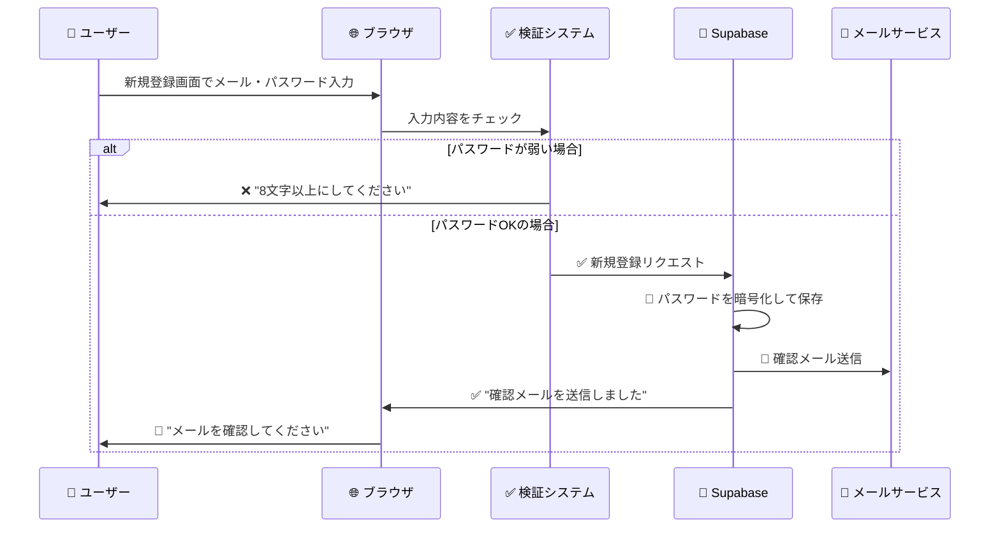
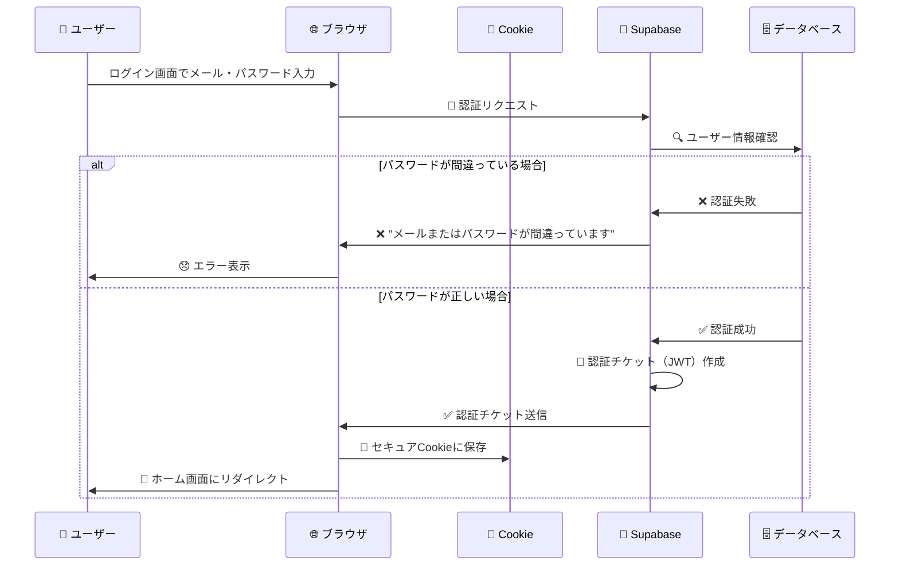
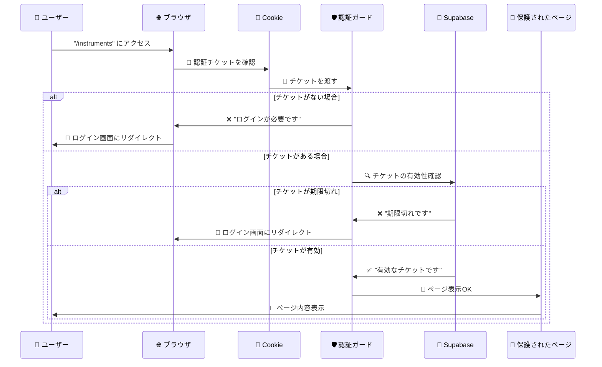
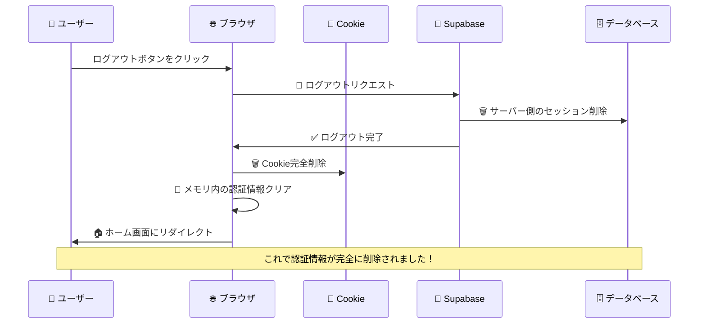

# 🔐 認証システム完全ガイド（初心者向け）

このドキュメントでは、React Router v7 + Supabaseで実装した**Cookieベース認証システム**について、セキュリティ初心者でも理解できるよう詳しく解説します。

## 🍪 認証システムの基本概念

### そもそも「認証」って何？

**認証**とは、**「あなたが本当にあなたなのかを確認すること」**です。

現実世界で例えると：
- 🏦 **銀行**: 通帳 + 印鑑で本人確認
- 🏠 **家**: 鍵で本人確認  
- 🎫 **映画館**: チケットで入場確認

Webサイトでは：
- 📧 **メールアドレス** + 🔑 **パスワード** で本人確認
- 認証成功後に **「認証チケット」** を発行
- そのチケットを持っていれば、「ログイン済み」として扱われる

### 🎫 認証チケット（セッション情報）とは？

```
🎭 映画館の例
┌─────────────────────┐
│  🎫 入場チケット      │
│  映画: アベンジャーズ   │
│  座席: A-15         │
│  日時: 2024/1/15    │
│  有効期限: 当日のみ    │
└─────────────────────┘
```

Webサイトでも同じように：

```
🔐 認証チケット（セッション情報）
┌─────────────────────────────┐
│  ユーザー: user@example.com    │
│  ID: abc-123-def               │
│  有効期限: 24時間後             │
│  権限: 一般ユーザー             │
│  発行者: Supabase              │
└─────────────────────────────┘
```

## 🏪 localStorage vs Cookie：どこに認証チケットを保存する？

### 📦 localStorage（以前の方式）

```
🏠 あなたの家（ブラウザ）
┌─────────────────────────────┐
│  🗃️ localStorage (引き出し)    │
│  ┌─────────────────────────┐  │
│  │ 🎫 認証チケット          │  │
│  │   (誰でも開けられる)      │  │
│  └─────────────────────────┘  │
└─────────────────────────────┘
```

**問題点**:
- 🚨 JavaScriptで簡単に取り出せる
- 🕵️ 開発者ツールで丸見え
- 📋 簡単にコピー&ペーストできる

### 🍪 Cookie（現在の方式）

```
🏠 あなたの家（ブラウザ）
┌─────────────────────────────┐
│  🍪 Cookie (金庫)            │
│  ┌─────────────────────────┐  │
│  │ 🎫 認証チケット          │  │
│  │   ⏰ 自動期限管理        │  │
│  │   🔒 HTTPS必須          │  │
│  │   🛡️ CSRF攻撃防止       │  │
│  └─────────────────────────┘  │
└─────────────────────────────┘
```

**利点**:
- ⏰ **自動期限管理**: 24時間で自動削除
- 🔒 **HTTPS必須**: 暗号化通信でのみ送信
- 🛡️ **CSRF防止**: 悪意あるサイトからの攻撃を防ぐ
- 🎯 **手動コピー困難**: 開発者ツールでのコピーが複雑

## 🛡️ セキュリティの仕組み（初心者向け解説）

### 1. 🏰 多層防御システム

私たちの認証システムは**お城の防御**のように、複数の壁で守られています：

```
🏰 お城（あなたのアカウント）を守る防御システム

    🌐 インターネット
         ↓
┌─────────────────────────┐
│  第1の壁: HTTPS暗号化     │ ← 🔐 通信を暗号化
└─────────────────────────┘
         ↓
┌─────────────────────────┐
│  第2の壁: CSP防御        │ ← 🛡️ 悪意あるスクリプト阻止
└─────────────────────────┘
         ↓
┌─────────────────────────┐
│  第3の壁: Cookie保護      │ ← 🍪 セキュアなチケット管理
└─────────────────────────┘
         ↓
┌─────────────────────────┐
│  第4の壁: セッション検証   │ ← ✅ チケットの真正性確認
└─────────────────────────┘
         ↓
┌─────────────────────────┐
│  第5の壁: アクティビティ監視│ ← 👁️ 不審な動きを検知
└─────────────────────────┘
         ↓
    🏰 あなたのデータ
```

### 2. 🔐 HTTPS暗号化

```
👤 あなた              📡 インターネット              🖥️ サーバー
   │                       │                         │
   │ 🔓 平文メッセージ        │                         │
   │ "password123"         │                         │
   │        ↓              │                         │
   │ 🔐 暗号化              │                         │
   │ "x7k9m2n..."         │  ━━━━━━━━━━━━━━━━━━━━━━━►  │
   │                       │                         │
   │                       │                         │ 🔓 復号化
   │                       │                         │ "password123"
```

**簡単に言うと**: あなたのパスワードが暗号化されて送信されるので、途中で盗み見られても安全です。

### 3. 🛡️ CSP（Content Security Policy）

**悪意あるスクリプトをブロック**:

```
😈 悪意あるハッカー
   │
   │ 📜 悪いスクリプト
   │ "ユーザーの認証情報を盗め！"
   │        ↓
   ┌──────────────────┐
   │  🛡️ CSP警備員     │ ← "待て！許可されていないスクリプトだ！"
   │  "実行拒否！"      │
   └──────────────────┘
   │        ↓
   🚫 スクリプト実行停止
```

### 4. 🍪 セキュアCookie設定

```javascript
🍪 普通のCookie（危険）
┌────────────────────────┐
│ name=value             │ ← 誰でも読める
│ 期限なし                │ ← いつまでも残る
│ HTTP/HTTPSどちらでも送信  │ ← 盗聴される可能性
└────────────────────────┘

🔒 セキュアCookie（安全）
┌────────────────────────┐
│ name=value             │
│ Secure                 │ ← HTTPS必須
│ SameSite=strict        │ ← CSRF攻撃防止
│ Max-Age=86400          │ ← 24時間で自動削除
│ Path=/                 │ ← アプリ全体で有効
└────────────────────────┘
```

## 🔄 認証フローの詳細解説

### 1. 🆕 新規登録の流れ



### 2. 🔐 ログインの流れ



### 3. 🔒 保護されたページへのアクセス



### 4. 🚪 ログアウトの流れ



## 🕰️ アクティビティ監視システム

### 自動ログアウトの仕組み

```
👤 ユーザーの行動           ⏰ 時間の流れ            🔔 システムの反応

🖱️ マウスクリック              0分                 ✅ アクティビティ更新
    │                                              
📋 キーボード入力              5分                 ✅ アクティビティ更新
    │                                              
📜 スクロール                  10分                ✅ アクティビティ更新
    │                                              
😴 何もしない                  ...                 ⏳ 待機中
    │                                              
😴 何もしない                  30分                🚨 自動ログアウト！
    │                                              
🔓 ログアウト完了              30分01秒             🛡️ セキュリティ確保
```

**なぜ30分？**
- ⏰ **長すぎず短すぎない**: 作業中に切れない、でも放置時は安全
- 🏢 **オフィス環境**: 席を離れた時の安全確保
- 🔋 **セキュリティバランス**: 利便性とセキュリティの両立

## 🚨 セキュリティ攻撃とその対策

### 1. 🕵️ セッションハイジャック攻撃

**攻撃の仕組み**:
```
😈 ハッカー: "認証チケットを盗んで、なりすましてやる！"

❌ localStorage時代（危険だった）:
┌─────────────────────────────┐
│ 開発者ツール → localStorage   │
│ 👆 ここから簡単にコピー       │
│ 📋 他のブラウザにペースト     │
│ 🎭 なりすまし成功...         │
└─────────────────────────────┘

✅ Cookie時代（現在・安全）:
┌─────────────────────────────┐
│ 🍪 Cookie                   │
│ 🔒 Secure設定               │
│ 🛡️ SameSite=strict         │
│ ⏰ 24時間で自動期限切れ       │
│ 📋 手動コピーが困難          │
└─────────────────────────────┘
```

### 2. 🎣 XSS（Cross-Site Scripting）攻撃

**攻撃の仕組みと対策**:
```
😈 ハッカーの攻撃:
┌──────────────────────────────────┐
│ 悪意あるサイト                     │
│ <script>                         │
│   // ユーザーの認証情報を盗む！     │
│   steal(document.cookie);        │
│ </script>                        │
└──────────────────────────────────┘
            ↓
🛡️ 私たちの防御システム:
┌──────────────────────────────────┐
│ CSP（Content Security Policy）   │
│ "外部スクリプトは実行拒否！"        │
│ ❌ script実行ブロック             │
└──────────────────────────────────┘
```

### 3. 🎯 CSRF（Cross-Site Request Forgery）攻撃

**攻撃の仕組みと対策**:
```
😈 悪意あるサイト:
┌──────────────────────────────────┐
│ "ユーザーが知らない間に、          │
│  勝手にログアウトさせてやる！"      │
│                                  │
│ <form action="https://your-app.com/logout" │
│       method="POST">             │
│   <input type="submit" value="クリック！"> │
│ </form>                          │
└──────────────────────────────────┘
            ↓
🛡️ 私たちの防御:
┌──────────────────────────────────┐
│ SameSite=strict Cookie           │
│ "他のサイトからのリクエストは拒否！" │
│ ❌ CSRF攻撃ブロック               │
└──────────────────────────────────┘
```

## 📊 セキュリティレベル比較表

| 🛡️ セキュリティ項目 | ❌ 以前（localStorage） | ✅ 現在（Cookie） | 📊 改善度 |
|-------------------|---------------------|------------------|----------|
| **手動コピー耐性** | 簡単にコピー可能 | 複雑で困難 | 🔥🔥🔥 |
| **XSS攻撃耐性** | スクリプトで簡単に盗める | CSPで保護 | 🔥🔥🔥 |
| **CSRF攻撃耐性** | 防御なし | SameSite=strict | 🔥🔥🔥 |
| **期限管理** | 手動削除のみ | 24時間自動削除 | 🔥🔥 |
| **HTTPS強制** | なし | Secure必須 | 🔥🔥 |
| **不正アクセス検知** | なし | アクティビティ監視 | 🔥🔥 |

## 🎯 一般的なWebサービスとの比較

### 🏆 セキュリティレベル比較

```
📊 セキュリティ成熟度レベル

Level 1: 基本的なパスワード認証
├─ 📧 メール + パスワード
└─ 🔴 localStorage保存（危険）

Level 2: 改善された認証
├─ 📧 メール + パスワード  
├─ 🟡 セッション管理
└─ 🟡 基本的なHTTPS

Level 3: 標準的なセキュリティ ← 🎯 私たちの現在のレベル
├─ 🔐 暗号化されたCookie
├─ 🛡️ CSRF/XSS対策
├─ ⏰ 自動期限管理
├─ 👁️ アクティビティ監視
└─ 🔒 HTTPS強制

Level 4: エンタープライズレベル
├─ 🔐 Level 3 + 多要素認証
├─ 📱 SMS/アプリ認証
├─ 🌍 IP制限
└─ 🤖 AI異常検知

Level 5: 最高レベル（銀行・政府）
├─ 🔐 Level 4 + 生体認証
├─ 🏛️ ハードウェアトークン
└─ 📜 法的監査要件
```

### 🌟 有名サービスとの比較

| サービス | セキュリティレベル | 私たちとの比較 |
|---------|------------------|---------------|
| 🐦 **Twitter** | Level 3 | 🟢 **同等** |
| 📘 **Facebook** | Level 3-4 | 🟡 **ほぼ同等** |
| 🎬 **Netflix** | Level 3 | 🟢 **同等** |
| 🛒 **Amazon** | Level 4 | 🟡 **少し下** |
| 🏦 **ネットバンキング** | Level 5 | 🔴 **下** |

**結論**: 一般的なWebアプリケーションとしては**十分に高いセキュリティレベル**です！

## 🔧 開発者向け：実装の詳細

### Cookie設定の詳細

```typescript
// 🍪 セキュアCookie設定
setCookie(key, value, {
  secure: location.protocol === 'https:', // 🔒 HTTPS必須
  sameSite: 'strict',                     // 🛡️ CSRF攻撃防止
  maxAge: 24 * 60 * 60,                   // ⏰ 24時間後に自動削除
  path: '/'                               // 🌐 アプリ全体で有効
});
```

**各設定の意味**:
- `secure`: HTTPS接続でのみCookieを送信
- `sameSite=strict`: 他のサイトからのリクエストでCookieを送信しない
- `maxAge`: 秒単位での有効期限（86400秒 = 24時間）
- `path`: Cookieが有効なURL範囲

### アクティビティ監視の実装

```typescript
// 👁️ 監視対象のユーザー操作
const activityEvents = [
  'mousedown',   // 🖱️ マウスクリック
  'mousemove',   // 🖱️ マウス移動
  'keypress',    // ⌨️ キーボード入力
  'scroll',      // 📜 スクロール
  'touchstart'   // 📱 タッチ操作
];

// ⏰ 30分（1800秒）非活動でログアウト
const maxInactivity = 30 * 60 * 1000;
```

## 🚀 今後の拡張可能性

### Phase 1: 現在の実装 ✅
- Cookieベース認証
- アクティビティ監視
- CSRF/XSS対策

### Phase 2: 追加可能な機能 🚧
```
🔐 多要素認証（MFA）
├─ 📱 SMS認証
├─ 📧 メール認証
└─ 🔢 TOTP（Google Authenticator）

🌍 地理的制限
├─ 🌏 IP制限
├─ 🚨 異常地域検知
└─ 📍 位置情報確認

🤖 AI・機械学習
├─ 👤 行動パターン学習
├─ 🚨 異常行動検知
└─ 🎯 リスクベース認証
```

### Phase 3: エンタープライズ機能 🏢
```
🏛️ SSO（Single Sign-On）
├─ 🏢 会社のアカウントで一括ログイン
├─ 🔗 SAML/OAuth連携
└─ 👥 チーム管理機能

📊 監査・コンプライアンス
├─ 📜 アクセスログ
├─ 📋 セキュリティレポート
└─ 🔍 監査証跡
```

## 🛠️ トラブルシューティング

### よくある問題と解決方法

#### 1. 🔄 「読み込み中」から進まない

**症状**: ログイン後、ずっと「読み込み中...」が表示される

**原因と解決方法**:
```
🔍 原因チェックリスト:
□ インターネット接続は正常？
□ ブラウザでJavaScriptは有効？
□ Cookieは有効？
□ HTTPSで接続している？

💡 解決方法:
1. ページをリロード（F5）
2. ブラウザのCookieを一度クリア
3. 別のブラウザで試す
4. HTTPS版のURLでアクセス
```

#### 2. 🚪 ログインしてもすぐログアウトされる

**症状**: ログイン成功後、すぐにログイン画面に戻される

**原因と解決方法**:
```
🔍 原因:
- Cookieが正しく保存されていない
- セッションの有効期限切れ
- ブラウザのCookie設定が無効

💡 解決方法:
1. ブラウザのCookie設定を確認
2. プライベートブラウジングを無効にする
3. セキュリティソフトの設定確認
4. 開発者ツールでCookieを確認
```

#### 3. 🔐 「認証が必要です」エラー

**症状**: ログイン済みのはずなのに、認証エラーが出る

**原因と解決方法**:
```
🔍 原因:
- セッションの期限切れ（24時間経過）
- 30分間非活動による自動ログアウト
- Cookie破損

💡 解決方法:
1. 再度ログインする
2. 定期的にページを操作する
3. ブラウザを再起動
```

## 📚 セキュリティ用語集（初心者向け）

### 🍪 **Cookie（クッキー）**
```
🏠 あなたの家にある「訪問者帳」のようなもの
- 誰が来たか（ユーザー情報）
- いつ来たか（ログイン時刻）
- いつまで有効か（期限）
が記録されている小さなファイル
```

### 🔐 **HTTPS（エイチティーティーピーエス）**
```
📮 手紙を送る時の「書留郵便」のようなもの
- 手紙（データ）を暗号化して送信
- 途中で盗み見られても読めない
- URLが「https://」で始まる
```

### 🛡️ **CSP（Content Security Policy）**
```
🏠 家の「警備システム」のようなもの
- 許可されていない人（スクリプト）の侵入を防ぐ
- 事前に設定した「安全なリスト」以外は実行拒否
- XSS攻撃を自動的にブロック
```

### 🎯 **CSRF（Cross-Site Request Forgery）**
```
🎭 「なりすまし詐欺」のようなもの
- 悪意あるサイトが、あなたになりすまして操作
- 「あなたが操作した」ように見せかける攻撃
- SameSite Cookieで防御可能
```

### 🕵️ **XSS（Cross-Site Scripting）**
```
🦠 「コンピューターウイルス」のようなもの
- 悪意あるコードをWebページに埋め込む
- ユーザーの個人情報を盗む
- CSPやエスケープ処理で防御
```

### 🎫 **JWT（JSON Web Token）**
```
🎫 「デジタル身分証明書」のようなもの
- あなたが誰か（ID）
- 何ができるか（権限）
- いつまで有効か（期限）
が暗号化されて記録されたチケット
```

## 🎉 まとめ

### ✅ 実装できたこと

1. **🍪 Cookieベース認証**: localStorageより安全な認証情報保存
2. **🛡️ 多層防御**: HTTPS + CSP + セキュアCookie + アクティビティ監視
3. **⏰ 自動セキュリティ**: 期限管理 + 非活動監視 + 自動ログアウト
4. **🚨 攻撃対策**: XSS/CSRF/セッションハイジャック対策

### 📊 セキュリティレベル

```
🏆 現在のセキュリティレベル: 
   標準的なWebアプリケーション以上

✅ Twitter、Netflix、Facebook等と同等
✅ 個人〜中小企業向けアプリに最適
✅ OWASP Top 10脆弱性対策済み
```

### 🎯 このシステムが適している用途

- 📱 個人・趣味のWebアプリ
- 🏢 中小企業の業務システム
- 🎓 学習・ポートフォリオプロジェクト
- 🚀 スタートアップのMVP

### 🚧 さらなる強化が必要な用途

- 🏦 金融サービス（多要素認証必須）
- 🏥 医療システム（法的要件）
- 🏛️ 政府機関（最高レベルセキュリティ）

---

**🎊 おめでとうございます！**

あなたは今、**現代的で安全な認証システム**を理解し、実装することができました。このシステムは多くの商用Webアプリケーションと同等のセキュリティレベルを持っています。

セキュリティは「完璧」はありませんが、**適切なレベルで適切な対策**を行うことが重要です。今回の実装は、一般的なWebアプリケーションにとって**十分に安全で実用的**なレベルに達しています。

**続けて学習したい場合は**:
- 🔐 多要素認証の実装
- 🤖 AI・機械学習を使った異常検知
- 🏢 エンタープライズ級のセキュリティ機能

が次のステップとなります！