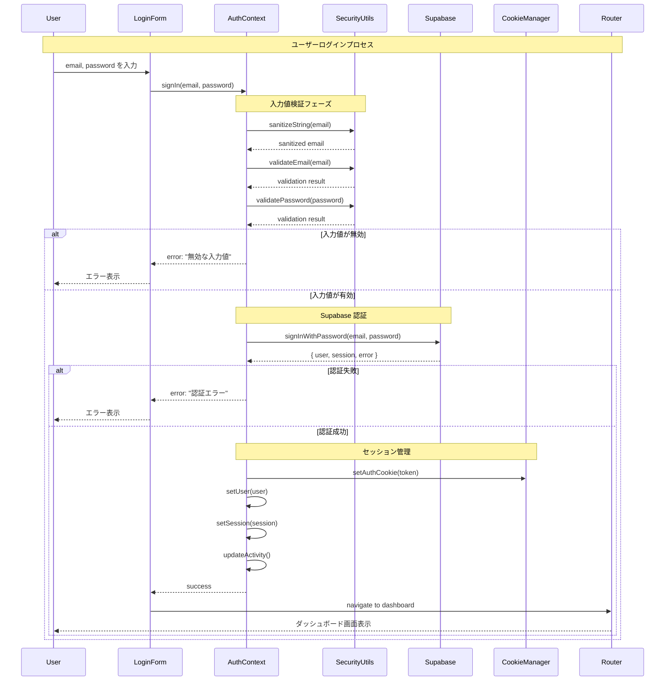
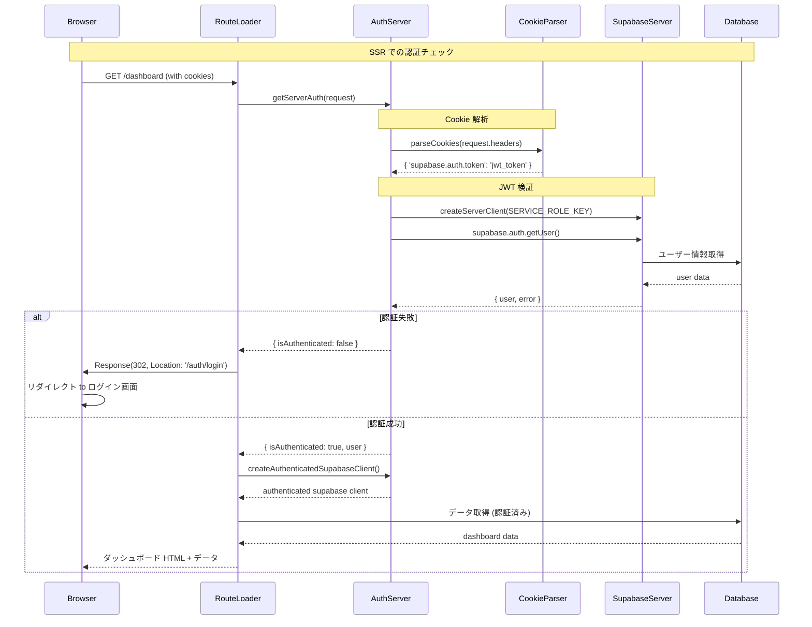
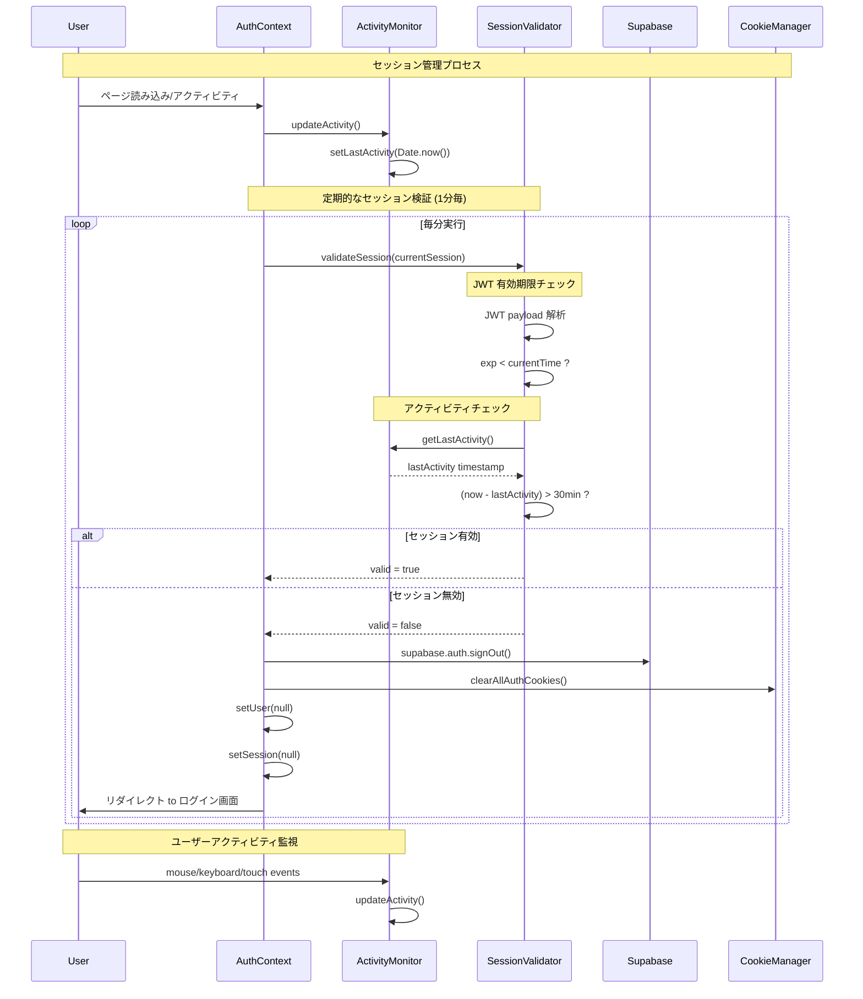
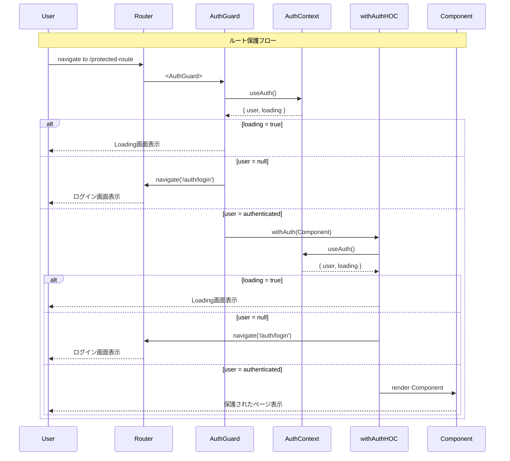
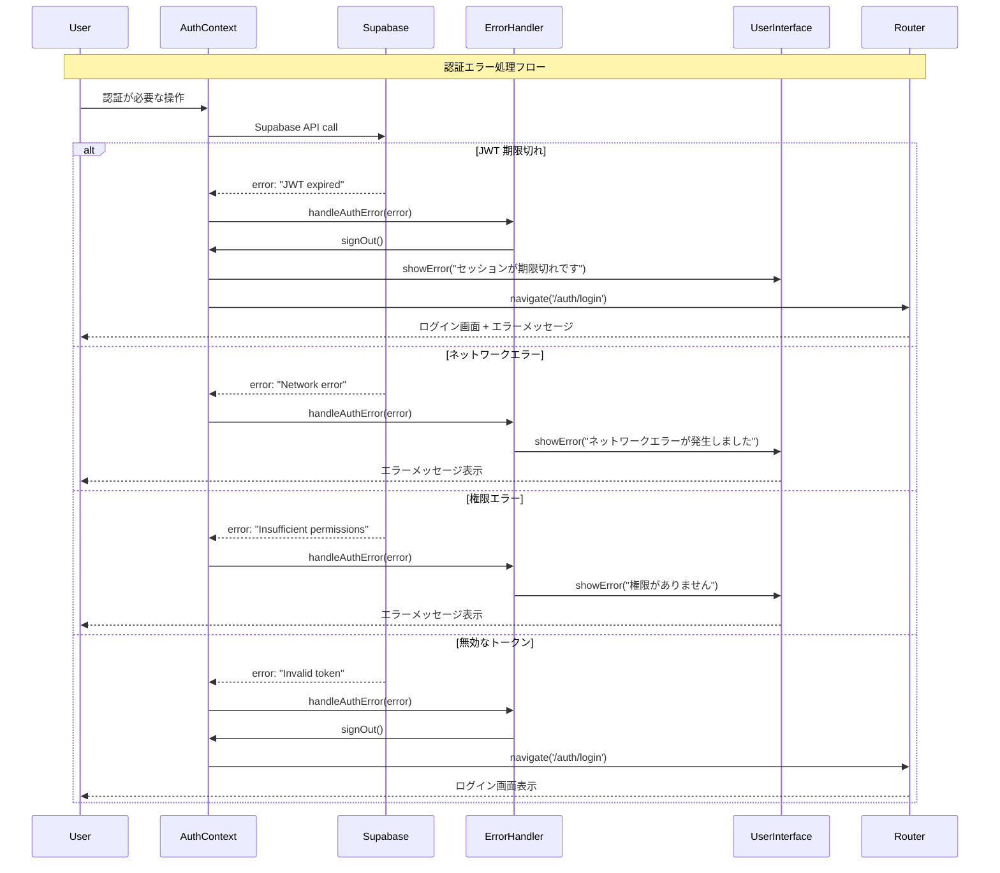
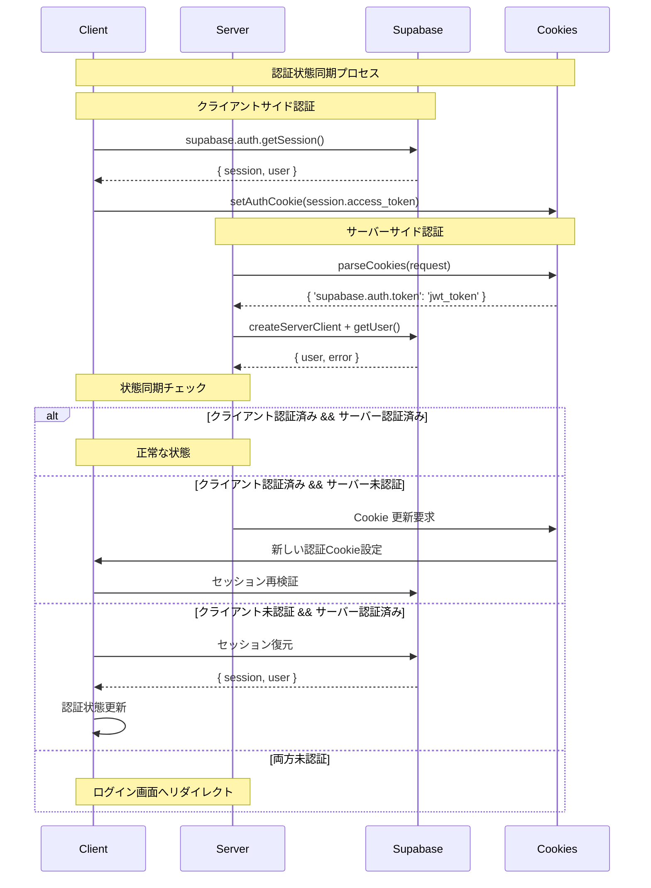
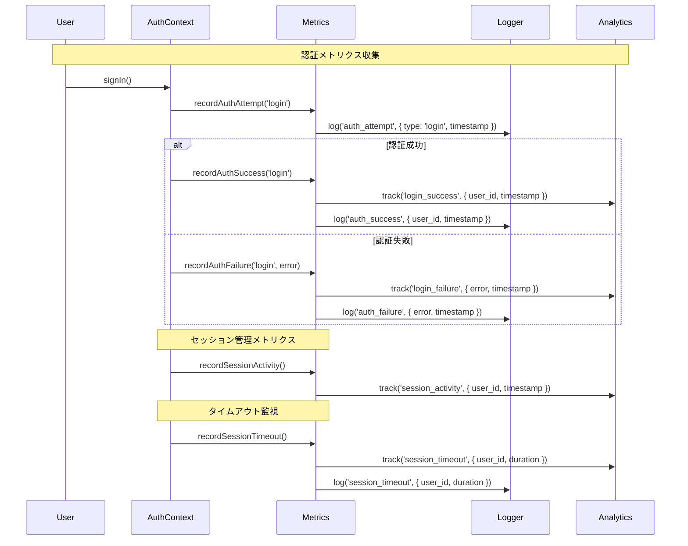
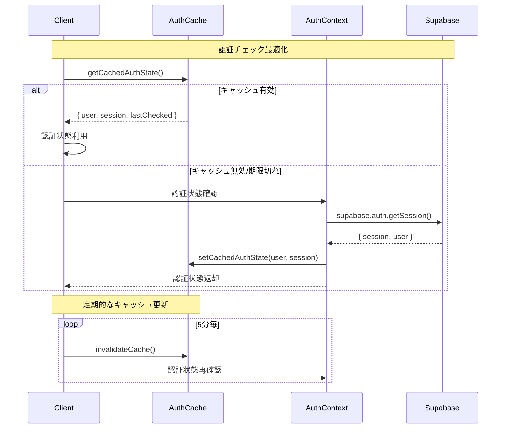

# 認証システム シーケンス図

## 📋 概要
このドキュメントは、バケットリストアプリケーションの認証システムにおける各種フローのシーケンス図を提供します。

## 🔐 認証フロー図

### 1. ログインフロー



### 2. サーバーサイド認証チェック



### 3. セッション管理とアクティビティ監視



### 4. ルート保護メカニズム



### 5. ログアウトフロー

```mermaid
sequenceDiagram
    participant U as User
    participant UI as UserInterface
    participant AC as AuthContext
    participant SB as Supabase
    participant CK as CookieManager
    participant LS as LocalStorage
    participant R as Router

    Note over U,R: ログアウトプロセス
    U->>UI: ログアウトボタンクリック
    UI->>AC: signOut()
    
    Note over AC,SB: Supabase セッション削除
    AC->>SB: supabase.auth.signOut()
    SB-->>AC: success
    
    Note over AC,CK: Cookie クリア
    AC->>CK: clearAllAuthCookies()
    CK->>CK: document.cookie = "supabase.auth.token=; expires=Thu, 01 Jan 1970 00:00:00 UTC; path=/;"
    CK->>CK: document.cookie = "supabase.auth.refresh_token=; expires=Thu, 01 Jan 1970 00:00:00 UTC; path=/;"
    
    Note over AC,LS: LocalStorage クリア (フォールバック)
    AC->>LS: localStorage.removeItem('supabase.auth.token')
    AC->>LS: localStorage.removeItem('supabase.auth.refreshToken')
    
    Note over AC,AC: 状態リセット
    AC->>AC: setUser(null)
    AC->>AC: setSession(null)
    
    Note over AC,R: リダイレクト
    AC->>R: navigate('/auth/login')
    R-->>U: ログイン画面表示
```

### 6. 認証エラーハンドリング



## 🔄 認証状態の同期

### クライアント・サーバー間での認証状態同期



## 📊 認証メトリクス

### 認証システムの監視ポイント



## 🎯 パフォーマンス最適化

### 認証チェックの最適化フロー



## 📚 関連ドキュメント
- [認証システム実装ガイド](./authentication.md)
- [セキュリティガイドライン](../security/security-guidelines.md)
- [Supabase Auth API Reference](https://supabase.com/docs/reference/javascript/auth-api)

---
**更新履歴**
- 2025-06-14: 初版作成 - 認証システムの全フローシーケンス図を追加