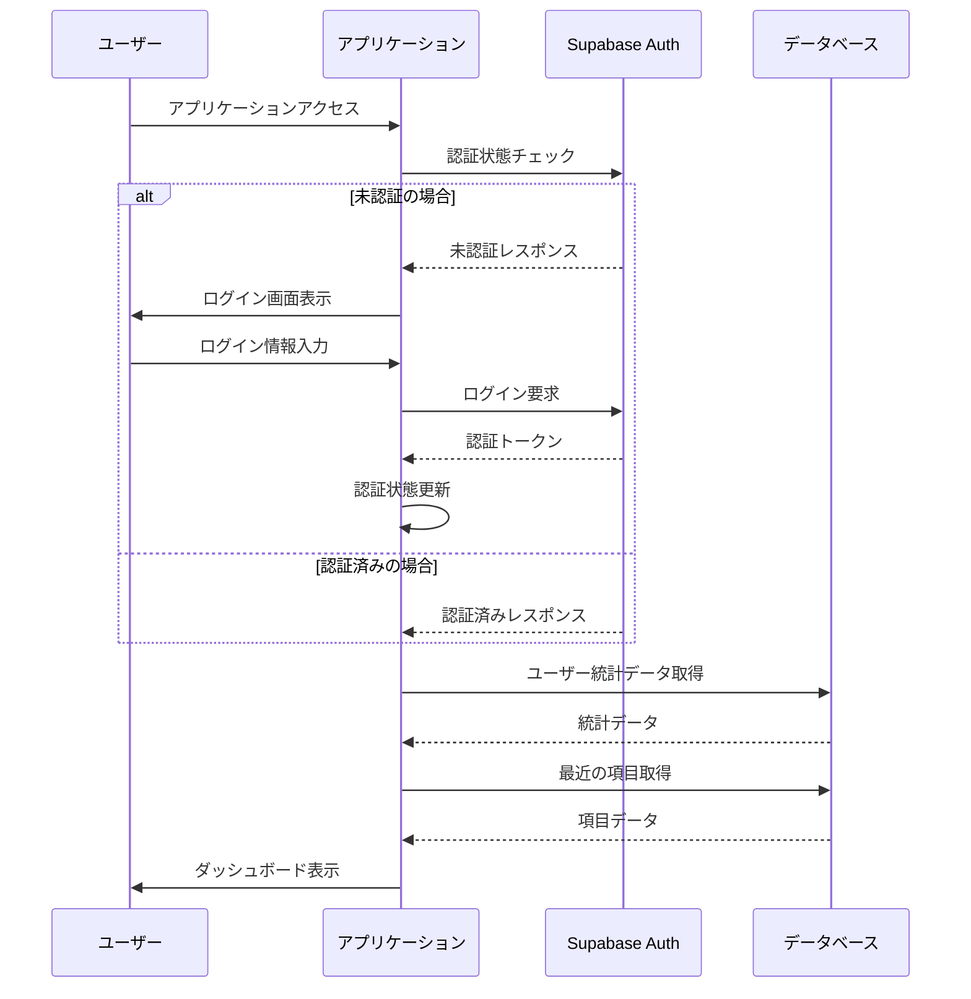
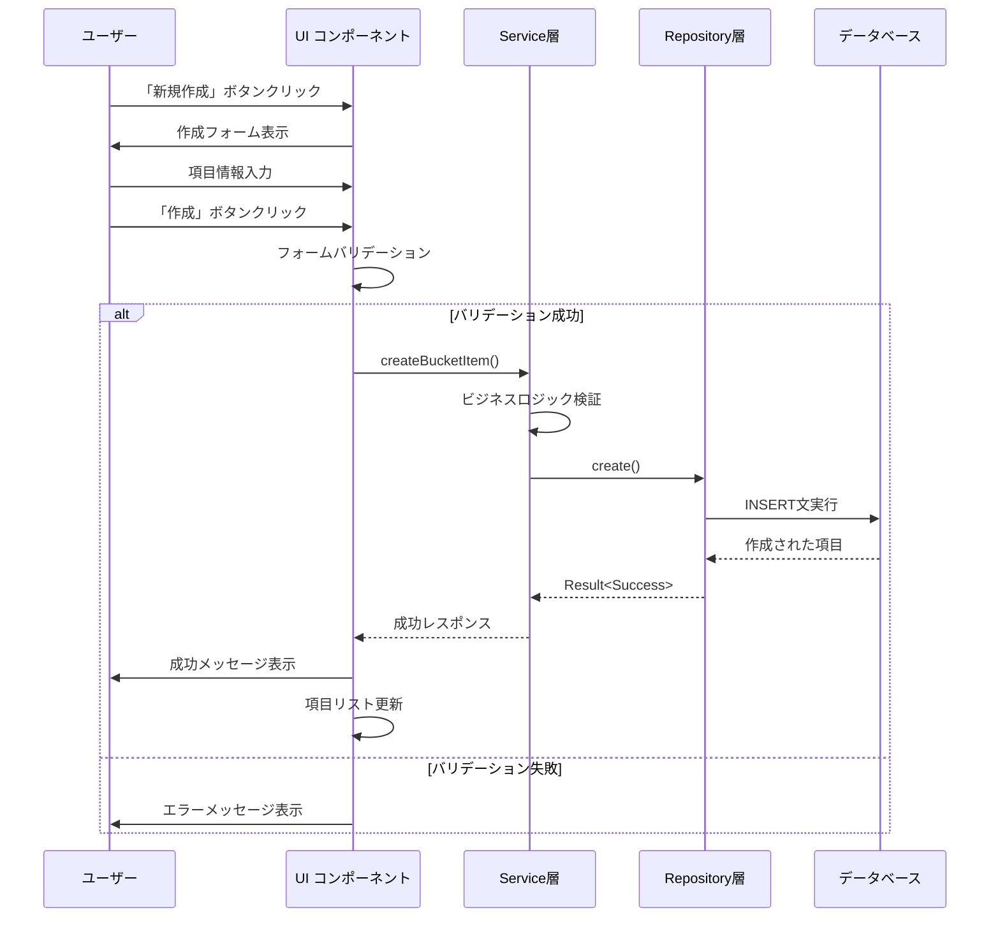
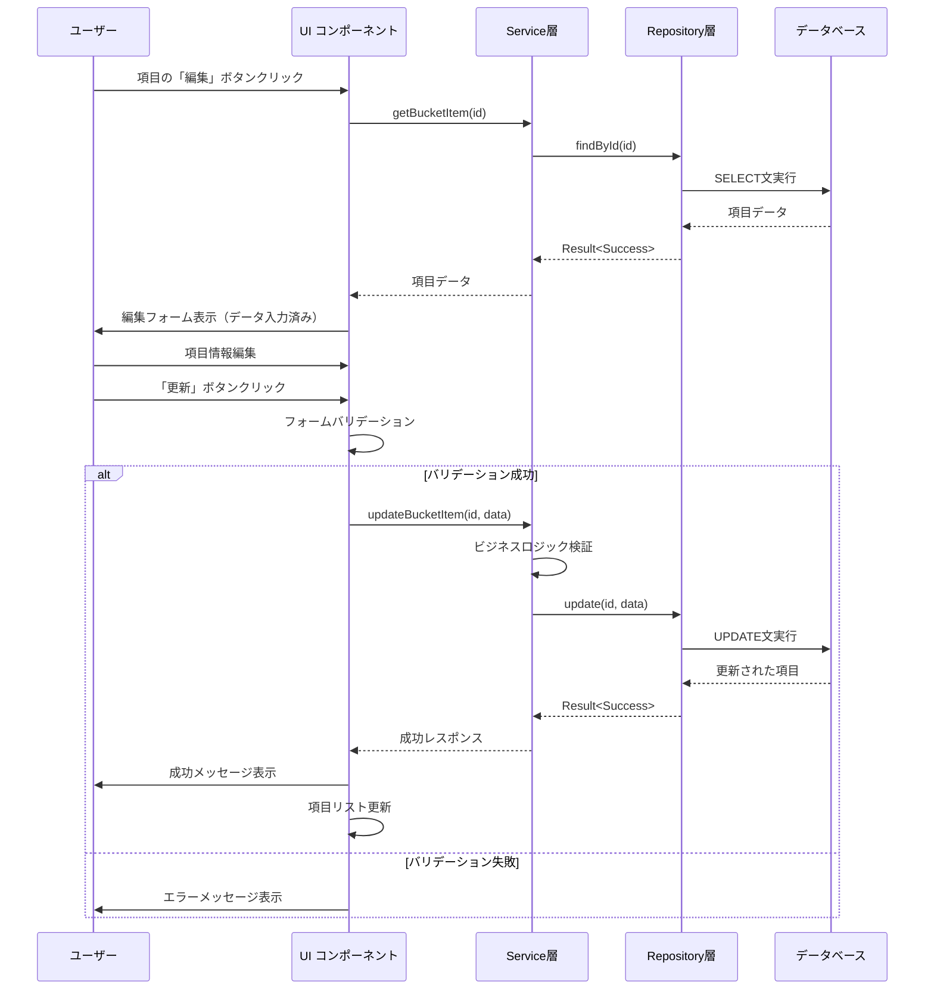
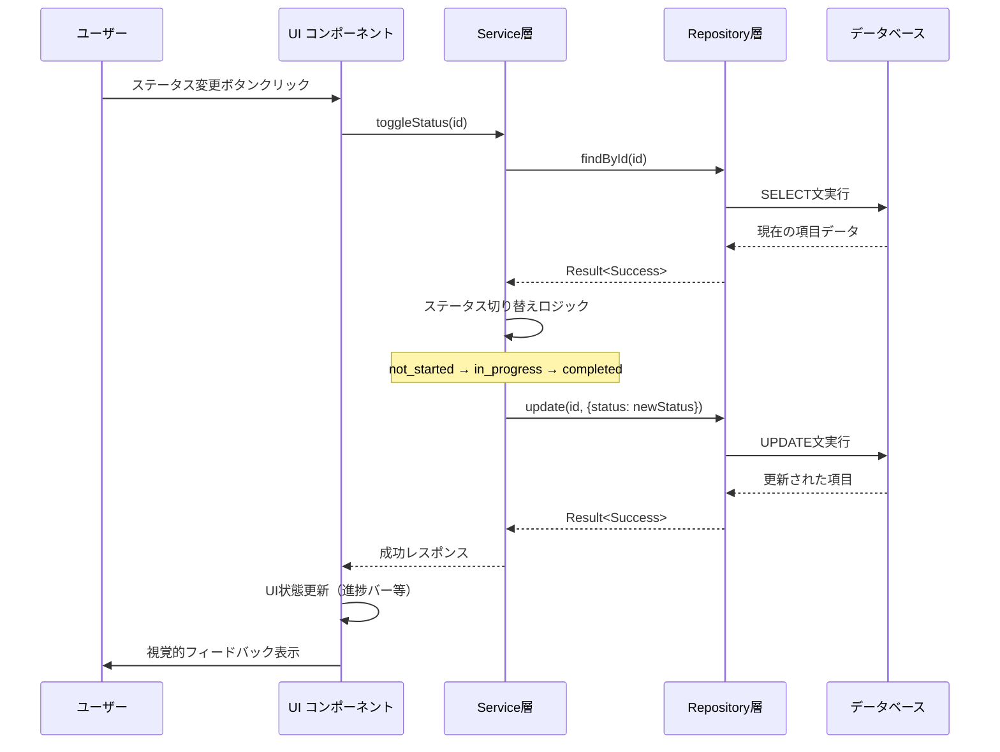
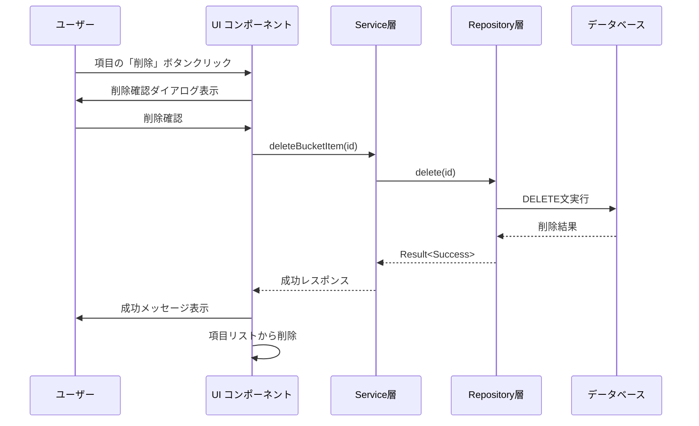
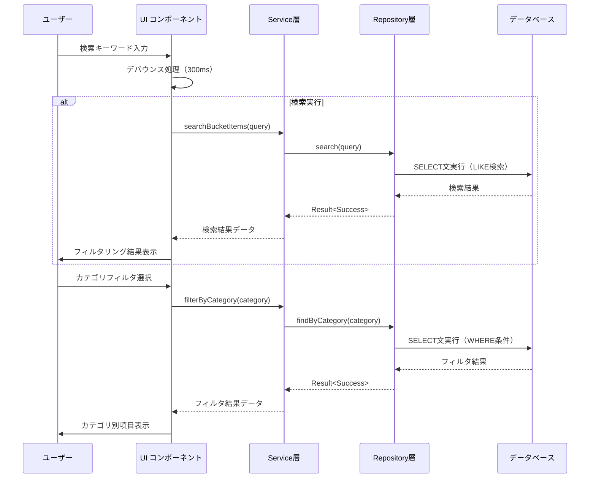
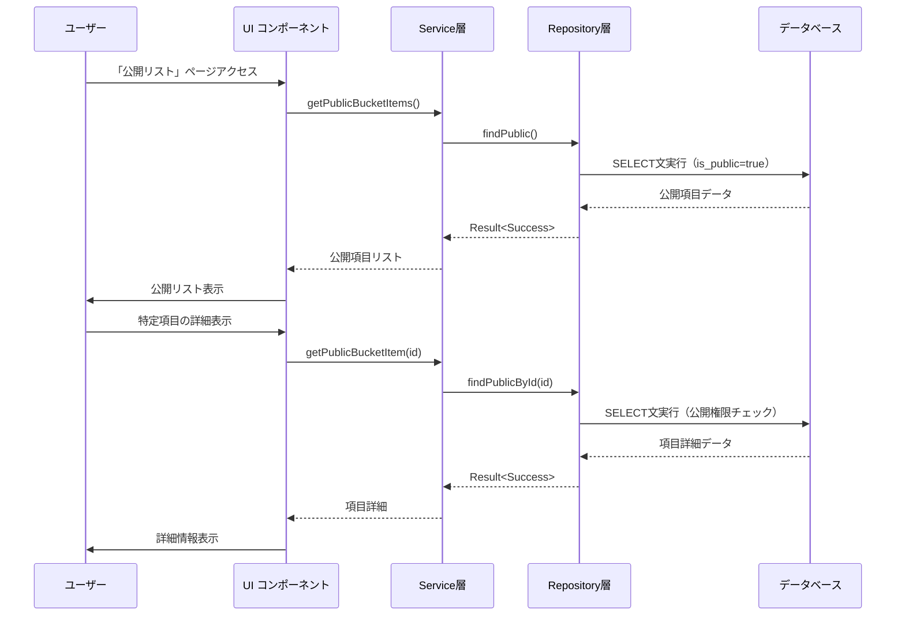

# ユーザーフローシーケンス図

このドキュメントでは、バケットリストアプリケーションの主要なユーザーフローをシーケンス図で説明します。

## 1. ログインからダッシュボード表示

## 2. やりたいこと項目の新規作成

## 3. 項目の編集・更新

## 4. 項目のステータス変更（完了マーク）

## 5. 項目の削除

## 6. 検索・フィルタリング

## 7. 公開リスト閲覧

## アーキテクチャ特徴

### Result型エラーハンドリング

全てのService層およびRepository層では、Result<T, E>型を使用した型安全なエラーハンドリングを実装しています：

- **成功時**: `Result<Success<T>>`
- **失敗時**: `Result<Failure<E>>`

### 関数型プログラミング

Service層は完全に関数型で実装されており、以下の特徴があります：

- 純粋関数による副作用の分離
- 関数合成とコンビネーターの活用
- 不変性の原則

### SSR対応

React Router v7によるServer-Side Renderingにより、初期ページロード時のデータ取得が最適化されています。

## エラーハンドリングパターン

各フローで発生する可能性のあるエラーとその対処：

1. **認証エラー**: 自動ログイン画面へリダイレクト
2. **バリデーションエラー**: フォーム上にエラーメッセージ表示
3. **データベースエラー**: 適切なエラーメッセージとリトライ機能
4. **ネットワークエラー**: 接続状態の確認とリトライ提案

## パフォーマンス最適化

- **デバウンス処理**: 検索入力での不要なAPI呼び出し削減
- **キャッシュ戦略**: 頻繁にアクセスされるデータのキャッシュ
- **遅延読み込み**: 大量データの段階的ロード
- **リアルタイム更新**: 必要最小限のデータ更新