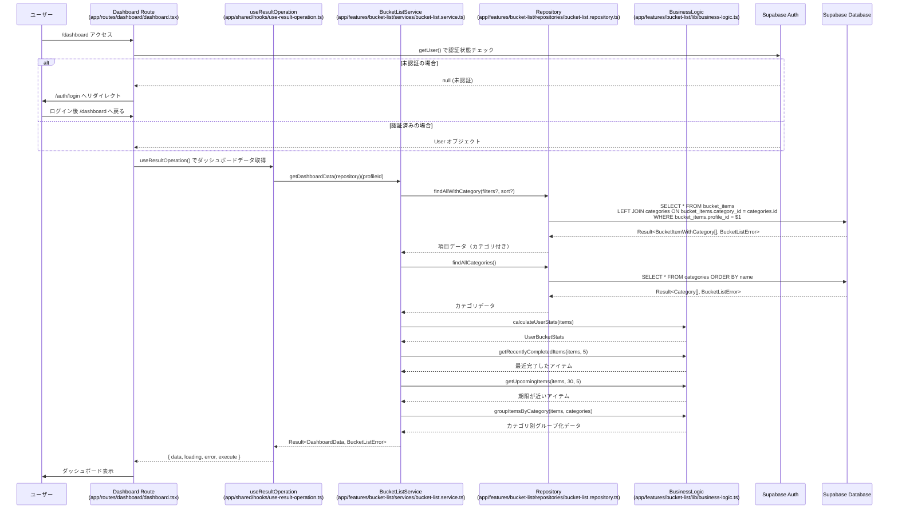
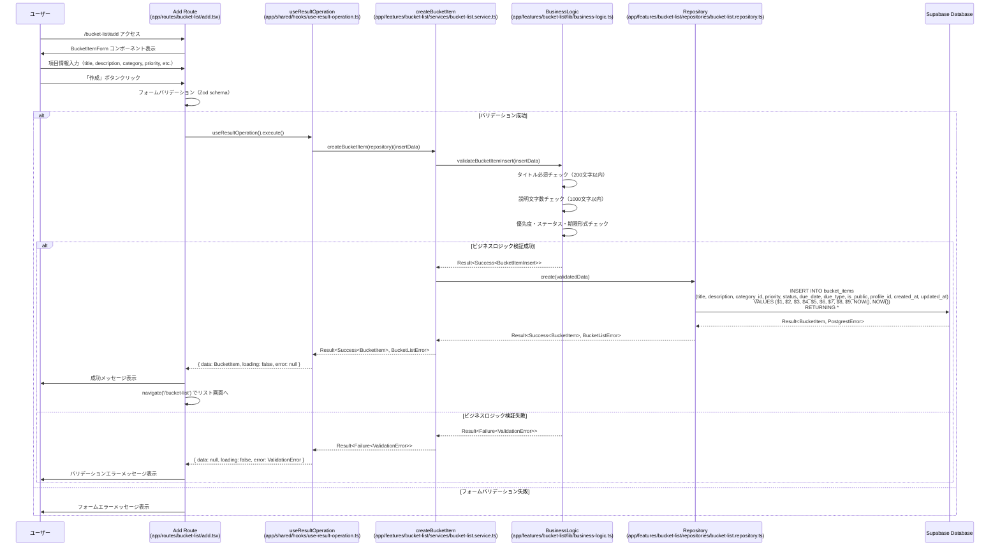
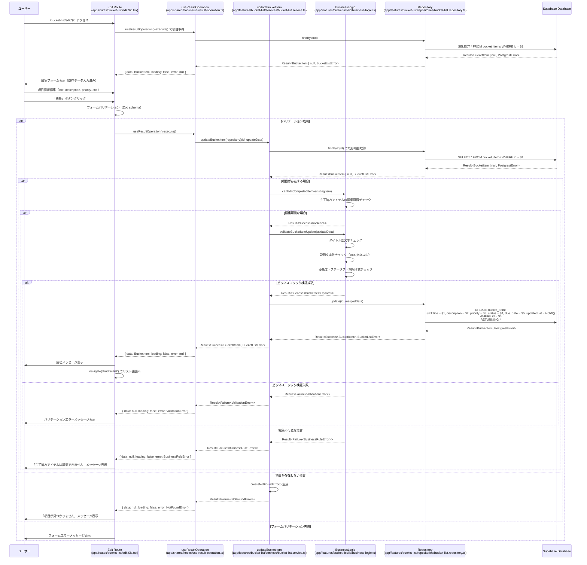
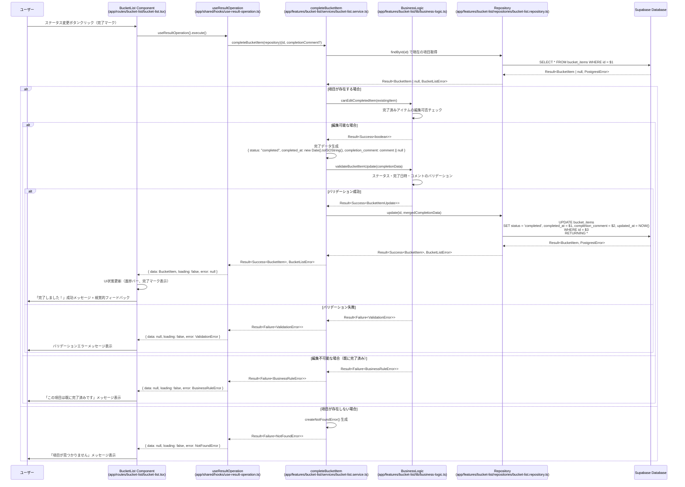
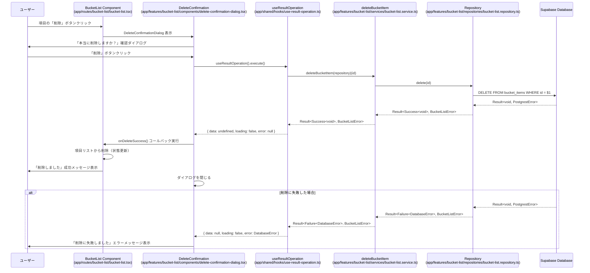
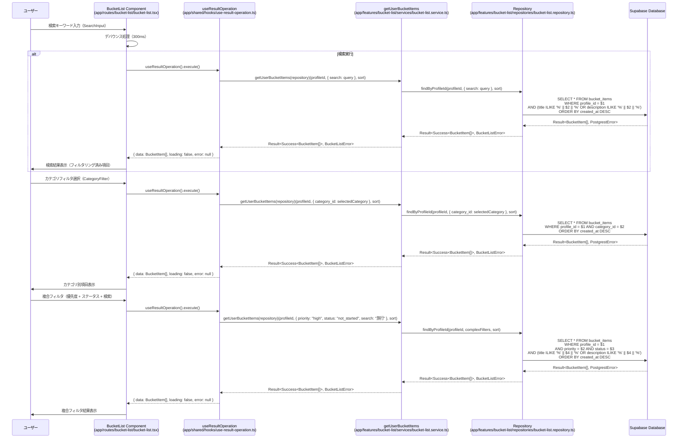
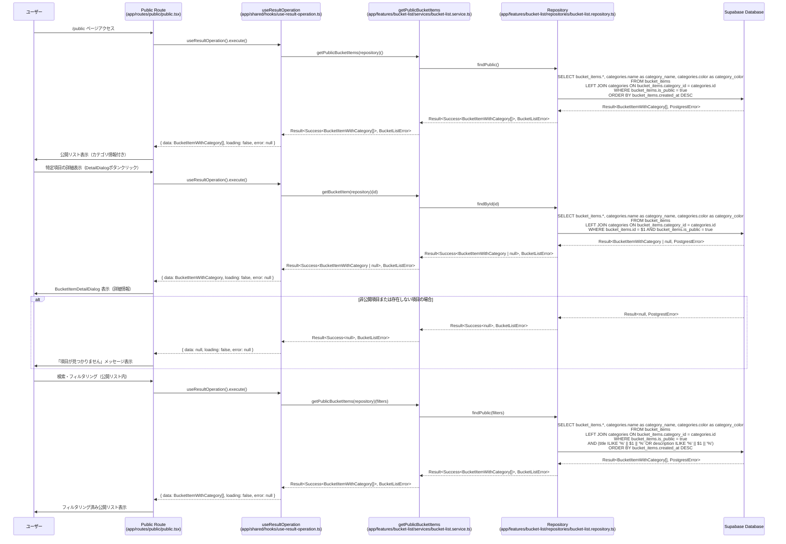

# ユーザーフローシーケンス図 - 開発者向け詳細版

このドキュメントでは、バケットリストアプリケーションの主要なユーザーフローを、具体的な関数名・ファイルパス・実装詳細を含めたシーケンス図で説明します。

## 1. ログインからダッシュボード表示



## 2. やりたいこと項目の新規作成



## 3. 項目の編集・更新



## 4. 項目のステータス変更（完了マーク）



## 5. 項目の削除



## 6. 検索・フィルタリング



## 7. 公開リスト閲覧



## アーキテクチャ特徴

### Result型エラーハンドリング

全てのService層およびRepository層では、Result<T, E>型を使用した型安全なエラーハンドリングを実装しています：

- **成功時**: `Result<Success<T>>` - `{ success: true, data: T }`
- **失敗時**: `Result<Failure<E>>` - `{ success: false, error: E }`

**定義場所**: `app/shared/types/result.ts`

**使用例**:
```typescript
// Service層での使用
const result = await createBucketItem(repository)(insertData);
if (isSuccess(result)) {
  // result.data: BucketItem
} else {
  // result.error: BucketListError
}

// Repository層での使用
const dbResult = await supabase.from('bucket_items').select('*');
return dbResult.error 
  ? failure(createDatabaseError(dbResult.error.message))
  : success(dbResult.data);
```

### 関数型プログラミング

Service層は完全に関数型で実装されており、以下の特徴があります：

- **純粋関数による副作用の分離**: ビジネスロジックは `business-logic.ts` に集約
- **関数合成とコンビネーターの活用**: `combineResults()` 等のヘルパー関数使用
- **不変性の原則**: 全ての操作で新しいオブジェクトを返す
- **カリー化**: `createBucketItem(repository)(data)` のような関数構成

**実装例**:
```typescript
// カリー化された関数型Service
export const createBucketItem = 
  (repository: FunctionalBucketListRepository) =>
  async (data: BucketItemInsert): Promise<Result<BucketItem, BucketListError>> => {
    const validationResult = validateBucketItemInsert(data);
    if (isFailure(validationResult)) return validationResult;
    
    return repository.create(validationResult.data);
  };
```

### Hooks による状態管理

`useResultOperation` hooks により、非同期操作の状態管理を統一：

- **loading**: 非同期処理中の状態
- **error**: エラー状態（BucketListError型）
- **data**: 成功時のデータ
- **execute**: 非同期処理実行関数

**実装場所**: `app/shared/hooks/use-result-operation.ts`

### SSR対応

React Router v7によるServer-Side Renderingにより、初期ページロード時のデータ取得が最適化されています。

**Route定義**: `app/routes/` 配下の各ファイル

## エラーハンドリングパターン

各フローで発生する可能性のあるエラーとその対処：

### 1. 認証エラー (AuthenticationError)
```typescript
// app/shared/types/errors.ts
interface AuthenticationError {
  type: "AuthenticationError";
  message: string;
  reason: "invalid_credentials" | "token_expired" | "insufficient_permissions" | "user_not_found";
}
```
**対処**: 自動ログイン画面へリダイレクト

### 2. バリデーションエラー (ValidationError)
```typescript
interface ValidationError {
  type: "ValidationError";
  field: string;
  message: string;
  code?: string;
}
```
**対処**: フォーム上にエラーメッセージ表示

### 3. データベースエラー (DatabaseError)
```typescript
interface DatabaseError {
  type: "DatabaseError";
  message: string;
  code?: string;
  operation?: "create" | "read" | "update" | "delete";
}
```
**対処**: 適切なエラーメッセージとリトライ機能

### 4. ビジネスルールエラー (BusinessRuleError)
```typescript
interface BusinessRuleError {
  type: "BusinessRuleError";
  rule: string;
  message: string;
  context?: Record<string, unknown>;
}
```
**対処**: ビジネスルール違反の説明とガイダンス

### 5. リソース未発見エラー (NotFoundError)
```typescript
interface NotFoundError {
  type: "NotFoundError";
  resource: string;
  id?: string;
  message: string;
}
```
**対処**: 「項目が見つかりません」メッセージ表示

## パフォーマンス最適化

### 1. デバウンス処理
```typescript
// 検索入力での不要なAPI呼び出し削減
const [searchTerm, setSearchTerm] = useState('');
const debouncedSearch = useCallback(
  debounce((term: string) => {
    execute(getUserBucketItems(repository)(profileId, { search: term }));
  }, 300),
  [execute, repository, profileId]
);
```

### 2. Result型による効率的なエラーハンドリング
```typescript
// 複数の非同期操作の結果をまとめて処理
const results = await Promise.all([
  repository.findAllWithCategory(),
  repository.findAllCategories()
]);

const combinedResult = combineResults(results);
if (isSuccess(combinedResult)) {
  // 全て成功時の処理
}
```

### 3. 適切なSQL最適化
```sql
-- インデックスを活用した効率的なクエリ
SELECT bucket_items.*, categories.name as category_name 
FROM bucket_items 
LEFT JOIN categories ON bucket_items.category_id = categories.id 
WHERE bucket_items.profile_id = $1 
  AND bucket_items.is_public = true 
ORDER BY bucket_items.created_at DESC;
```

## 開発者向けデバッグ情報

### 1. Result型のデバッグ
```typescript
// Result型の詳細ログ出力
const result = await someOperation();
console.log('Operation result:', {
  success: isSuccess(result),
  data: isSuccess(result) ? result.data : null,
  error: isFailure(result) ? result.error : null
});
```

### 2. 非同期操作の状態監視
```typescript
// useResultOperation の状態監視
const { loading, error, data } = useResultOperation();
console.log('Hook state:', { loading, error: error?.type, hasData: !!data });
```

### 3. SQL クエリのデバッグ
Supabase のログやブラウザの Network タブでクエリの実行状況を確認可能。

## 関連ファイル

- **Service層**: `app/features/bucket-list/services/bucket-list.service.ts`
- **Repository層**: `app/features/bucket-list/repositories/bucket-list.repository.ts`
- **Business Logic**: `app/features/bucket-list/lib/business-logic.ts`
- **Error Types**: `app/shared/types/errors.ts`
- **Result Types**: `app/shared/types/result.ts`
- **Hooks**: `app/shared/hooks/use-result-operation.ts`
- **Routes**: `app/routes/` 配下の各ファイル