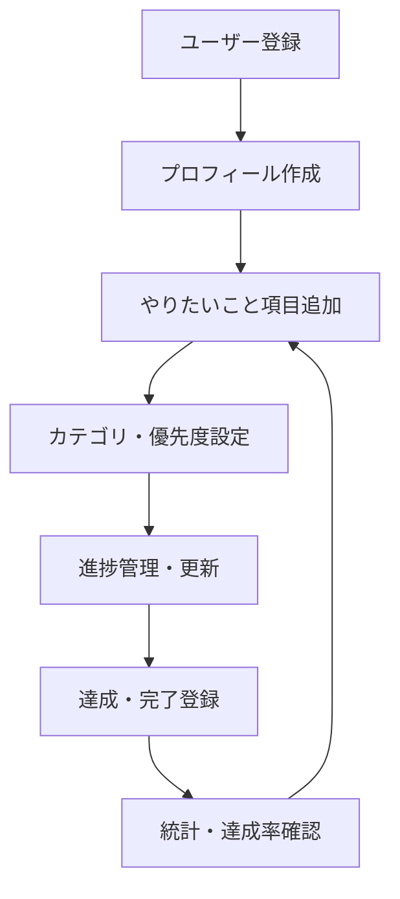

# バケットリストアプリ 要件定義

## 📋 基本情報

- **プロジェクト名**: 人生でやりたいことリストアプリ
- **機能名**: バケットリスト管理システム
- **作成日**: 2025-01-11
- **作成者**: Development Team
- **承認者**: Product Owner
- **バージョン**: v2.0

## 🎯 目的・背景

### ビジネス目的

- **解決したい課題**: 人生の目標・夢を体系的に管理し、達成促進する仕組みの不足
- **期待される効果**:
  - 定量的: ユーザーの目標達成率30%向上
  - 定性的: 人生の充実感・モチベーション向上
- **対象ユーザー**: 目標達成意識の高い20-40代、自己啓発・成長志向の個人

### 技術的背景

- **現在の技術スタック**: React Router v7, TypeScript, Supabase, TailwindCSS
- **制約条件**:
  - Supabaseの無料枠内での運用
  - モバイルファーストデザイン必須
- **前提条件**: インターネット接続環境、モダンブラウザ対応

## 🔍 機能要件

### 主要機能

#### 機能1: やりたいこと項目管理

- **概要**: 個人の目標・夢・やりたいことを項目として登録・管理
- **詳細**:
  - タイトル・詳細説明の入力
  - カテゴリ・優先度・期限の設定
  - ステータス（未着手/進行中/完了）の管理
- **入力**: タイトル（必須）、説明（任意）、カテゴリID、優先度、期限情報
- **出力**: 登録されたバケットリスト項目、一意のID付与
- **優先度**: High

#### 機能2: 達成状況追跡・可視化

- **概要**: 目標の達成状況を視覚的に表示し、モチベーション向上を支援
- **詳細**:
  - 全体・カテゴリ別達成率の表示
  - 進捗状況のプログレスバー表示
  - 達成時のお祝い表示機能
- **入力**: ユーザーのバケットリスト項目データ
- **出力**: 達成率グラフ、統計情報、進捗可視化
- **優先度**: High

#### 機能3: 検索・フィルタ・ソート

- **概要**: 大量の項目から目的の項目を効率的に見つける機能
- **詳細**:
  - キーワード検索（タイトル・説明文対象）
  - カテゴリ・優先度・ステータスでのフィルタ
  - 作成日・更新日・期限でのソート
- **入力**: 検索キーワード、フィルタ条件、ソート条件
- **出力**: 条件にマッチするバケットリスト項目一覧
- **優先度**: Medium

#### 機能4: 公開リスト閲覧

- **概要**: 他ユーザーの公開リストを閲覧し、参考・インスピレーション取得
- **詳細**:
  - 公開設定されたリストの閲覧（作成者名はマスク）
  - 閲覧のみ（編集・コメント不可）
  - カテゴリ別での公開リスト表示
- **入力**: 閲覧リクエスト、フィルタ条件
- **出力**: 公開バケットリスト項目一覧（匿名化済み）
- **優先度**: Medium

#### 機能5: ランディングページ・マーケティング機能

- **概要**: 未認証ユーザー向けの魅力的なランディングページと初回ユーザー体験
- **詳細**:
  - ヒーローセクション（キャッチコピー・メインCTA）
  - 機能紹介セクション（6つの主要機能の詳細説明）
  - デモ統計・利用例表示（サンプルデータによる使用イメージ）
  - 認証状態に応じた動的コンテンツ表示
  - 認証済みユーザーの適切なリダイレクト処理
- **入力**: ユーザーアクセス、認証状態
- **出力**: 認証状態別の最適化されたランディングページ
- **優先度**: High

### 補助機能

- **ダッシュボード**: 統計情報の一覧表示
- **プロフィール管理**: ユーザー情報の編集
- **データエクスポート**: 将来拡張予定

## 📊 非機能要件

### パフォーマンス要件

- **レスポンス時間**: 1秒以内（90%の操作）
- **同時接続数**: 100人まで対応
- **処理能力**: 1000項目/ユーザーまで快適動作

### 可用性要件

- **稼働率**: 99%以上（Supabase SLA準拠）
- **メンテナンス時間**: 月2時間以内
- **復旧時間**: 24時間以内

### セキュリティ要件

- **認証**: Supabase Auth（OAuth, Email/Password）
- **認可**: Row Level Security (RLS) による行レベルアクセス制御
- **データ保護**: HTTPS通信、個人情報の適切な匿名化
- **監査**: アクセスログ・操作ログの記録

### 互換性要件

- **ブラウザ対応**: Chrome, Firefox, Safari, Edge（最新2バージョン）
- **デバイス対応**: PC/タブレット/スマートフォン（レスポンシブ）
- **API互換性**: Supabase API v2準拠

## 🎨 UI/UX要件

### デザイン要件

- **デザインシステム**: shadcn-ui + TailwindCSS
- **レスポンシブ対応**: 320px-1920px対応
- **アクセシビリティ**: WCAG 2.1 AA準拠

### ユーザビリティ要件

- **操作性**: 直感的操作（3クリック以内で主要機能アクセス）
- **学習容易性**: 初回利用時30分以内での基本操作習得
- **エラー処理**: わかりやすいエラーメッセージ・回復手順提示

## 🗄️ データ要件

### データ構造

```sql
-- メインテーブル構成
CREATE TABLE profiles (
  id UUID PRIMARY KEY,
  user_id UUID REFERENCES auth.users(id),
  email VARCHAR(255) UNIQUE NOT NULL,
  display_name VARCHAR(100)
);

CREATE TABLE categories (
  id SERIAL PRIMARY KEY,
  name VARCHAR(50) UNIQUE NOT NULL,
  color VARCHAR(7) DEFAULT '#6B7280'
);

CREATE TABLE bucket_items (
  id UUID PRIMARY KEY,
  profile_id UUID REFERENCES profiles(id),
  category_id INTEGER REFERENCES categories(id),
  title VARCHAR(200) NOT NULL,
  description TEXT,
  priority VARCHAR(20) DEFAULT 'medium',
  status VARCHAR(20) DEFAULT 'not_started',
  is_public BOOLEAN DEFAULT false,
  created_at TIMESTAMPTZ DEFAULT NOW()
);
```

### データ量・成長予測

- **初期データ量**: ユーザー100人、平均20項目/人 = 2,000項目
- **年間増加率**: ユーザー数200%、項目数150%
- **5年後予測**: ユーザー3,200人、項目数32,000件

### データ保持・削除ポリシー

- **保持期間**: ユーザーアカウント有効期間中は永続保持
- **削除条件**: ユーザーアカウント削除時にカスケード削除
- **バックアップ**: Supabase自動バックアップに依存

## 🔄 業務フロー

### 基本フロー



### 例外フロー

- **登録失敗**: バリデーションエラー → 修正画面表示 → 再入力
- **権限エラー**: 認証切れ → ログイン画面リダイレクト → 再認証
- **データ競合**: 同時更新検出 → 最新データ表示 → 再編集要求

## ✅ 受入基準

### 機能受入基準

- [x] **CRUD操作**: 項目の作成・読取・更新・削除が正常動作すること
- [x] **検索機能**: キーワード検索で適切な結果が表示されること
- [x] **フィルタ機能**: カテゴリ・ステータス別フィルタが動作すること
- [x] **統計表示**: 達成率が正確に計算・表示されること
- [x] **公開機能**: 公開リストが適切に匿名化表示されること
- [x] **ランディングページ**: 認証状態別の適切なコンテンツ表示が動作すること

### 品質受入基準

- [x] **パフォーマンス**: 主要操作が1秒以内で完了すること
- [x] **セキュリティ**: RLSによる適切なアクセス制御が動作すること
- [x] **テスト**: ユニットテストカバレッジ80%以上を達成すること
- [x] **アクセシビリティ**: キーボード操作のみで全機能利用可能なこと

## 📅 スケジュール

| フェーズ               | 期間 | 成果物                     | 担当者           |
| ---------------------- | ---- | -------------------------- | ---------------- |
| 要件定義               | 完了 | 要件定義書                 | Development Team |
| 設計・実装             | 完了 | MVP機能実装                | Development Team |
| テスト強化             | 完了 | テストスイート構築         | Development Team |
| 品質改善               | 完了 | コード品質向上             | Development Team |
| ランディングページ強化 | 完了 | マーケティング機能・UX改善 | Development Team |

## 📚 参考資料

- **技術ドキュメント**: [アーキテクチャガイド](../development/architecture.md)
- **認証仕様**: [認証システム](../development/authentication.md)
- **データベース設計**: [データベース設計](../development/database.md)

## 📝 補足・注意事項

### 既知の制約

- **RLS制約**: bucket_itemsテーブルのRLSは実用性重視で現在無効化
- **Supabase制約**: 無料枠での運用のため、スケール制限あり

### 将来の拡張予定

- **ファイル添付**: 画像添付機能（Phase 4予定）
- **ソーシャル機能**: コメント・いいね機能（Phase 5予定）
- **通知機能**: 期限・進捗リマインダー（Phase 6予定）

---

**変更履歴**
| バージョン | 日付 | 変更内容 | 変更者 |
|------------|------|----------|--------|
| v1.0 | 2024-XX-XX | 初版作成 | Development Team |
| v2.0 | 2025-01-11 | テンプレート適用・内容拡充 | Development Team |
| v2.1 | 2025-01-14 | ランディングページ機能追加・受入基準更新 | Development Team |
