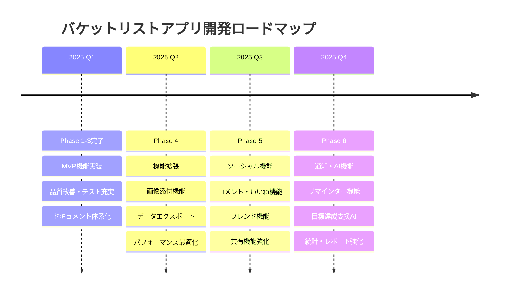

# バケットリストアプリ ロードマップ

## 📋 基本情報
- **プロジェクト名**: 人生でやりたいことリストアプリ
- **現在バージョン**: v1.0 (MVP完成)
- **作成日**: 2025-01-11
- **作成者**: Development Team

## 🎯 ビジョン・目標

### 長期ビジョン (3年後)
**「人生の目標達成を支援する、最も使いやすいライフプランニングプラットフォーム」**

- ユーザー数: 10,000人
- 平均目標達成率: 50%向上
- 機能充実度: ソーシャル・AI支援機能搭載

### 短期目標 (6ヶ月後)
- ユーザー数: 500人
- 基本機能の安定稼働
- ユーザーフィードバック収集・改善

## 🗓️ ロードマップ概要

## 📅 詳細ロードマップ

### ✅ Phase 1-3.5: 基盤構築・品質改善・ランディングページ強化 (完了: 2025年1月)

#### 主要成果
- **MVP機能実装**: CRUD操作、検索・フィルタ、統計表示
- **Clean Architecture**: Repository + Service層実装
- **テスト基盤**: Vitest + React Testing Library環境構築
- **品質向上**: TypeScriptエラー0個、型安全性達成
- **ドキュメント整備**: 統一テンプレート・体系化完了
- **ランディングページ強化**: 本格的マーケティングページ・UX改善

#### 技術的負債解決
- コード品質: 70点 → 88点
- 型安全性: 完全な型保護達成
- テストカバレッジ: 主要機能カバー完了
- UX改善: ランディングページ・認証フロー最適化

---

### 🚀 Phase 4: 機能拡張・UX向上 (予定: 2025年2-3月)

#### 主要機能
**画像添付機能**
- 📋 概要: バケットリスト項目への画像添付機能
- 🎯 目的: 視覚的なモチベーション向上
- 📅 期間: 2週間
- 👥 工数: 20時間

**データエクスポート機能**
- 📋 概要: JSON/CSV形式でのデータエクスポート
- 🎯 目的: データポータビリティ向上
- 📅 期間: 1週間
- 👥 工数: 8時間

**パフォーマンス最適化**
- 📋 概要: ページロード速度・レスポンス改善
- 🎯 目的: ユーザー体験向上
- 📅 期間: 1週間
- 👥 工数: 12時間

#### 技術要件
- **Supabase Storage**: 画像ファイル管理
- **React Query**: データキャッシュ最適化
- **Image Optimization**: 画像圧縮・最適化

#### 成功指標
- 画像添付率: 30%以上
- ページロード時間: 2秒以内
- ユーザー満足度: 4.0/5.0以上

---

### 🤝 Phase 5: ソーシャル機能強化 (予定: 2025年4-6月)

#### 主要機能
**コメント・いいね機能**
- 📋 概要: 公開リストへのコメント・いいね機能
- 🎯 目的: コミュニティ形成・モチベーション向上
- 📅 期間: 3週間
- 👥 工数: 30時間

**フレンド機能**
- 📋 概要: ユーザー間のフレンド関係構築
- 🎯 目的: パーソナライズされたソーシャル体験
- 📅 期間: 2週間
- 👥 工数: 20時間

**共有機能強化**
- 📋 概要: SNS連携・リンク共有機能
- 🎯 目的: ユーザー獲得・バイラル効果
- 📅 期間: 1週間
- 👥 工数: 10時間

#### 技術要件
- **リアルタイム通信**: Supabase Realtime
- **SNS API**: Twitter, Facebook連携
- **通知システム**: プッシュ通知基盤

#### 成功指標
- ソーシャル機能利用率: 40%以上
- ユーザー招待率: 20%以上
- 継続利用率: 70%以上

---

### 🧠 Phase 6: 通知・AI機能 (予定: 2025年7-9月)

#### 主要機能
**リマインダー機能**
- 📋 概要: 期限・進捗に基づく自動リマインダー
- 🎯 目的: 目標達成率向上
- 📅 期間: 2週間
- 👥 工数: 15時間

**目標達成支援AI**
- 📋 概要: AI による目標設定・達成アドバイス
- 🎯 目的: パーソナライズされた支援
- 📅 期間: 4週間
- 👥 工数: 40時間

**統計・レポート強化**
- 📋 概要: 詳細な進捗分析・可視化
- 🎯 目的: 自己分析・改善支援
- 📅 期間: 2週間
- 👥 工数: 20時間

#### 技術要件
- **AI/ML**: OpenAI API, 自然言語処理
- **通知システム**: Email, Push通知
- **データ分析**: 統計・可視化ライブラリ

#### 成功指標
- AI機能利用率: 50%以上
- 目標達成率: 30%向上
- ユーザーエンゲージメント: 50%向上

---

### 🚀 Phase 7: プラットフォーム拡張 (予定: 2025年10-12月)

#### 主要機能
**モバイルアプリ**
- 📋 概要: React Native によるモバイルアプリ開発
- 🎯 目的: モバイル体験最適化
- 📅 期間: 8週間
- 👥 工数: 80時間

**API公開**
- 📋 概要: 外部サービス連携用API提供
- 🎯 目的: エコシステム拡張
- 📅 期間: 3週間
- 👥 工数: 30時間

**企業向け機能**
- 📋 概要: チーム・組織向け目標管理機能
- 🎯 目的: BtoB市場開拓
- 📅 期間: 6週間
- 👥 工数: 60時間

## 📊 リソース計画

### 開発リソース
| フェーズ | 期間 | 工数 | 必要スキル |
|----------|------|------|------------|
| Phase 4 | 2-3月 | 40時間 | React, Supabase Storage |
| Phase 5 | 4-6月 | 60時間 | Realtime, SNS API |
| Phase 6 | 7-9月 | 75時間 | AI/ML, データ分析 |
| Phase 7 | 10-12月 | 170時間 | React Native, API設計 |

### 技術投資
- **AI/ML学習**: 20時間
- **モバイル開発学習**: 30時間
- **インフラ強化**: 15時間

## 🎯 成功指標・KPI

### ユーザー指標
| 指標 | 現在 | Phase 4 | Phase 5 | Phase 6 | Phase 7 |
|------|------|---------|---------|---------|---------|
| MAU | - | 100人 | 300人 | 500人 | 1,000人 |
| 継続利用率 | - | 60% | 70% | 75% | 80% |
| 目標達成率 | - | 20% | 25% | 35% | 45% |

### 技術指標
| 指標 | 現在 | Phase 4 | Phase 5 | Phase 6 | Phase 7 |
|------|------|---------|---------|---------|---------|
| ページロード時間 | 1.2s | 1.0s | 0.8s | 0.8s | 0.6s |
| 可用性 | 99% | 99.5% | 99.5% | 99.8% | 99.9% |
| テストカバレッジ | 80% | 85% | 90% | 90% | 95% |

## ⚠️ リスク・制約

### 技術的リスク
- **Supabase制約**: 無料枠でのスケール制限
  - 対策: 有料プランへの移行検討
- **AI機能**: API コスト・精度の課題
  - 対策: 段階的実装・コスト監視

### 市場リスク
- **競合出現**: 類似サービスの登場
  - 対策: 差別化機能の強化
- **ユーザー獲得**: マーケティング戦略必要
  - 対策: SNS活用・インフルエンサー連携

### リソースリスク
- **開発リソース**: 個人開発での限界
  - 対策: オープンソース化・コミュニティ形成

## 🔄 見直し・調整

### 定期見直し
- **月次レビュー**: 進捗・KPI確認
- **四半期レビュー**: ロードマップ調整
- **年次レビュー**: 戦略・ビジョン見直し

### 調整基準
- **ユーザーフィードバック**: 機能優先度変更
- **技術革新**: 新技術導入検討
- **市場変化**: 競合・トレンド対応

---
**策定者**: Development Team  
**最終更新**: 2025-01-14  
**次回見直し**: 2025-04-01