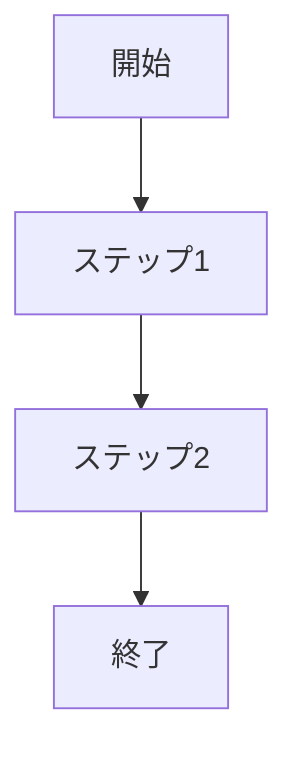

# [機能名] 要件定義

## 📋 基本情報
- **プロジェクト名**: プロジェクト名
- **機能名**: 機能名
- **作成日**: YYYY-MM-DD
- **作成者**: 作成者名
- **承認者**: 承認者名
- **バージョン**: v1.0

## 🎯 目的・背景
### ビジネス目的
- **解決したい課題**: 課題の詳細説明
- **期待される効果**: 定量的・定性的効果
- **対象ユーザー**: ペルソナ・ユーザー層

### 技術的背景
- **現在の技術スタック**: 技術構成
- **制約条件**: 技術的・ビジネス的制約
- **前提条件**: システム・環境の前提

## 🔍 機能要件
### 主要機能
#### 機能1: 機能名
- **概要**: 機能の概要説明
- **詳細**: 詳細な動作仕様
- **入力**: 入力データ・形式
- **出力**: 出力データ・形式
- **優先度**: High/Medium/Low

#### 機能2: 機能名
- **概要**: 機能の概要説明
- **詳細**: 詳細な動作仕様
- **入力**: 入力データ・形式
- **出力**: 出力データ・形式
- **優先度**: High/Medium/Low

### 補助機能
- **機能A**: 概要説明
- **機能B**: 概要説明

## 📊 非機能要件
### パフォーマンス要件
- **レスポンス時間**: X秒以内
- **同時接続数**: X人まで対応
- **処理能力**: X件/秒

### 可用性要件
- **稼働率**: XX%
- **メンテナンス時間**: 月X時間以内
- **復旧時間**: X時間以内

### セキュリティ要件
- **認証**: 認証方式・強度
- **認可**: アクセス制御方式
- **データ保護**: 暗号化・匿名化要件
- **監査**: ログ・追跡要件

### 互換性要件
- **ブラウザ対応**: 対応ブラウザ・バージョン
- **デバイス対応**: PC/タブレット/スマートフォン
- **API互換性**: 既存APIとの互換性

## 🎨 UI/UX要件
### デザイン要件
- **デザインシステム**: 使用するデザインシステム
- **レスポンシブ対応**: 対応画面サイズ
- **アクセシビリティ**: WCAG準拠レベル

### ユーザビリティ要件
- **操作性**: 直感的操作の要件
- **学習容易性**: 習得時間目標
- **エラー処理**: エラー表示・回復方法

## 🗄️ データ要件
### データ構造
```sql
-- テーブル定義例
CREATE TABLE example_table (
  id UUID PRIMARY KEY,
  name VARCHAR(255) NOT NULL,
  created_at TIMESTAMP DEFAULT NOW()
);
```

### データ量・成長予測
- **初期データ量**: X件
- **年間増加率**: XX%
- **5年後予測**: X件

### データ保持・削除ポリシー
- **保持期間**: X年間
- **削除条件**: 削除条件
- **バックアップ**: 頻度・期間

## 🔄 業務フロー
### 基本フロー


### 例外フロー
- **例外ケース1**: 処理フロー
- **例外ケース2**: 処理フロー

## ✅ 受入基準
### 機能受入基準
- [ ] **基準1**: 具体的な確認項目
- [ ] **基準2**: 具体的な確認項目
- [ ] **基準3**: 具体的な確認項目

### 品質受入基準
- [ ] **パフォーマンス**: X秒以内でレスポンス
- [ ] **セキュリティ**: 脆弱性スキャン通過
- [ ] **テスト**: カバレッジXX%以上

## 📅 スケジュール
| フェーズ | 期間 | 成果物 | 担当者 |
|----------|------|--------|--------|
| 要件定義 | YYYY-MM-DD ~ YYYY-MM-DD | 要件定義書 | 担当者名 |
| 設計 | YYYY-MM-DD ~ YYYY-MM-DD | 設計書 | 担当者名 |
| 実装 | YYYY-MM-DD ~ YYYY-MM-DD | 機能実装 | 担当者名 |
| テスト | YYYY-MM-DD ~ YYYY-MM-DD | テスト結果 | 担当者名 |

## 📚 参考資料
- **関連ドキュメント**: [ドキュメント名](リンク)
- **外部仕様**: [仕様書名](リンク)
- **法的要件**: 準拠する法律・規格

## 📝 補足・注意事項
### 既知の制約
- **制約1**: 制約内容と対応方針
- **制約2**: 制約内容と対応方針

### 将来の拡張予定
- **拡張案1**: 概要・実装時期
- **拡張案2**: 概要・実装時期

---
**変更履歴**
| バージョン | 日付 | 変更内容 | 変更者 |
|------------|------|----------|--------|
| v1.0 | YYYY-MM-DD | 初版作成 | 作成者名 |